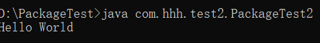

# 编写代码

## com.hhh.test.PackageTest

```java
package com.hhh.test;

public class PackageTest {
    public static void main(String[] args) {
        System.out.println("Hello World");
    }
}
```
## com.hhh.test2.PackageTest2
```java
package com.hhh.test2;

import com.hhh.test.PackageTest;

public class PackageTest2 {
    public static void main(String[] args) {
        PackageTest obj = new PackageTest();
        System.out.println("Hello World");
    }
}
```

# 预处理

跳转到指定区域
- `PackageTest.java`、`PackageTest2.java`文件放到`D:\PackageTest`路径下。
- cmd输入`D:` ，从C盘切到D盘。
- 输入命令`cd D:\PackageTest`，跳转到指定路径下。


# 编译第一个文件

输入命令`javac PackageTest.java`，编译第一个文件，生成`PackageTest.class`。


# 编译第二个文件

输入命令`javac PackageTest2.java`，编译第二个文件，却报错了：


其实我们import了啊，但为什么找不到呢？
看错误原因：**程序包com.hhh.test不存在**！
不知道大家在使用Eclipse、IDEA等IDE的时候记不记得那包结构看起来就是一层一层的“文件夹”？
所以啊，你看看我们这里，哪有个文件夹嘛？

# 更正编译指令，重新编译程序一

输入命令`javac -d . PackageTest.java`，重新编译第一个文件，生成包结构的“文件夹”。
我们逐层打开看看是什么样子：


这才是真正的把包结构弄出来了。

# 重新编译程序二

输入命令`javac PackageTest2.java`，编译第二个文件，生成`PackageTest2.class`。

使用`-d .`可以达到预期，并且发现com和hhh果真是合并在一起的，只是test和test2分列两个文件夹：


# 运行程序一

如下运行，报错，找不到Class文件，无法加载主类（请注意：已编译完成，所以不要去找.java。JVM解释执行的是.class）：


于是想到，实际上在命令行使用包结构的时候必须要使用包全名才能执行，且不需要跳到.class文件的具体路径：


# 运行程序二



# 探究自建文件夹是否有效

我们先不使用`-d .`，而是进行普通的编译，然后自己新建文件夹，把编译好的.class放进去，再执行：


得到了同样的结果，也就是可执行的，是有效的。

# 探究拆了文件夹能否执行

其实根据PackageTest2.java编译通不过这件事我们就能推测出这肯定不能执行，但实践出真知嘛：


果然，不行的呢！

# 对package的思考

## package为何而存在

为了更好地组织类，Java 提供了包机制，用于区别类名的命名空间。

## package的作用

- 把功能相似或相关的类或接口组织在同一个包中，方便类的查找和使用。
- 如同文件夹一样，包也采用了树形目录的存储方式。同一个包中的类名字是不同的，不同的包中的类的名字是可以相同的，当同时调用两个不同包中相同类名的类时，应该加上包名加以区别。因此，包可以避免名字冲突。
- 包也限定了访问权限，拥有包访问权限的类才能访问某个包中的类。

## Java与package

Java 使用包（package）这种机制是为了防止命名冲突，进行访问控制，便于搜索和定位类（class）、接口（interface）、枚举（enumeration）和注解（annotation）等。

package既是一种机制、一种结构，也是一个关键词。

我们编写一个类的时候，.java源文件的顶部就是`package package1[.package2[.package3[...]]];`这种语法格式，其中**package**正是我们说的那个关键词。 

在导入包的时候就要用**import**，语法格式是：`import package1[.package2[.package3[...]]].ClassName;`。当然也有 **import static** 这种操作，此处就不提了。
