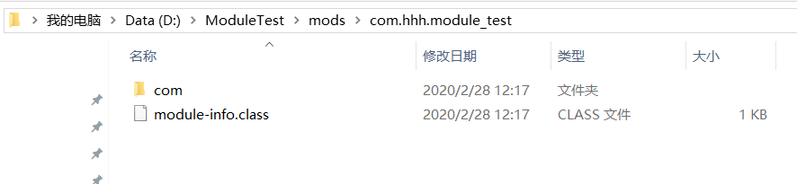

---
title: 命令行下的Java模块化建构、编译、执行
date: 2020-02-28 14:11:00
summary: 本文分享命令行下的Java模块化建构、编译、执行的过程。
tags:
- Java
categories:
- Java
---

# 编写代码

## module-info.java

```java
module com.hhh.module_test {}
```

## ModuleTest.java

```java
package com.hhh.module_test;

public class ModuleTest {
    public static void main(String[] args) {
        System.out.println("Hello World!");
    }
}
```

# 建立工程目录

首先，建立工程目录。
我是选择了D:/ModuleTest作为工程根目录的：


# 创建src文件夹

众所周知，src目录一般用于存放源码：


# 创建模块文件夹

模块名是com.hhh.module_test，我们在src下建立对应的文件夹：


# 逐层建立包结构

先在模块根目录下放置module-info.java文件，再逐层建立包结构。
先是com：


然后是hhh：


然后是module_test：


module_test目录下放置ModuleTest.java：

返回工程根路径下，添加mods文件夹：


这里就空着呗：


# 运行程序

## 编译命令

`javac -d mods/com.hhh.module_test src/com.hhh.module_test/module-info.java src/com.hhh.module_test/com/hhh/module_test/ModuleTest.java`

## 运行命令

`java --module-path mods -m com.hhh.module_test/com.hhh.module_test.ModuleTest`

## 运行截图


# 查看编译后结果





可以发现，与src里确实是一一对应的，而这一切都不是我们手动做的！

# 总结

我们使用比较复杂的javac、java命令分别完成了带有包结构和划分模块的Java程序的编译和执行，亲手操作了一次IDE帮我们省略的工作，虽不复杂，但很棒的不是吗？

我们不能只会使用IDE这种开发工具，越是强大的IDE，往往越是隐去了更多我们的基本操作，对于掌握知识未必是好事。

本文的核心是：手把手地教大家使用命令行完成与Java模块化相关的建构、编译、运行，展示了module的使用方法。
希望能对大家有所帮助吧！
