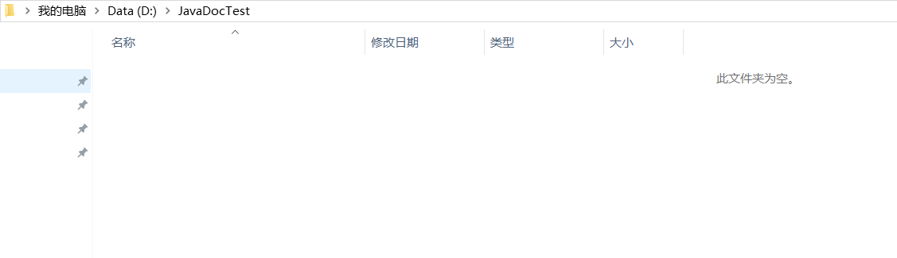
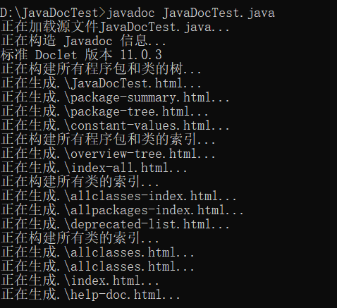
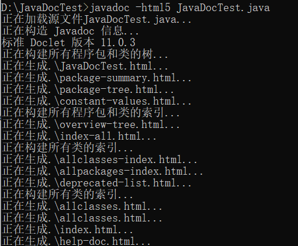
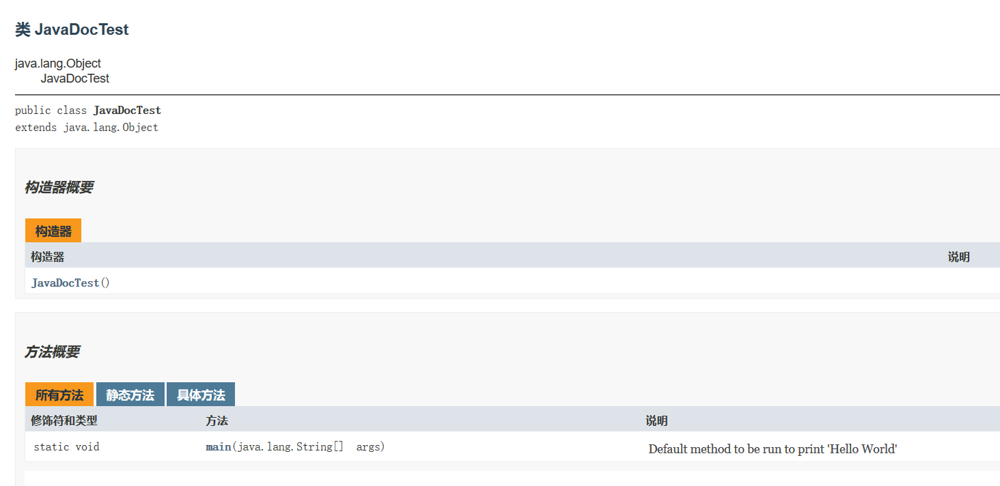
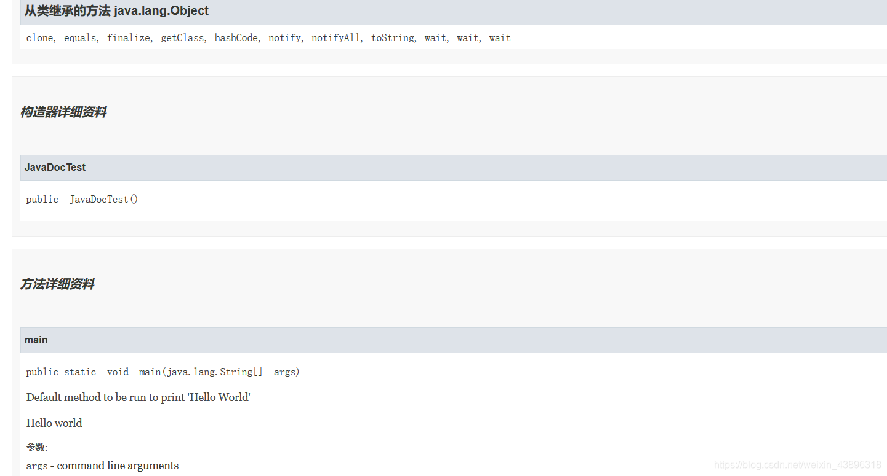

---
title: 命令行生成JavaDoc文档
date: 2020-02-27 23:57:51
summary: 本文分享命令行生成JavaDoc文档的过程。
tags:
- Java
categories:
- Java
---

# 编写简单的文档注释

```java
/**
  * @author BlankSpace
  * @version 1.0
  */
public class JavaDocTest {
    /**
     * Default method to be run to print 'Hello World'
     * <p>Hello world</p>
     * @param args command line arguments
     */
    public static void main(String[] args) {
        System.out.println("Hello World");
    }
}
```

# 创建新的文件夹



# 跳转到指定区域并生成文档

1. `JavaDocTest.java`文件放到`D:\JavaDocTest`路径下。
2. cmd输入`D:` ，从C盘切到D盘。
3. 输入命令`cd D:\JavaDocTest`，跳转到指定路径下。
4. 输入命令`javadoc JavaDocTest.java`，生成文档注释（无须提前编译好）。



# 发现生成的一系列文件


# -html5

在Java8→Java9的时候，加上-html5会表示使用HTML5的规范，但现在我用的Java11，我总觉得是默认了HTML5规范……
我这是写的还算规范，你要是写的不合规范的话，javadoc命令执行的时候会报警告或者报错。



# 查看文档内容




# 查看网页源码

```html
<!DOCTYPE HTML>
<!-- NewPage -->
<html lang="zh">
<head>
<!-- Generated by javadoc (11.0.3) on Thu Feb 27 23:41:28 CST 2020 -->
<title>JavaDocTest</title>
<meta http-equiv="Content-Type" content="text/html; charset=utf-8">
<meta name="dc.created" content="2020-02-27">
<link rel="stylesheet" type="text/css" href="stylesheet.css" title="Style">
<link rel="stylesheet" type="text/css" href="jquery/jquery-ui.css" title="Style">
<script type="text/javascript" src="script.js"></script>
<script type="text/javascript" src="jquery/jszip/dist/jszip.min.js"></script>
<script type="text/javascript" src="jquery/jszip-utils/dist/jszip-utils.min.js"></script>
<!--[if IE]>
<script type="text/javascript" src="jquery/jszip-utils/dist/jszip-utils-ie.min.js"></script>
<![endif]-->
<script type="text/javascript" src="jquery/jquery-3.3.1.js"></script>
<script type="text/javascript" src="jquery/jquery-migrate-3.0.1.js"></script>
<script type="text/javascript" src="jquery/jquery-ui.js"></script>
</head>
<body>
<script type="text/javascript"><!--
    try {
        if (location.href.indexOf('is-external=true') == -1) {
            parent.document.title="JavaDocTest";
        }
    }
    catch(err) {
    }
//-->
var data = {"i0":9};
var tabs = {65535:["t0","\u6240\u6709\u65B9\u6CD5"],1:["t1","\u9759\u6001\u65B9\u6CD5"],8:["t4","\u5177\u4F53\u65B9\u6CD5"]};
var altColor = "altColor";
var rowColor = "rowColor";
var tableTab = "tableTab";
var activeTableTab = "activeTableTab";
var pathtoroot = "./";
var useModuleDirectories = true;
loadScripts(document, 'script');</script>
<noscript>
<div>您的浏览器已禁用 JavaScript。</div>
</noscript>
<header role="banner">
<nav role="navigation">
<div class="fixedNav">
<!-- ========= START OF TOP NAVBAR ======= -->
<div class="topNav"><a id="navbar.top">
<!--   -->
</a>
<div class="skipNav"><a href="#skip.navbar.top" title="跳过导航链接">跳过导航链接</a></div>
<a id="navbar.top.firstrow">
<!--   -->
</a>
<ul class="navList" title="导航">
<li><a href="package-summary.html">程序包</a></li>
<li class="navBarCell1Rev">类</li>
<li><a href="package-tree.html">树</a></li>
<li><a href="deprecated-list.html">已过时</a></li>
<li><a href="index-all.html">索引</a></li>
<li><a href="help-doc.html">帮助</a></li>
</ul>
</div>
<div class="subNav">
<ul class="navList" id="allclasses_navbar_top">
<li><a href="allclasses.html">所有类</a></li>
</ul>
<ul class="navListSearch">
<li><label for="search">SEARCH:</label>
<input type="text" id="search" value="search" disabled="disabled">
<input type="reset" id="reset" value="reset" disabled="disabled">
</li>
</ul>
<div>
<script type="text/javascript"><!--
  allClassesLink = document.getElementById("allclasses_navbar_top");
  if(window==top) {
    allClassesLink.style.display = "block";
  }
  else {
    allClassesLink.style.display = "none";
  }
  //-->
</script>
<noscript>
<div>您的浏览器已禁用 JavaScript。</div>
</noscript>
</div>
<div>
<ul class="subNavList">
<li>概要:&nbsp;</li>
<li>嵌套&nbsp;|&nbsp;</li>
<li>字段&nbsp;|&nbsp;</li>
<li><a href="#constructor.summary">构造器</a>&nbsp;|&nbsp;</li>
<li><a href="#method.summary">方法</a></li>
</ul>
<ul class="subNavList">
<li>详细资料:&nbsp;</li>
<li>字段&nbsp;|&nbsp;</li>
<li><a href="#constructor.detail">构造器</a>&nbsp;|&nbsp;</li>
<li><a href="#method.detail">方法</a></li>
</ul>
</div>
<a id="skip.navbar.top">
<!--   -->
</a></div>
<!-- ========= END OF TOP NAVBAR ========= -->
</div>
<div class="navPadding">&nbsp;</div>
<script type="text/javascript"><!--
$('.navPadding').css('padding-top', $('.fixedNav').css("height"));
//-->
</script>
</nav>
</header>
<!-- ======== START OF CLASS DATA ======== -->
<main role="main">
<div class="header">
<h2 title="类 JavaDocTest" class="title">类 JavaDocTest</h2>
</div>
<div class="contentContainer">
<ul class="inheritance">
<li>java.lang.Object</li>
<li>
<ul class="inheritance">
<li>JavaDocTest</li>
</ul>
</li>
</ul>
<div class="description">
<ul class="blockList">
<li class="blockList">
<hr>
<pre>public class <span class="typeNameLabel">JavaDocTest</span>
extends java.lang.Object</pre>
</li>
</ul>
</div>
<div class="summary">
<ul class="blockList">
<li class="blockList">
<!-- ======== CONSTRUCTOR SUMMARY ======== -->
<section role="region">
<ul class="blockList">
<li class="blockList"><a id="constructor.summary">
<!--   -->
</a>
<h3>构造器概要</h3>
<table class="memberSummary">
<caption><span>构造器</span><span class="tabEnd">&nbsp;</span></caption>
<tr>
<th class="colFirst" scope="col">构造器</th>
<th class="colLast" scope="col">说明</th>
</tr>
<tr class="altColor">
<th class="colConstructorName" scope="row">`<span class="memberNameLink"><a href="#%3Cinit%3E()">JavaDocTest</a></span>()`</th>
<td class="colLast">&nbsp;</td>
</tr>
</table>
</li>
</ul>
</section>
<!-- ========== METHOD SUMMARY =========== -->
<section role="region">
<ul class="blockList">
<li class="blockList"><a id="method.summary">
<!--   -->
</a>
<h3>方法概要</h3>
<table class="memberSummary">
<caption><span id="t0" class="activeTableTab"><span>所有方法</span><span class="tabEnd">&nbsp;</span></span><span id="t1" class="tableTab"><span><a href="javascript:show(1);">静态方法</a></span><span class="tabEnd">&nbsp;</span></span><span id="t4" class="tableTab"><span><a href="javascript:show(8);">具体方法</a></span><span class="tabEnd">&nbsp;</span></span></caption>
<tr>
<th class="colFirst" scope="col">修饰符和类型</th>
<th class="colSecond" scope="col">方法</th>
<th class="colLast" scope="col">说明</th>
</tr>
<tr id="i0" class="altColor">
<td class="colFirst">`static void`</td>
<th class="colSecond" scope="row">`<span class="memberNameLink"><a href="#main(java.lang.String%5B%5D)">main</a></span>&#8203;(java.lang.String[]&nbsp;args)`</th>
<td class="colLast">
<div class="block">Default method to be run to print 'Hello World'</div>
</td>
</tr>
</table>
<ul class="blockList">
<li class="blockList"><a id="methods.inherited.from.class.java.lang.Object">
<!--   -->
</a>
<h3>从类继承的方法&nbsp;java.lang.Object</h3>
`clone, equals, finalize, getClass, hashCode, notify, notifyAll, toString, wait, wait, wait`</li>
</ul>
</li>
</ul>
</section>
</li>
</ul>
</div>
<div class="details">
<ul class="blockList">
<li class="blockList">
<!-- ========= CONSTRUCTOR DETAIL ======== -->
<section role="region">
<ul class="blockList">
<li class="blockList"><a id="constructor.detail">
<!--   -->
</a>
<h3>构造器详细资料</h3>
<a id="&lt;init&gt;()">
<!--   -->
</a>
<ul class="blockListLast">
<li class="blockList">
<h4>JavaDocTest</h4>
<pre>public&nbsp;JavaDocTest()</pre>
</li>
</ul>
</li>
</ul>
</section>
<!-- ============ METHOD DETAIL ========== -->
<section role="region">
<ul class="blockList">
<li class="blockList"><a id="method.detail">
<!--   -->
</a>
<h3>方法详细资料</h3>
<a id="main(java.lang.String[])">
<!--   -->
</a>
<ul class="blockListLast">
<li class="blockList">
<h4>main</h4>
<pre class="methodSignature">public static&nbsp;void&nbsp;main&#8203;(java.lang.String[]&nbsp;args)</pre>
<div class="block">Default method to be run to print 'Hello World'
 <p>Hello world</p></div>
<dl>
<dt><span class="paramLabel">参数:</span></dt>
<dd>`args` - command line arguments</dd>
</dl>
</li>
</ul>
</li>
</ul>
</section>
</li>
</ul>
</div>
</div>
</main>
<!-- ========= END OF CLASS DATA ========= -->
<footer role="contentinfo">
<nav role="navigation">
<!-- ======= START OF BOTTOM NAVBAR ====== -->
<div class="bottomNav"><a id="navbar.bottom">
<!--   -->
</a>
<div class="skipNav"><a href="#skip.navbar.bottom" title="跳过导航链接">跳过导航链接</a></div>
<a id="navbar.bottom.firstrow">
<!--   -->
</a>
<ul class="navList" title="导航">
<li><a href="package-summary.html">程序包</a></li>
<li class="navBarCell1Rev">类</li>
<li><a href="package-tree.html">树</a></li>
<li><a href="deprecated-list.html">已过时</a></li>
<li><a href="index-all.html">索引</a></li>
<li><a href="help-doc.html">帮助</a></li>
</ul>
</div>
<div class="subNav">
<ul class="navList" id="allclasses_navbar_bottom">
<li><a href="allclasses.html">所有类</a></li>
</ul>
<div>
<script type="text/javascript"><!--
  allClassesLink = document.getElementById("allclasses_navbar_bottom");
  if(window==top) {
    allClassesLink.style.display = "block";
  }
  else {
    allClassesLink.style.display = "none";
  }
  //-->
</script>
<noscript>
<div>您的浏览器已禁用 JavaScript。</div>
</noscript>
</div>
<div>
<ul class="subNavList">
<li>概要:&nbsp;</li>
<li>嵌套&nbsp;|&nbsp;</li>
<li>字段&nbsp;|&nbsp;</li>
<li><a href="#constructor.summary">构造器</a>&nbsp;|&nbsp;</li>
<li><a href="#method.summary">方法</a></li>
</ul>
<ul class="subNavList">
<li>详细资料:&nbsp;</li>
<li>字段&nbsp;|&nbsp;</li>
<li><a href="#constructor.detail">构造器</a>&nbsp;|&nbsp;</li>
<li><a href="#method.detail">方法</a></li>
</ul>
</div>
<a id="skip.navbar.bottom">
<!--   -->
</a></div>
<!-- ======== END OF BOTTOM NAVBAR ======= -->
</nav>
</footer>
</body>
</html>
```

# 总结

虽然我们使用javadoc命令完成了整个的文档生成，但我们至少亲手操作了一次IDE帮我们省略的工作，虽不复杂，但很棒的不是吗？

我们不能只会使用IDE这种开发工具，越是强大的IDE，往往越是隐去了更多我们的基本操作，对于掌握知识未必是好事。
