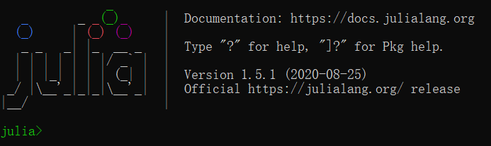
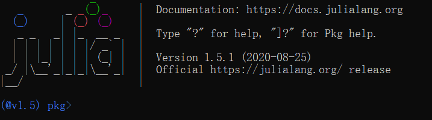
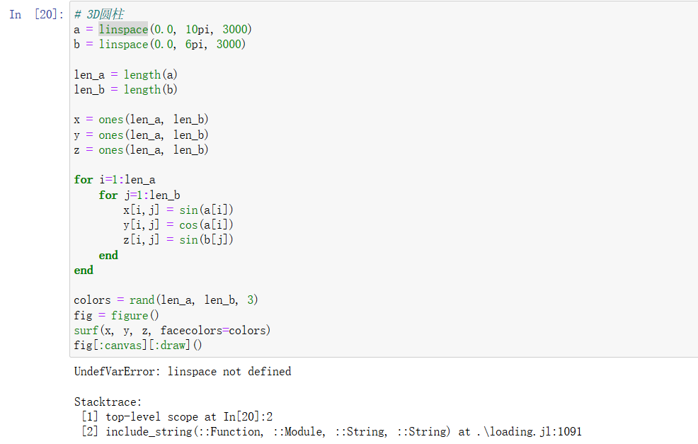
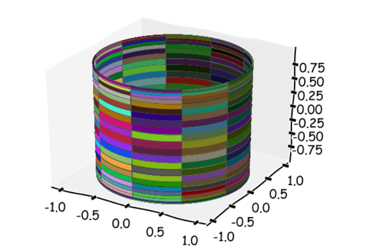

---
title: Julia程序开发注意事项
date: 2020-09-13 10:27:33
summary: 本文分享一些Julia程序开发的注意事项。
tags:
- Julia
categories:
- 开发技术
---

# Julia更改Pkg存放位置

Julia的Pkg下载包默认下载到user目录下的`.julia`，可能会导致C盘占用过大，建议更改存放路径。

解决方法：设置一个环境变量，名为：`JULIA_DEPOT_PATH`，值为：`你需要的路径`。

## 背景

这篇文章描述问题的前提是：
1. 已经熟悉Julia库的下载和使用
2. 考虑到C盘空间的问题，我将Julia的安装路径调到了D盘

# Julia配置Pkg下载镜像

## 报错信息

报错信息：<font color="red">ERROR: SystemError: opening file "D:\\Julia\\julia\\Julia 1.5.1\\pkgs\\registries\\General\\Registry</font>

## 错误原因分析和解决方法

对于这个错误，也不用专门查什么资料，说白了还是下载不了东西，需要配置镜像。

配置镜像的话，其实按照网上很多的说法是不能成功的，而且有个坑是，你的本地仓库已经下载了一些东西的情况下，没法继续的。

想要解决这个问题，首先要删掉你的仓库文件夹。

我的文件夹就是：`D:\Julia\julia\Julia 1.5.1\pkgs\registries\General`，直接删掉。（有的人可能是在用户目录的`.julia\registries\General`）

然后命令行输入`julia`：


直接输入`]`：


在这个情况下输入：`registry add https://mirrors.ustc.edu.cn/julia/registries/General.git/`，然后输入：`add https://mirrors.ustc.edu.cn/julia/PkgMirrors.jl.git`，等运行完毕就解决了问题。

此后，安装诸如`IJulia`等库就会很顺畅。

## PyCall安装

PyCall安装失败的读者建议读读[这个帖子](https://discourse.juliacn.com/t/topic/2317)。

# Julia异常修复

## ERROR: UndefVarError: linspace not defined

依据如下代码：

```matlab
using PyPlot

a = linspace(0.0, 10pi, 3000)
b = linspace(0.0, 6pi, 3000)

len_a = length(a)
len_b = length(b)

x = ones(len_a, len_b)
y = ones(len_a, len_b)
z = ones(len_a, len_b)

for i=1:len_a #循环创建数据
    for j=1:len_b
        x[i,j] = sin(a[i])
        y[i,j] = cos(a[i])
        z[i,j] = sin(b[j])
    end
end

colors = rand(len_a, len_b, 3)
fig = figure()
surf(x, y, z, facecolors=colors) 
fig[:canvas][:draw]()
```

执行时报错：


改正方法是什么呢？

=> 将`linspace`改成`LinRange`即可：
```julia
a = LinRange(0.0, 10pi, 3000)
b = LinRange(0.0, 6pi, 3000)
```

运行效果：

