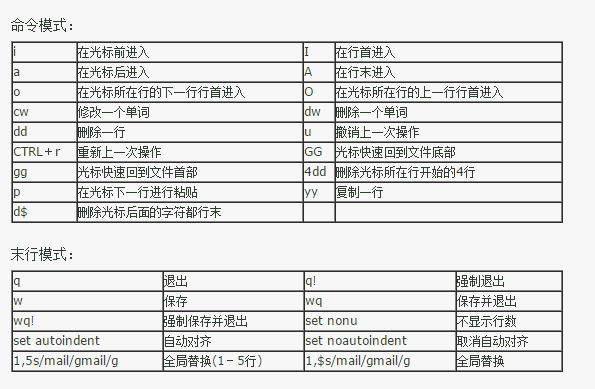

# XXX is not in the sudoers file ……

网上资料都告诉大家，解决方法是改`root    ALL=(ALL)       ALL`那里，可能有的新手看不懂，这里解释一下。

在终端执行sudo命令时，Linux提示：<font color="red">"XXX is not in the sudoers file ……"</font>

原因是没有权限进行sudo，解决方法如下：

1. 切换到超级用户：#su （然后输入root的密码，即可登录）
2. 打开/etc/sudoers文件：#visudo
3. 修改文件内容（后面会说）
4. 退出超级用户：#exit

有关修改文件，初学者可能不能接受这种纯命令行的方式。
做法是，找到"<code>root    ALL=(ALL)       ALL</code>"一行，在下面插入新的一行，内容是"<code>username   ALL=(ALL)       ALL</code>"，然后在vim键入命令"<code>:wq!</code>"保存并退出。
注：这个文件是只读的，不加“!”保存会失败。

## How to write and save？

最难的是初学者不知道怎么才能修改这个文件并保存。
编辑的时候存在三种模式：
- 一般模式：一进去就是这种状态，其实是只读的，不可写。
- 编辑模式：在一般模式下按<code>i</code>就会进入编辑模式，此时就可以改写文件内容，按ESC可回到一般模式。
- 命令模式：在一般模式下按<code>:</code>就会进入命令模式，左下角会有一个冒号出现，此时可以敲入命令并执行。（比如最后的保存啊，最初啊啥的）



# E: dpkg 被中断，您必须手工运行 'sudo dpkg --configure -a' 解决此问题

Linux执行命令`sudo apt install curl`报错：
<font color="red">E: dpkg 被中断，您必须手工运行 ‘sudo dpkg --configure -a’ 解决此问题。</font>

系统版本：Ubuntu 20.04 LTS

解决方法：命令行三步走

```shell
sudo rm /var/lib/dpkg/updates/*
sudo apt-get update
sudo apt-get upgrade
```

# curl: (23) Failure writing output to destination

Linux执行`curl`命令报错：`curl: (23) Failure writing output to destination`

操作系统：Ubuntu 20.04 LTS

解决方法：`snap curl`没用，应该卸载并用`apt`重装：

```shell
sudo snap remove curl
sudo apt install curl
```

至此，问题解决。
