---
title: Linux服务器远程连接
date: 2022-11-09 11:10:08
summary: 本文介绍各种工具连接远程Linux服务器的方法。
tags:
- Linux
categories:
- Linux
---

# Linux修改初始密码

关键命令：`passwd <usrname>`

```shell
<usrname>@<usrname-laptoppasswd>:~$ passwd <usrname>
Changing password for <username>.
Current password:
New password:
Retype new password:
passwd: password updated successfully
<usrname>@<usrname-laptoppasswd>:
```

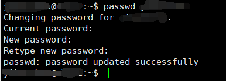

# SSH终端连接服务器

尝试通过ssh连接服务器：
```shell
ssh -i <your_rsa_path> <your_username>@<server_ip> -p <server_port>
```

rsa秘钥请找服务器管理员获取。

连接过程中，常见错误是：<font color="red">Permissions for 'xxx' are too open.</font>

<font color="red">@@@@@@@@@@@@@@@@@@@@@@@@@@@@@@@@@@@@@@@@@@@@@@@@@@@@@@@@@@@</font>
<font color="red">@         WARNING: UNPROTECTED PRIVATE KEY FILE!          @</font>
<font color="red">@@@@@@@@@@@@@@@@@@@@@@@@@@@@@@@@@@@@@@@@@@@@@@@@@@@@@@@@@@@</font>
<font color="red">Permissions for '\<your\_rsa\_path\>' are too open.</font>
<font color="red">It is required that your private key files are NOT accessible by others.</font>
<font color="red">This private key will be ignored.</font>

解决方法：[\_\_万波\_\_的CSDN博客](https://blog.csdn.net/u010571709/article/details/121990664)

连接成功后，可以通过`logout`断开连接。

# Xshell连接服务器

Xshell和Xftp的免费版可以从[官网](https://www.xshell.com/zh/free-for-home-school/)直接申请下载。

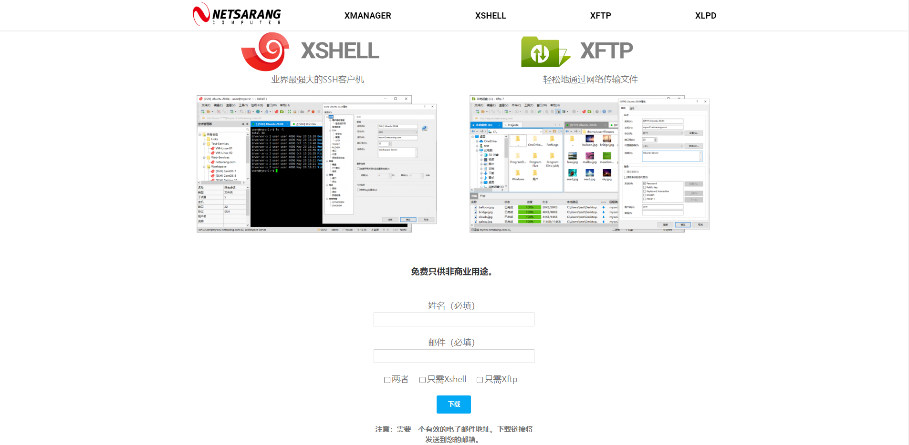

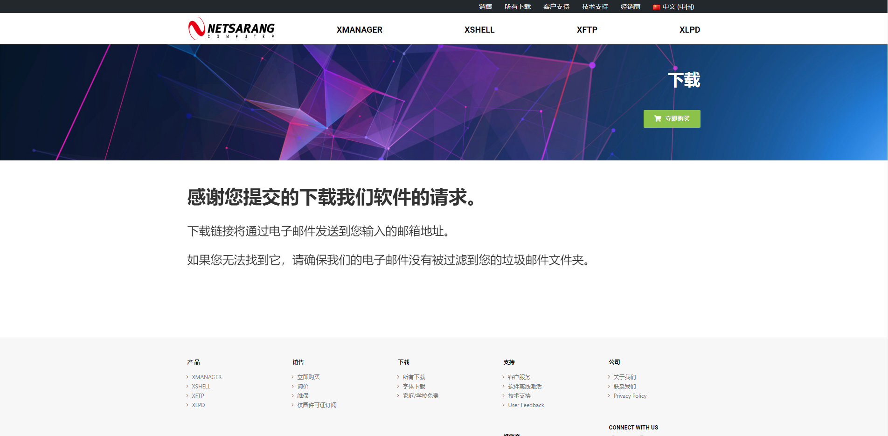


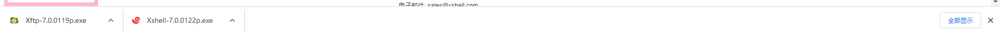

通过Xshell可以通过命令行操作远程服务器。

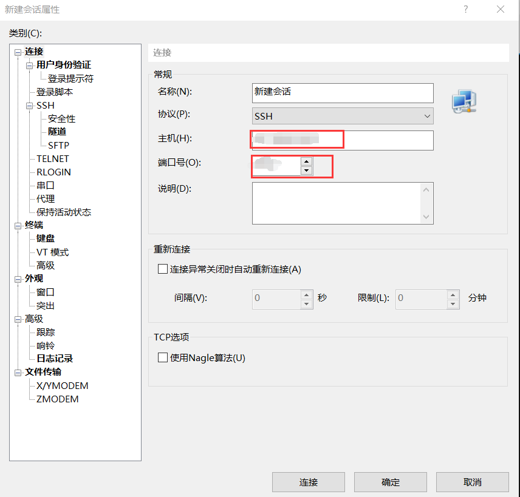

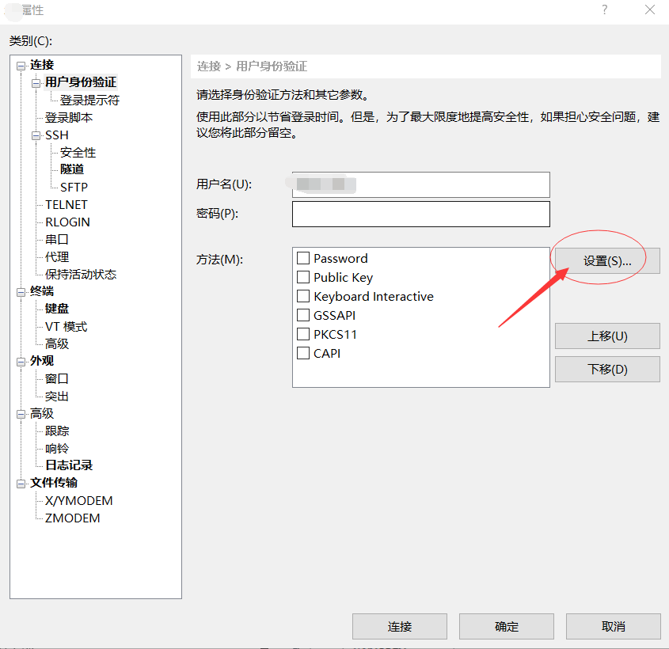

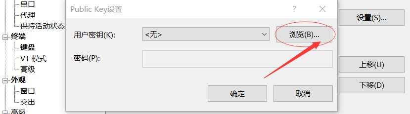

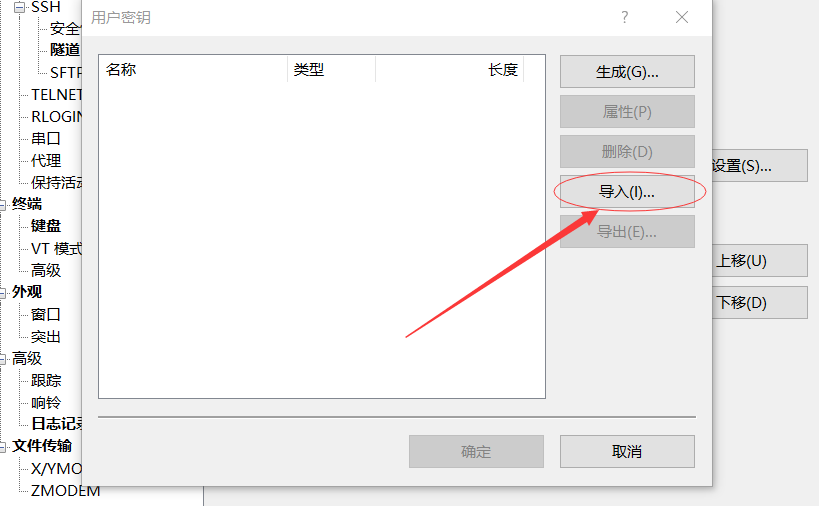

这里需要rsa秘钥`OPENSSH PRIVATE KEY`

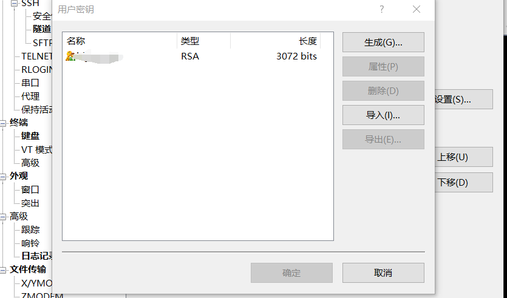

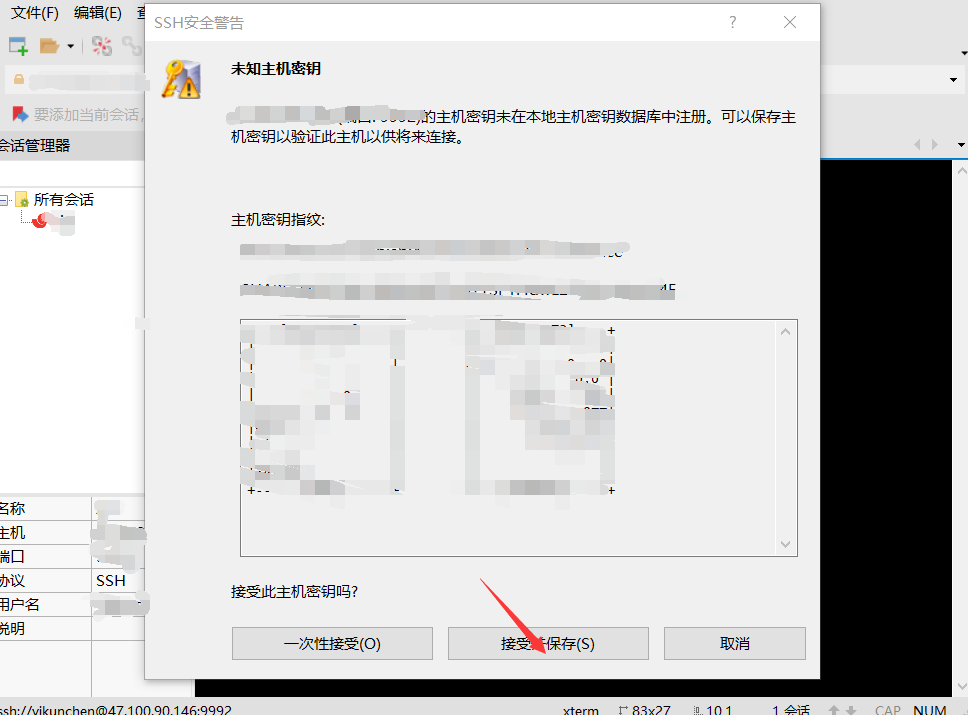

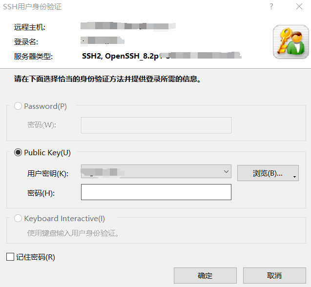

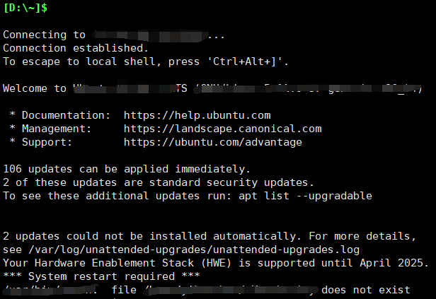

# Xftp连接服务器

通过Xftp可以在本机与远程服务器间传输文件。

Xftp配置方法与Xshell相同，不赘述。


# VSCode连接服务器

前文介绍Xshell等工具连接服务器的方法，JetBrains全家桶的连接方法与之类似，但VSCode连接服务器的方法与之不同，本文介绍之。

在VSCode连接服务器前，应该先尝试通过ssh连接服务器：
```shell
ssh -i <your_rsa_path> <your_username>@<server_ip> -p <server_port>
```

rsa秘钥请找服务器管理员获取。

连接过程中，常见错误是：<font color="red">Permissions for 'xxx' are too open.</font>

<font color="red">@@@@@@@@@@@@@@@@@@@@@@@@@@@@@@@@@@@@@@@@@@@@@@@@@@@@@@@@@@@</font>
<font color="red">@         WARNING: UNPROTECTED PRIVATE KEY FILE!          @</font>
<font color="red">@@@@@@@@@@@@@@@@@@@@@@@@@@@@@@@@@@@@@@@@@@@@@@@@@@@@@@@@@@@</font>
<font color="red">Permissions for '\<your\_rsa\_path\>' are too open.</font>
<font color="red">It is required that your private key files are NOT accessible by others.</font>
<font color="red">This private key will be ignored.</font>

解决方法：[\_\_万波\_\_的CSDN博客](https://blog.csdn.net/u010571709/article/details/121990664)

连接成功后，可以通过`logout`断开连接。

接下来配置VSCode。

VSCode安装`Remote - SSH`插件：

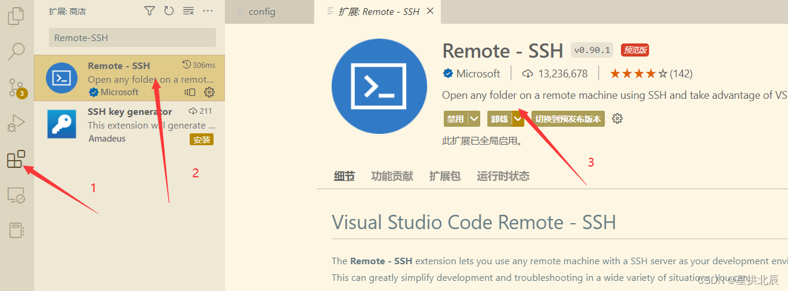

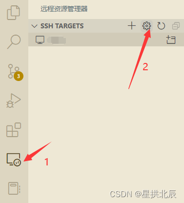

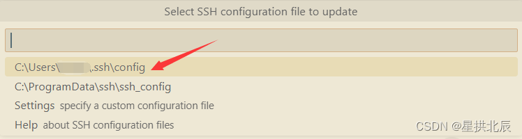

按以下格式插入host配置：

```text
Host <server_name>
  HostName <server_ip>
  User <your_username>
  Port <server_port>
  IdentityFile <your_rsa_path>
  ForwardAgent yes
```

保存后出现：

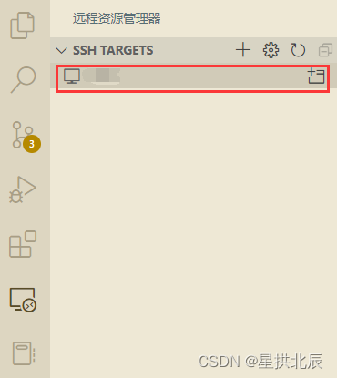

下面开始连接服务器：

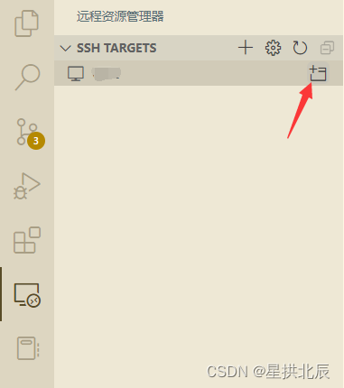

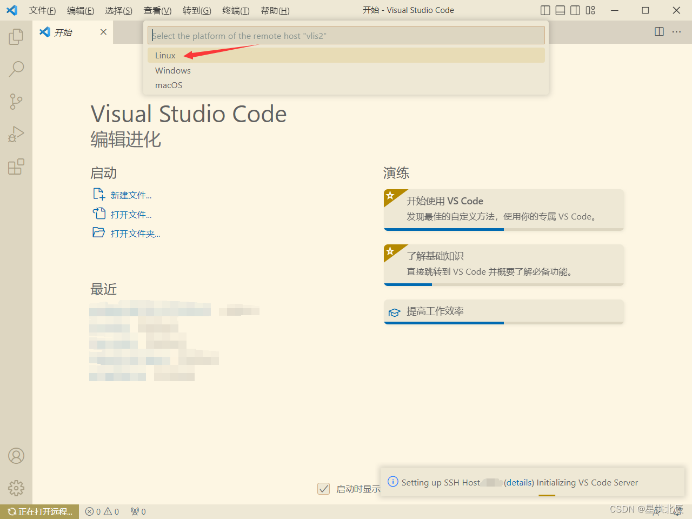

等待连接成功即可！
