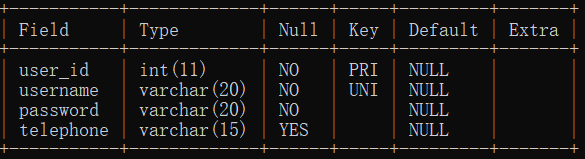
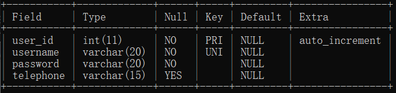

---
title: 向已有主键的表附加主键属性的自动编号
date: 2020-09-26 19:22:23
summary: 本文分享向已有主键的表附加主键属性的自动编号的经验。
tags:
- MySQL
categories:
- MySQL
---

在使用JDBC的时候，有一句SQL是这么写的：<code>insert into user_login (username, password, telephone) values (?,?,?);</code> ，可是报错：
<font color="red">java.sql.SQLException: Field 'user_id' doesn't have a default value
  at com.mysql.cj.jdbc.exceptions.SQLError.createSQLException(SQLError.java:129)
  at com.mysql.cj.jdbc.exceptions.SQLError.createSQLException(SQLError.java:97)
  at com.mysql.cj.jdbc.exceptions.SQLExceptionsMapping.translateException(SQLExceptionsMapping.java:122)
  at com.mysql.cj.jdbc.ClientPreparedStatement.executeInternal(ClientPreparedStatement.java:953)
  at com.mysql.cj.jdbc.ClientPreparedStatement.executeUpdateInternal(ClientPreparedStatement.java:1092)
  at com.mysql.cj.jdbc.ClientPreparedStatement.executeUpdateInternal(ClientPreparedStatement.java:1040)
  at com.mysql.cj.jdbc.ClientPreparedStatement.executeLargeUpdate(ClientPreparedStatement.java:1347)
  at com.mysql.cj.jdbc.ClientPreparedStatement.executeUpdate(ClientPreparedStatement.java:1025)
  at com.xxx.login.dao.UserDaoImpl.addUser(UserDaoImpl.java:29)
  at com.xxx.login.service.UserServiceImpl.register(UserServiceImpl.java:30)
  at com.xxx.login.servlet.RegisterServlet.doGet(RegisterServlet.java:23)
  at com.xxx.login.servlet.RegisterServlet.doPost(RegisterServlet.java:44)
  at javax.servlet.http.HttpServlet.service(HttpServlet.java:660)
  at javax.servlet.http.HttpServlet.service(HttpServlet.java:741)
  at org.apache.catalina.core.ApplicationFilterChain.internalDoFilter(ApplicationFilterChain.java:231)
  at org.apache.catalina.core.ApplicationFilterChain.doFilter(ApplicationFilterChain.java:166)
  at org.apache.tomcat.websocket.server.WsFilter.doFilter(WsFilter.java:53)
  at org.apache.catalina.core.ApplicationFilterChain.internalDoFilter(ApplicationFilterChain.java:193)
  at org.apache.catalina.core.ApplicationFilterChain.doFilter(ApplicationFilterChain.java:166)
  at org.apache.catalina.core.StandardWrapperValve.invoke(StandardWrapperValve.java:200)
  at org.apache.catalina.core.StandardContextValve.invoke(StandardContextValve.java:96)
  at org.apache.catalina.authenticator.AuthenticatorBase.invoke(AuthenticatorBase.java:490)
  at org.apache.catalina.core.StandardHostValve.invoke(StandardHostValve.java:139)
  at org.apache.catalina.valves.ErrorReportValve.invoke(ErrorReportValve.java:92)
  at org.apache.catalina.valves.AbstractAccessLogValve.invoke(AbstractAccessLogValve.java:678)
  at org.apache.catalina.core.StandardEngineValve.invoke(StandardEngineValve.java:74)
  at org.apache.catalina.connector.CoyoteAdapter.service(CoyoteAdapter.java:343)
  at org.apache.coyote.http11.Http11Processor.service(Http11Processor.java:408)
  at org.apache.coyote.AbstractProcessorLight.process(AbstractProcessorLight.java:66)
  at org.apache.coyote.AbstractProtocol\$ConnectionHandler.process(AbstractProtocol.java:836)
  at org.apache.tomcat.util.net.NioEndpoint\$SocketProcessor.doRun(NioEndpoint.java:1747)
  at org.apache.tomcat.util.net.SocketProcessorBase.run(SocketProcessorBase.java:49)
  at java.base/java.util.concurrent.ThreadPoolExecutor.runWorker(ThreadPoolExecutor.java:1128)
  at java.base/java.util.concurrent.ThreadPoolExecutor\$Worker.run(ThreadPoolExecutor.java:628)
  at org.apache.tomcat.util.threads.TaskThread\$WrappingRunnable.run(TaskThread.java:61)
  at java.base/java.lang.Thread.run(Thread.java:834)</font>

单独回到命令行进行insert测试，发现错误原因是没有默认值。

之后又尝试了<code>alter table user_login alter user_id set default 10005;</code> ，这种附加default的方式被证实在第二次插值的时候会因为主键不允许重复值而报错，所以不可行。

那我们可以考虑加入auto_increment：<code>alter table user_login auto_increment=1;</code>，执行后得到<code>Query OK, 0 rows affected</code>，但还是不能解决问题，有和没有一样。

当然了，我们稍加分析可知default与primary_key是不兼容的，所以要去掉，此时使用<code>desc user_login;</code>命令查询表结构，如下图：



果然是因为auto_increment看似加进去实则没加进去导致的。
那问题就在于怎么加这个auto_increment？
我们直接alter是无效的，而删表并重建，是不现实的。
似乎很纠结、很困难，下面说一下怎么写命令：
<code>alter table user_login modify column \`user_id\` int not null auto_increment;</code>
如果我们这么处理的话，除了主键以外把整列重新指定，就能解决问题：



一定不要再附带primary_key，只因为主键已经被指定。

验证：

```sql
mysql> insert into user_login (username, password, telephone) values('XiaoLaJiao', '12123', '12123');
Query OK, 1 row affected (0.15 sec)

mysql> insert into user_login (username, password, telephone) values('XiaoCaiJi', '12123', '12123');
Query OK, 1 row affected (0.14 sec)
```

再开一下Navicat，证明确实insert成功，这样我们就化解了这个问题。

更多情况，[请戳此处](https://blog.csdn.net/plg17/article/details/86748086)！
文中讲解了三种情况如何去处理，比本文覆盖面更广；本文胜在详细和复盘各种尝试过程。
