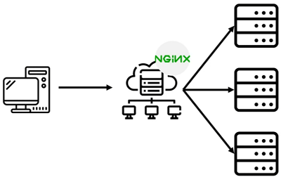

# Nginx

Nginx是一款轻量级的Web 服务器/反向代理服务器及电子邮件（IMAP/POP3）代理服务器，在BSD-like 协议下发行。其特点是占有内存少，并发能力强，事实上nginx的并发能力在同类型的网页服务器中表现较好。

Nginx官网：[http://nginx.org](http://nginx.org)
Nginx源码：[https://github.com/nginx/nginx](https://github.com/nginx/nginx)



Nginx常见命令：
- `nginx -s stop`：快速关闭Nginx，可能不保存相关信息，并迅速终止web服务。
- `nginx -s quit`：平稳关闭Nginx，保存相关信息，有安排的结束web服务。
- `nginx -s reload`：因改变了Nginx相关配置，需要重新加载配置而重载。
- `nginx -s reopen`：重新打开日志文件。
- `nginx -c filename`：为 Nginx 指定一个配置文件，来代替缺省的。
- `nginx -t`：不运行，仅仅测试配置文件。nginx 将检查配置文件的语法的正确性，并尝试打开配置文件中所引用到的文件。
- `nginx -v`：显示 nginx 的版本。
- `nginx -V`：显示 nginx 的版本，编译器版本和配置参数。

# Nginx搭建文件服务器

搭建流程：
1. [下载](http://nginx.org/en/download.html)并解压Nginx压缩包
2. 切换到`nginx-<version>`根目录下，查看Nginx版本：`nginx.exe -v`
3. 修改`/nginx-<version>/conf/nginx.conf`配置文件：
    ```javascript
    autoindex on;# 显示目录
    autoindex_exact_size on;# 显示文件大小
    autoindex_localtime on;# 显示文件时间

    server {
        charset      utf-8,gbk; # windows 服务器下设置后，依然乱码，暂时无解
        listen       9050 default_server;
        listen       [::]:9050 default_server;
        server_name  _;
        root         ../root/;
    }
    ```
4. 检查Nginx配置文件语法正确性：`nginx.exe -t -c conf/nginx.conf`
5. 启动Nginx：`nginx.exe -c conf/nginx.conf`
6. 通过[http://127.0.0.1:9050](http://127.0.0.1:9050)访问文件服务器
7. 关闭Nginx：`nginx.exe -s stop`

媒体资源获取：
- [音频获取](https://pixabay.com/music/search/short)
- [视频获取](https://ssyoutube.com/en307)
