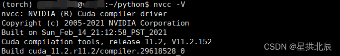
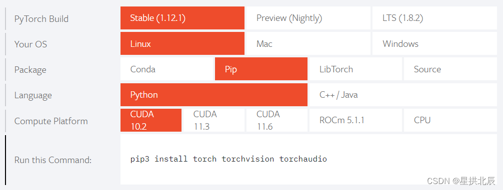

---
title: Conda安装TensorFlow和PyTorch的GPU支持包
date: 2022-08-26 00:13:41
summary: 本文介绍基于Conda(Anaconda/Miniconda)的TensorFlow和PyTorch的GPU支持包安装方法(conda/pip)。
tags:
- Python
- PyTorch
- TensorFlow
- Anaconda
categories:
- Python
---

本文介绍基于Conda(Anaconda/Miniconda)的TensorFlow和PyTorch的GPU支持包安装方法(conda/pip)

# Conda基本操作

这里的Conda可以包括Miniconda和Anaconda，是一个统称。

配置conda镜像：
```shell
vim ~/.condarc
```

内容：
```shell
channels:
  - defaults
show_channel_urls: true
default_channels:
  - https://mirrors.tuna.tsinghua.edu.cn/anaconda/pkgs/main
  - https://mirrors.tuna.tsinghua.edu.cn/anaconda/pkgs/r
  - https://mirrors.tuna.tsinghua.edu.cn/anaconda/pkgs/msys2
custom_channels:
  conda-forge: https://mirrors.tuna.tsinghua.edu.cn/anaconda/cloud
  msys2: https://mirrors.tuna.tsinghua.edu.cn/anaconda/cloud
  bioconda: https://mirrors.tuna.tsinghua.edu.cn/anaconda/cloud
  menpo: https://mirrors.tuna.tsinghua.edu.cn/anaconda/cloud
  pytorch: https://mirrors.tuna.tsinghua.edu.cn/anaconda/cloud
  simpleitk: https://mirrors.tuna.tsinghua.edu.cn/anaconda/cloud
```

配置镜像还可以：
```shell
conda config --add channels <url>
```

查看当前conda镜像：
```shell
conda config --show channels
```

删除全部conda镜像：
```shell
conda config --remove-key channels
```

删除指定conda镜像：
```shell
conda config --remove channels <url>
```

禁止进入服务器自动启动conda(base)虚拟环境：
```shell
conda config --set auto_activate_base false
```

创建名称为`<name>`的conda虚拟环境(Python版本为3.7)：

```shell
conda create --name <name> python==3.7
```

启用名称为`<name>`的conda虚拟环境：
```shell
conda activate <name>
```

退出conda虚拟环境:
```shell
conda deactivate
```

删除名称为`<name>`的conda虚拟环境：
```shell
conda remove -n <name> --all
```

# TensorFlow安装

可以选择conda安装和pip安装，个人推荐pip安装。

conda搜索TensorFlow的GPU版本：

```shell
conda search tensorflow-gpu
```

conda安装TensorFlow的GPU版本：

```shell
conda install tensorflow-gpu==2.2.0
```

pip安装TensorFlow的GPU版本：

```shell
pip install tensorflow-gpu
```

# PyTorch安装

可以选择conda安装和pip安装，个人推荐pip安装。

conda搜索PyTorch的GPU版本：
```shell
conda search torch-gpu
```

conda安装PyTorch的GPU版本(版本1.2.0)：
```shell
conda install torch-gpu==1.2.0
```

CUDA版本查看：
```shell
nvcc -V
```



pip安装PyTorch的GPU版本：
```shell
pip install torch torchvision torchaudio
```

pip安装PyTorch的命令应该去[官网](https://pytorch.org)查看：



pip安装不顺可以直接下载[.whl](http://download.pytorch.org/whl)文件，本地`pip install`。
