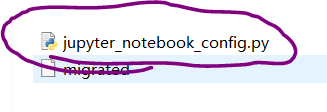
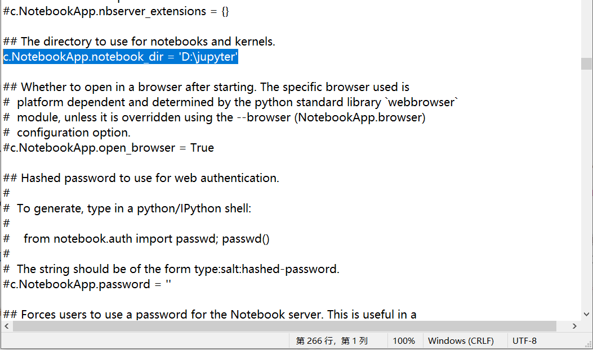
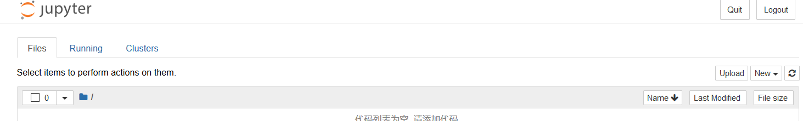

---
title: JupyterNotebook路径配置
date: 2020-09-13 10:03:29
summary: 本文分享JupyterNotebook路径配置方法。
tags:
- Python
- Jupyter
categories:
- Python
---

## 关于安装

安装Anaconda即可，或者也可以使用pip安装JupyterNotebook。

## 启动Jupyter

命令行输入`jupyter notebook`，如果你有默认浏览器的话，就可以弹出Jupyter界面。（启动时可以自己设置端口参数）

刚刚启动的时候，会有很多很多文件夹，因涉及个人隐私，此处不附截图。

第一次启动难免看到这些，不要慌，正常。

解决方法是首先找到C盘你的User目录下的`.jupyter`目录，找到`jupyter_notebook_config.py`：

如果你没有看到的话，也别慌，命令行输入`jupyter notebook --generate-config`，命令行会告诉你就在那个位置，然后你再去看，就有了。

文本编辑器或者IDLE打开这个文件，搜索`/c.NotebookApp.notebook_dir`，找到一行`#/c.NotebookApp.notebook_dir=‘’`。

这是一个Python文件，学过Python我们都知道`#`是注释，所以删掉这个注释符号，然后在引号里添加你自己指定的Jupyter文件存放地址。

以我自己的为例：`c.NotebookApp.notebook_dir = 'D:\jupyter'`

保存即可。

重新运行`jupyter notebook`：

这就是我们要的效果。

至此，路径配置完成。
