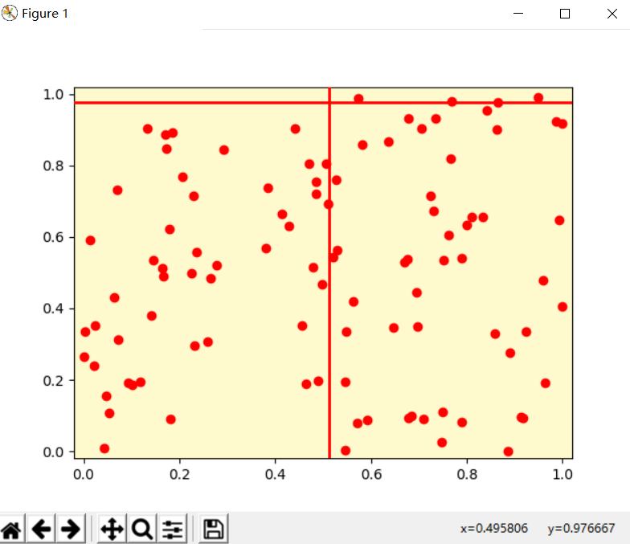
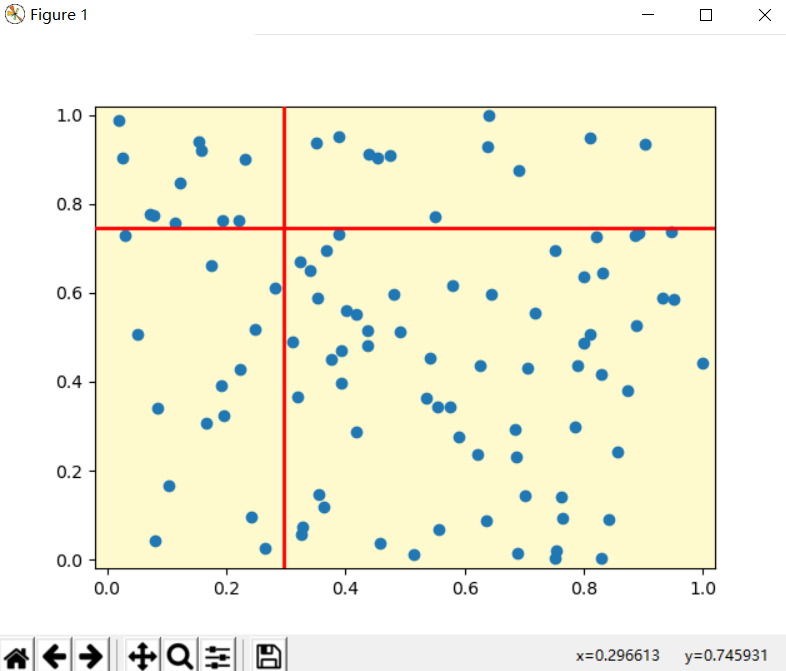

---
title: Matplotlib光标Cursor移动
date: 2020-02-15 19:02:14
summary: 本文分享Matplotlib的Cursor光标移动实现方法。
tags:
- Python
- Matplotlib
categories:
- Python
---

# Cursor

Cursor水平和/或垂直跨越轴并随鼠标光标移动。 
- `ax` : Axes to attach the cursor to.
- `horizOn`：To draw the horizontal line(default: True). ***(Optional Parameter)***
- `vertOn`：To draw the vertical line(default: True). ***(Optional Parameter)***
- `useblit`：Use blitting for faster drawing if supported by the backend(default: False). ***(Optional Parameter)***
- `**lineprops`：Line properties to control appearance of the lines(linewidth, color). ***(Optional Parameter)***

# 实现代码

```python
import matplotlib.pyplot as plt
import numpy as np
from matplotlib.widgets import Cursor

lineprops = dict(color="red", lw=2)

fig, ax = plt.subplots(1, 1, subplot_kw=dict(facecolor="lemonchiffon"))

x = np.random.random(100)
y = np.random.random(100)
ax.scatter(x, y, marker="o", color="red")
ax.set_xlim(-0.02, 1.02)
ax.set_ylim(-0.02, 1.02)

cursor = Cursor(ax, useblit=True, **lineprops)

plt.show()
```

# 结果演示



# 异常情况

我们利用了Matplotlib的类Cursor，向图形添加一组纵横交叉的直线，从而实现图形界面中任何位置的数值定位的可视化效果。

但使用PyCharm，绘图结果在右侧的部分：


这固然是需要绘制的图，但确实静态的，没有实现所谓的“定位可视化”。

## 解决方法

1. 打开 File → Settings，选择最下面的Tools：

2. 接下来，展开Tools，看到 Python Scientific：

3. 点击Python Scientific，右边有一个被选中的对勾，这不是我们需要的，勾掉就好：

4. 接下来，右侧的边栏图案就单独分离出来了：

5. 我们重新运行程序，就得到了需要的结果：

