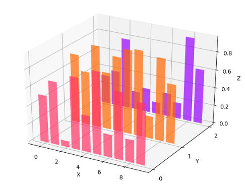

---
title: Matplotlib分层绘制投影柱状图
date: 2020-02-12 20:43:26
summary: 本文分享Matplotlib分层绘制投影柱状图的过程。
tags:
- Python
- Matplotlib
categories:
- Python
---

# 问题描述

我们在2D平面上可以绘制柱状图，如果要绘制多组数据的柱状图，则可以尝试使用**堆叠柱状图**或者**并列柱状图**。
但是，如果数据量过多，那么使用这两种柱状图展示数据的可视化效果就不是很理想。
这时候，我们可以先将多组数据的柱状图**投射到指定平面上**，再借助指定坐标轴将投射后的柱状图**分层**，从而在3D空间里实现**多组数据的分层展示**的2D柱状图的绘制任务。

# Matplotlib编程实现

```python
import matplotlib.pyplot as plt
import numpy as np
from mpl_toolkits.mplot3d import Axes3D

fig = plt.figure()
ax = fig.add_subplot(1, 1, 1, projection="3d")

colorList = ["#9900FF", "#FF6600", "#FF3366"]
yLayerList = [2, 1, 0]

for color, layer in zip(colorList, yLayerList):
    x = np.arange(10)
    y = np.random.rand(10)
    ax.bar(x, y, zs=layer, zdir="y", color=color, alpha=0.7)

ax.set(xlabel="X", ylabel="Y", zlabel="Z", yticks=yLayerList)

plt.show()
```

# 成品图


