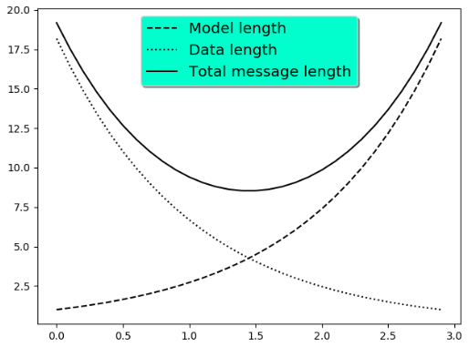

---
title: Matplotlib利用指数函数的向量及其逆向向量绘图
date: 2020-02-15 19:30:26
summary: 本文分享Matplotlib利用指数函数的向量及其逆向向量绘图的过程。
tags:
- Python
- Matplotlib
categories:
- Python
---

# Matplotlib编程实现

```python
import numpy as np
import matplotlib.pyplot as plt


a = b = np.arange(0, 3, 0.1)
c = np.exp(a)
d = c[::-1]

fig, ax = plt.subplots()
ax.plot(a, c, 'k--', label='Model length')
ax.plot(a, d, 'k:', label='Data length')
ax.plot(a, c + d, 'k', label='Total message length')

legend = ax.legend(loc='upper center', shadow=True, fontsize='x-large')

legend.get_frame().set_facecolor('#00FFCC')

plt.show()
```

# Python语法解释

`c[::-1]`意为：<font color="red">取从后向前（相反）的元素</font>
`d = c[::-1]`就将c向量的元素倒着取，但索引是不会小于0的，所以实际上这图就相当于把存储指数函数数值的向量倒过来读了，就呈现出了图中的结果。

# 成品图


