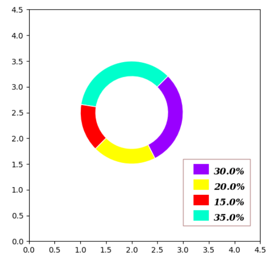

---
title: Matplotlib利用楔形绘制圆环形饼图
date: 2020-02-15 21:15:44
summary: 本文分享Matplotlib利用楔形绘制圆环形饼图的过程。
tags:
- Python
- Matplotlib
categories:
- Python
---

# Matplotlib编程实现

```python
import matplotlib.pyplot as plt
import numpy as np
from matplotlib.patches import Rectangle, Shadow, Wedge


fig, ax = plt.subplots(subplot_kw={"aspect":"equal"})
font_style = {"family": "serif", "size": 12, "style": "italic", "weight": "black"}
sample_data = [350, 150, 200, 300]
total = sum(sample_data)
percents = [i/float(total) for i in sample_data]
angles = [360*i for i in percents]
delta = 45

wedge1 = Wedge((2, 2.5), 1, delta, delta+sum(angles[0:1]), facecolor="#00FFCC", edgecolor="white", width=0.3)
wedge2 = Wedge((2, 2.5), 1, delta+sum(angles[0:1]), delta+sum(angles[0:2]), facecolor="#FF0000", edgecolor="white", width=0.3)
wedge3 = Wedge((2, 2.5), 1, delta+sum(angles[0:2]), delta+sum(angles[0:3]), facecolor="#FFFF00", edgecolor="white", width=0.3)
wedge4 = Wedge((2, 2.5), 1, delta+sum(angles[0:3]), delta, facecolor="#9900FF", edgecolor="white", width=0.3)

rectangle1 = Rectangle((3.0, 0.3), 1.3, 1.3, facecolor="w", edgecolor="rosybrown")
rectangle2 = Rectangle((3.2, 0.4), 0.3, 0.2, facecolor="#00FFCC")
rectangle3 = Rectangle((3.2, 0.7), 0.3, 0.2, facecolor="#FF0000")
rectangle4 = Rectangle((3.2, 1.0), 0.3, 0.2, facecolor="#FFFF00")
rectangle5 = Rectangle((3.2, 1.3), 0.3, 0.2, facecolor="#9900FF")

wedges = [wedge1, wedge2, wedge3, wedge4, rectangle1, rectangle2, rectangle3, rectangle4, rectangle5]

for wedge in wedges:
    ax.add_patch(wedge)

ax.text(3.6, 0.4, "%3.1f%%" % (percents[0]*100), **font_style)
ax.text(3.6, 0.7, "%3.1f%%" % (percents[1]*100), **font_style)
ax.text(3.6, 1.0, "%3.1f%%" % (percents[2]*100), **font_style)
ax.text(3.6, 1.3, "%3.1f%%" % (percents[3]*100), **font_style)

ax.axis([0, 4.5, 0, 4.5])

plt.show()
```

# 成品图


