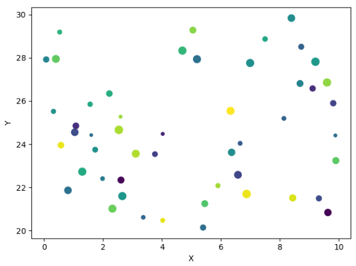

---
title: Matplotlib字符串绘制散点图
date: 2020-02-15 21:59:50
summary: 本文分享Matplotlib字符串绘制散点图的过程。
tags:
- Python
- Matplotlib
categories:
- Python
---

# 要点说明

在绘制散点图的时候，通常使用变量作为输入数据的载体。
其实，也可以使用字符串作为输入数据的存储载体。

下面代码的`data = {"a": x, "b": y, "color": c, "size": s}`正是将散点图的输入数据、颜色和标记大小放在**数据字典**data中作为键值对，对应的key是字符串string。

# Matplotlib编程实现

```python
import matplotlib.pyplot as plt
import numpy as np

fig = plt.figure()
ax = fig.gca()

x = np.random.rand(50)*10
y = np.random.rand(50)*10+20
s = np.random.rand(50)*100
c = np.random.rand(50)
data = {"a": x, "b": y, "color": c, "size": s}

ax.scatter("a", "b", c="color", s="size", data=data)
ax.set(xlabel="X", ylabel="Y")

plt.show()
```

# 成品图


