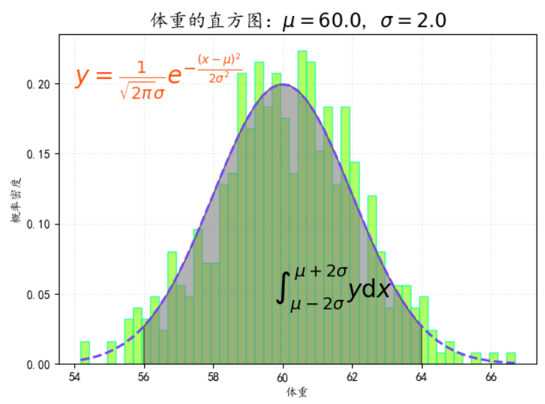

---
title: Matplotlib概率密度曲线图上绘制积分区域
date: 2020-02-15 21:47:56
summary: 本文分享Matplotlib概率密度曲线图上绘制积分区域的过程。
tags:
- Python
- Matplotlib
categories:
- Python
---

# 前文
文章链接：[Matplotlib在直方图中添加概率密度曲线和数学表达式](https://blankspace.blog.csdn.net/article/details/104328977)

# Matplotlib补充代码

```python
from matplotlib.patches import Polygon

int_x = np.linspace(mu-2*sigma, mu+2*sigma, 1000)
int_y = ((1/(np.power(2*np.pi, 0.5)*sigma))*np.exp(-0.5*np.power((int_x-mu)/sigma, 2)))
area = [(mu-2*sigma, 0), *zip(int_x, int_y), (mu+2*sigma, 0)]

poly = Polygon(area, facecolor="gray", edgecolor="k", alpha=0.6, closed=False)
ax.add_patch(poly)

ax.text(0.45, 0.2, r"$\int_{\mu-2\sigma}^{\mu+2\sigma} y\mathrm{d}x$", fontsize=20, transform=ax.transAxes)

ax.set_xlabel("体重")
ax.set_ylabel("概率密度")
ax.set_title(r"体重的直方图：$\mu=60.0$, $\sigma=2.0$", fontsize=16)
```

# 成品图



# Matplotlib完整代码

```python
# -*- coding:utf-8 -*-

import numpy as np
import matplotlib.pyplot as plt
import matplotlib as mpl

mpl.rcParams["font.sans-serif"] = ["KaiTi"]
mpl.rcParams["axes.unicode_minus"] = False

mu = 60.0
sigma = 2.0
x = mu + sigma*np.random.randn(500)

bins = 50

fig, ax = plt.subplots(1, 1)

n, bins, patches = ax.hist(x, bins, density=True, histtype="bar", facecolor="#99FF33", edgecolor="#00FF99", alpha=0.75)

y = ((1/(np.power(2*np.pi, 0.5)*sigma))*np.exp(-0.5*np.power((bins-mu)/sigma, 2)))

ax.plot(bins, y, color="#7744FF", ls="--", lw=2)

ax.grid(ls=":", lw=1, color="gray", alpha=0.2)

ax.text(54, 0.2, r"$y=\frac{1}{\sqrt{2\pi}\sigma}e^{-\frac{(x-\mu)^2}{2\sigma^2}}$",
        {"color": "#FF5511", "fontsize": 20})

from matplotlib.patches import Polygon

int_x = np.linspace(mu-2*sigma, mu+2*sigma, 1000)
int_y = ((1/(np.power(2*np.pi, 0.5)*sigma))*np.exp(-0.5*np.power((int_x-mu)/sigma, 2)))
area = [(mu-2*sigma, 0), *zip(int_x, int_y), (mu+2*sigma, 0)]

poly = Polygon(area, facecolor="gray", edgecolor="k", alpha=0.6, closed=False)
ax.add_patch(poly)

ax.text(0.45, 0.2, r"$\int_{\mu-2\sigma}^{\mu+2\sigma} y\mathrm{d}x$", fontsize=20, transform=ax.transAxes)

ax.set_xlabel("体重")
ax.set_ylabel("概率密度")
ax.set_title(r"体重的直方图：$\mu=60.0$, $\sigma=2.0$", fontsize=16)

plt.show()
```
