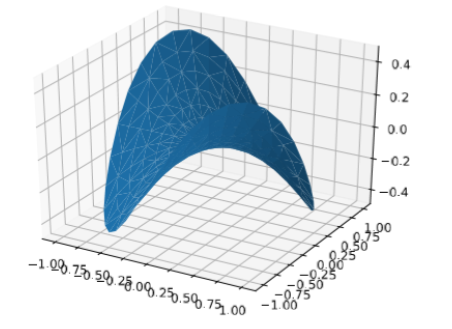

# Matplotlib绘图

## 图1

```python
import matplotlib.pyplot as plt
import numpy as np
from matplotlib import cm
from matplotlib.ticker import LinearLocator, FormatStrFormatter
from mpl_toolkits.mplot3d import Axes3D

fig = plt.figure()
ax = fig.add_subplot(1, 1, 1, projection="3d")

x = np.arange(-3, 3, 0.25)
y = np.arange(-3, 3, 0.25)
x, y = np.meshgrid(x, y)
r = np.sqrt(np.power(x, 2) + np.power(y, 2))
z = np.sin(r)

# plot 3d surface
surf = ax.plot_surface(x, y, z, rstride=1, cstride=1, cmap=cm.coolwarm, linewidth=0, antialiased=False)

# customize the z axis
ax.set(zlim=(-1, 1))
ax.zaxis.set_major_locator(LinearLocator(7))
ax.zaxis.set_major_formatter(FormatStrFormatter("%3.2f"))

# add a color bar mapping values to colors
fig.colorbar(surf, shrink=0.6, aspect=10)

plt.show()
```


## 图2

```python
import matplotlib.pyplot as plt
import numpy as np
from mpl_toolkits.mplot3d import Axes3D

fig = plt.figure()
ax = fig.gca(projection='3d')

n_radii = 8
n_angles = 36

radii = np.linspace(0.125, 1.0, n_radii)
angles = np.linspace(0, 2*np.pi, n_angles, endpoint=False)

angles = np.repeat(angles[..., np.newaxis], n_radii, axis=1)

x = np.append(0, (radii*np.cos(angles)).flatten())
y = np.append(0, (radii*np.sin(angles)).flatten())
z = np.sin(-x*y)

ax.plot_trisurf(x, y, z, linewidth=0.2, antialiased=True)

plt.show()
```



# Matplotlib画布保存

```python
import matplotlib.pyplot as plt
import numpy as np
from matplotlib import cm
from matplotlib.ticker import LinearLocator, FormatStrFormatter
from mpl_toolkits.mplot3d import Axes3D
from matplotlib.backends.backend_pdf import PdfPages


with PdfPages("D://PdfPages.pdf") as pdf:
    fig = plt.figure()
    ax = fig.add_subplot(1, 1, 1, projection="3d")
    x = np.arange(-3, 3, 0.25)
    y = np.arange(-3, 3, 0.25)
    x, y = np.meshgrid(x, y)
    r = np.sqrt(np.power(x, 2) + np.power(y, 2))
    z = np.sin(r)
    surf = ax.plot_surface(x, y, z, rstride=1, cstride=1, cmap=cm.coolwarm, linewidth=0, antialiased=False)
    ax.set(zlim=(-1, 1))
    ax.zaxis.set_major_locator(LinearLocator(7))
    ax.zaxis.set_major_formatter(FormatStrFormatter("%3.2f"))
    fig.colorbar(surf, shrink=0.6, aspect=10)
    plt.title("Page1")
    pdf.savefig()
    plt.close()

    fig = plt.figure()
    ax = fig.gca(projection='3d')
    n_radii = 8
    n_angles = 36
    radii = np.linspace(0.125, 1.0, n_radii)
    angles = np.linspace(0, 2 * np.pi, n_angles, endpoint=False)
    angles = np.repeat(angles[..., np.newaxis], n_radii, axis=1)
    x = np.append(0, (radii * np.cos(angles)).flatten())
    y = np.append(0, (radii * np.sin(angles)).flatten())
    z = np.sin(-x * y)
    ax.plot_trisurf(x, y, z, linewidth=0.2, antialiased=True)
    fig.suptitle("Page2")
    pdf.savefig()
    plt.close()
```

## 效果展示

找到D盘根路径，发现出现这个文件：


打开文件后：


