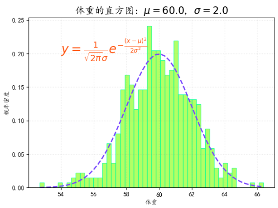

# 绘制目标

我们可以单独使用直方图来描述定量数据的分布特征，而如果为直方图添加一条概率密度曲线，就能更明显地去观察这种特征。

这里就会在频率分布直方图的基础上绘制一条About体重的正态分布概率密度曲线，并标定正态分布概率密度的公式。

Note：不熟悉正态分布、概率密度、频率分布直方图等内容的麻烦复习一下概率论的内容。

# Matplotlib编程实现

```python
# -*- coding:utf-8 -*-

import numpy as np
import matplotlib.pyplot as plt
import matplotlib as mpl


mpl.rcParams["font.sans-serif"] = ["KaiTi"]
mpl.rcParams["axes.unicode_minus"] = False

mu = 60.0
sigma = 2.0
x = mu + sigma*np.random.randn(500)

bins = 50

fig, ax = plt.subplots(1, 1)

n, bins, patches = ax.hist(x, bins, density=True, histtype="bar", facecolor="#99FF33", edgecolor="#00FF99", alpha=0.75)

y = ((1/(np.power(2*np.pi, 0.5)*sigma))*np.exp(-0.5*np.power((bins-mu)/sigma, 2)))

ax.plot(bins, y, color="#7744FF", ls="--", lw=2)

ax.grid(ls=":", lw=1, color="gray", alpha=0.2)

ax.text(54, 0.2, r"$y=\frac{1}{\sqrt{2\pi}\sigma}e^{-\frac{(x-\mu)^2}{2\sigma^2}}$", {"color":"#FF5511", "fontsize":20})

ax.set_xlabel("体重")
ax.set_ylabel("概率密度")
ax.set_title(r"体重的直方图：$\mu=60.0$, $\sigma=2.0$", fontsize=16)

plt.show()
```

# 成品图


