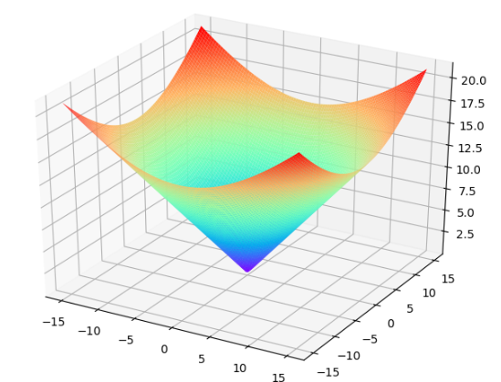

---
title: Matplotlib绘制七彩锥面
date: 2020-02-13 17:32:41
summary: 本文分享Matplotlib绘制七彩锥面的过程。
tags:
- Python
- Matplotlib
categories:
- Python
---

# Matplotlib编程实现

```python
import numpy as np
import matplotlib.pyplot as plt
from mpl_toolkits.mplot3d import Axes3D

fig = plt.figure()
axes3d = Axes3D(fig)

x = np.linspace(-15, 15, 100)
y = np.linspace(-15, 15, 100)
x, y = np.meshgrid(x, y)
z = np.sqrt(x ** 2 + y ** 2)

axes3d.plot_surface(x, y, z, rstride=1, cstride=1, cmap=plt.get_cmap('rainbow'))

plt.show()
```

# 成品图欣赏


