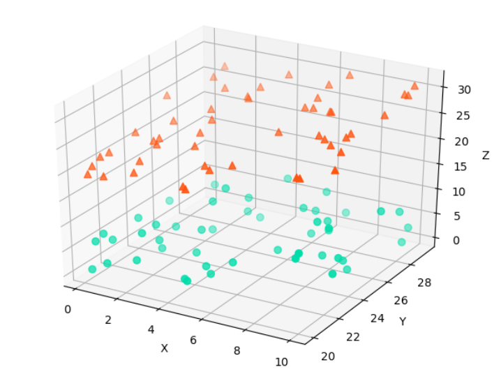

# 绘制方法

在3D空间里绘制散点图，就是在 *x* 轴和 *y* 轴之外再添一条 *z* 轴后，使用三元有序数对在3D空间里进行描点。

# 颜色说明

- *#00DDAA*：<font color="#00DDAA">**淡绿色**</font>
- *#FF5511*  ：<font color="#FF5511"> **橘红色**</font>

推荐CSS颜色代码大全：[Here](https://www.cnblogs.com/xmm2017/p/8441124.html)

# Matplotlib编程实现

```python
import matplotlib.pyplot as plt
import numpy as np
from mpl_toolkits.mplot3d import Axes3D

fig = plt.figure()
ax = fig.gca(projection="3d")

xs = np.random.rand(50)*10
ys = np.random.rand(50)*10+20
zs1=np.random.rand(50)*10
zs2 = np.sqrt(xs**2+ys**2)

ax.scatter(xs, ys, zs=zs1, zdir="z", c="#00DDAA", marker="o", s=40)
ax.scatter(xs, ys, zs=zs2, zdir="z", c="#FF5511", marker="^", s=40)

ax.set(xlabel="X", ylabel="Y", zlabel="Z")

plt.show()
```

# 成品图


