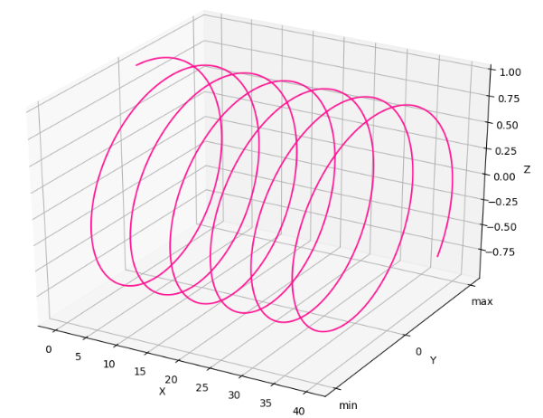

---
title: Matplotlib绘制三维线形图
date: 2020-02-13 15:42:46
summary: 本文分享Matplotlib绘制三维线形图的过程。
tags:
- Python
- Matplotlib
categories:
- Python
---

# Matplotlib编程实现

```python
import matplotlib.pyplot as plt
import numpy as np
from mpl_toolkits.mplot3d import Axes3D

x = np.linspace(0, 40, 1000)
y = np.sin(x)
z = np.cos(x)

fig = plt.figure(figsize=(8, 6))
ax = Axes3D(fig)

ax.plot(x, y, z, color="deeppink")

ax.set(xlabel="X", ylabel="Y", zlabel="Z")

ax.set_yticks([-1, 0, 1])
ax.set_yticklabels(['min', 0, 'max'])

plt.show()
```

# 成品图


