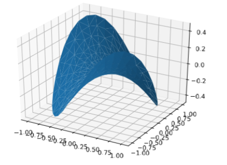

---
title: Matplotlib绘制三维马鞍面
date: 2020-02-25 22:55:33
summary: 本文分享Matplotlib绘制三维马鞍面的过程。
tags:
- Python
- Matplotlib
categories:
- Python
---

# Matplotlib编程实现

```python
import matplotlib.pyplot as plt
import numpy as np
from mpl_toolkits.mplot3d import Axes3D

fig = plt.figure()
ax = fig.gca(projection='3d')

n_radii = 8
n_angles = 36

radii = np.linspace(0.125, 1.0, n_radii)
angles = np.linspace(0, 2*np.pi, n_angles, endpoint=False)

angles = np.repeat(angles[..., np.newaxis], n_radii, axis=1)

x = np.append(0, (radii*np.cos(angles)).flatten())
y = np.append(0, (radii*np.sin(angles)).flatten())
z = np.sin(-x*y)

ax.plot_trisurf(x, y, z, linewidth=0.2, antialiased=True)

plt.show()
```

# 成品图


