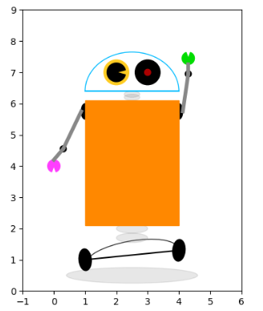

---
title: Matplotlib绘制可爱机器人
date: 2020-02-12 16:42:12
summary: 本文分享Matplotlib绘制可爱机器人的过程。
tags:
- Python
- Matplotlib
categories:
- Python
---

# 任务目标


# 颜色说明

颜色调的不是很好……这里说明一下使用到的颜色。
- *#888888*：<font color="#888888">**灰色**</font>
- *#000000*：<font color="#000000">**黑色**</font>
- *#FF8800*：<font color="#FF8800">**橘色**</font>
- *#FFCC22*：<font color="#FFCC22">**黄色**</font>
- *#FF3EFF*：<font color="#FF3EFF">**粉色**</font>
- *#00DD00*：<font color="#00DD00">**绿色**</font>
- *#AA0000*：<font color="#AA0000">**深红色**</font>
- *#00BBFF*：<font color="#00BBFF">**浅蓝色**</font>

这些颜色都有很多种，自己选就行啦。

# 绘制思路

把机器人整体看成一个一个几何部件的组合体就行。

分别绘制每个Part，再组合起来即可。

具体是哪个部位请看注释。

# Matplotlib编程实现

```python
import matplotlib.pyplot as plt
from matplotlib.patches import Arc, Ellipse, Rectangle, Wedge

fig, ax = plt.subplots(subplot_kw={"aspect": "equal"})

# 底部阴影
shadow = Ellipse((2.5, 0.5), 4.2, 0.5, color="#888888", alpha=0.2)

# 底座
ax.plot([1, 4], [1, 1.3], color="#000000")
base = Arc((2.5, 1.1), 3, 1, angle=10, theta1=0, theta2=180, color="#000000", alpha=0.8)

# 轮子
left_wheel = Ellipse((1, 1), 0.7, 0.4, angle=95, color="#000000")
right_wheel = Ellipse((4, 1.3), 0.7, 0.4, angle=85, color="#000000")

# 底部关节
bottom_join1 = Ellipse((2.5, 2), 1, 0.3, color="#888888", alpha=0.2)
bottom_join2 = Ellipse((2.5, 1.7), 1, 0.3, color="#888888", alpha=0.2)

# 肩膀关节
left_shoulder = Ellipse((1, 5.75), 0.5, 0.25, angle=90, color="#000000")
right_shoulder = Ellipse((4, 5.75), 0.5, 0.25, angle=90, color="#000000")

# 肘关节
left_elbow = Wedge((0.3, 4.55), 0.1, 0, 360, color="#000000")
right_elbow = Wedge((4.3, 6.95), 0.1, 0, 360, color="#000000")

# 腕关节和手部
left_wrist = Wedge((0, 4.0), 0.2, 290, 250, color="#FF3EFF")
right_wrist = Wedge((4.3, 7.45), 0.2, 110, 70, color="#00DD00")

# 颈部
neck1 = Ellipse((2.5, 6.2), 0.5, 0.2, color="#888888", alpha=0.2)
neck2 = Ellipse((2.5, 6.3), 0.5, 0.2, color="#888888", alpha=0.2)

# 躯干
body = Rectangle((1, 2.1), 3, 4, color="#FF8800")

# 大臂
left_arm = ax.plot([0.3, 0.875], [4.55, 5.75], color="#888888", lw=4)
right_arm = ax.plot([4.125, 4.3], [5.75, 6.95], color="#888888", lw=4)

# 小臂
left_forearm = ax.plot([0, 0.3], [4.2, 4.55], color="#888888", lw=4)
right_forearm = ax.plot([4.3, 4.3], [6.95, 7.25], color="#888888", lw=4)

# 头部
ax.plot([1, 4], [6.4, 6.4], color="#00BBFF")
head = Arc((2.5, 6.4), 3, 2.5, angle=0, theta1=0, theta2=180, color="#00BBFF")

# 眼睛
left_eye = Wedge((2, 7), 0.4, 0, 360, color="#FFCC22")
right_eye = Wedge((3, 7), 0.4, 0, 360, color="#000000")

# 瞳仁
left_eye_core = Wedge((2, 7), 0.3, 15, 345, color="#000000")
right_eye_core = Wedge((3, 7), 0.1, 0, 360, color="#AA0000")

# 零件的list
plot_list = [shadow, base, left_wheel, right_wheel, bottom_join1, bottom_join2, left_shoulder,
             left_elbow, left_wrist, right_shoulder, right_elbow, right_wrist,
             neck1, neck2, body, head, left_eye, left_eye_core, right_eye, right_eye_core]

# 拼接零件
for pln in plot_list:
    ax.add_patch(pln)

ax.axis([-1, 6, 0, 9])

plt.show()
```

# 成品图


