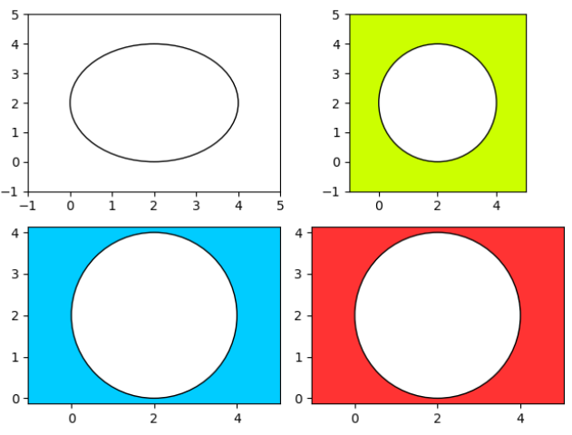

---
title: Matplotlib绘制圆形
date: 2020-02-15 21:30:13
summary: 本文分享Matplotlib绘制圆形的过程。
tags:
- Python
- Matplotlib
categories:
- Python
---

# Matplotlib编程实现

```python
import matplotlib.pyplot as plt
import numpy as np
from matplotlib.patches import Circle

fig, ax = plt.subplots(2, 2)

circle = Circle((2, 2), radius=2, facecolor="white", edgecolor="#000000")
ax[0, 0].add_patch(circle)

ax[0, 0].set_xlim(-1, 5)
ax[0, 0].set_ylim(-1, 5)

rectangle = ax[0, 1].patch
rectangle.set_facecolor("#CCFF00")

circle = Circle((2, 2), radius=2, facecolor="white", edgecolor="#000000")
ax[0, 1].add_patch(circle)

ax[0, 1].set_xlim(-1, 5)
ax[0, 1].set_ylim(-1, 5)

ax[0, 1].set_aspect("equal", "box")

rectangle = ax[1, 0].patch
rectangle.set_facecolor("#00CCFF")

circle = Circle((2, 2), radius=2, facecolor="white", edgecolor="#000000")
ax[1, 0].add_patch(circle)

ax[1, 0].axis("equal")

rectangle = ax[1, 1].patch
rectangle.set_facecolor("#FF3333")

circle = Circle((2, 2), radius=2, facecolor="white", edgecolor="#000000")
ax[1, 1].add_patch(circle)

ax[1, 1].axis([-1, 5, -1, 5])
ax[1, 1].set_yticks(np.arange(-1, 6, 1))

ax[1, 1].axis("equal")

plt.subplots_adjust(left=0.1)

plt.show()
```

# 成品图


