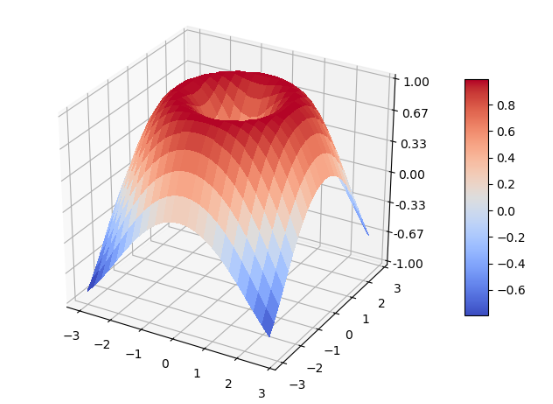

# 2D→3D

在2D画布中绘制3D图形时，绘制的本质就是绘制三维曲面，即由一对有序数对映射成的数据值和有序数对所组成的三元元组在画布上的描点成画。

这个三维曲面不仅可以着色，还可以按照曲面的高度分别涂上不同的颜色，同时用颜色标尺进行注释，说明高度变化。

# Matplotlib编程实现

```python
import matplotlib.pyplot as plt
import numpy as np
from matplotlib import cm
from matplotlib.ticker import LinearLocator, FormatStrFormatter
from mpl_toolkits.mplot3d import Axes3D

fig = plt.figure()
ax = fig.add_subplot(1, 1, 1, projection="3d")

x = np.arange(-3, 3, 0.25)
y = np.arange(-3, 3, 0.25)
x, y = np.meshgrid(x, y)
r = np.sqrt(np.power(x, 2) + np.power(y, 2))
z = np.sin(r)

# plot 3d surface
surf = ax.plot_surface(x, y, z, rstride=1, cstride=1, cmap=cm.coolwarm, linewidth=0, antialiased=False)

# customize the z axis
ax.set(zlim=(-1, 1))
ax.zaxis.set_major_locator(LinearLocator(7))
ax.zaxis.set_major_formatter(FormatStrFormatter("%3.2f"))

# add a color bar mapping values to colors
fig.colorbar(surf, shrink=0.6, aspect=10)

plt.show()
```

# 成品图


