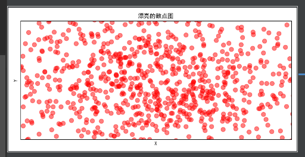

```python
# -*- coding: utf-8 -*-

import numpy as np
import matplotlib.pyplot as plt
import matplotlib


matplotlib.rcParams['font.sans-serif'] = ['SimHei']
matplotlib.rcParams['axes.unicode_minus'] = False

x = np.arange(1, 10)
y = x

fig = plt.figure()
plt.title("散点图")
plt.xlabel('X')
plt.ylabel('Y')
plt.scatter(x, y, c='red', marker='o')
plt.legend('x')
plt.show()
```


```python
# -*- coding: utf-8 -*-

import numpy as np
import matplotlib.pyplot as plt
import matplotlib


matplotlib.rcParams['font.sans-serif'] = ['SimHei']
matplotlib.rcParams['axes.unicode_minus'] = False

x = np.random.normal(0, 1, 1024)
y = np.random.normal(0, 1, 1024)

plt.figure(num=5, figsize=(8, 4))
plt.title("漂亮的散点图")
plt.xlim((-1.5, 1.5))
plt.ylim((-1.5, 1.5))
plt.xlabel('X')
plt.ylabel('Y')
plt.xticks(())
plt.yticks(())
plt.scatter(x, y, s=75, c="red", alpha=0.5)
plt.show()
```


