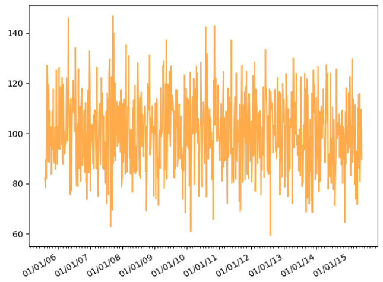

---
title: Matplotlib绘制日期型时间序列图
date: 2020-02-13 00:55:23
summary: 本文分享Matplotlib绘制日期型时间序列图的过程。
tags:
- Python
- Matplotlib
categories:
- Python
---

# 日期型时间序列图

一般而言，我们绘制时间序列图都是将日期类型的数据放在x轴上进行展示，将对应日期下的数据放在y轴上进行展示的。
因此，对于matplotlib库来讲，日期型时间序列图的绘制既可以调用模块pyplot的API函数plot_date()，也可以调用实例方法plot_date()。

# Matplotlib编程实现

```python
import datetime
import matplotlib.pyplot as plt
import matplotlib.dates as mdates
import numpy as np

fig, ax = plt.subplots()

months = mdates.MonthLocator()

dateFmt = mdates.DateFormatter("%m/%d/%y")

ax.xaxis.set_major_formatter(dateFmt)
ax.xaxis.set_minor_locator(months)
ax.tick_params(axis="both", direction="out", labelsize=10)

date1 = datetime.date(2005, 8, 8)
date2 = datetime.date(2015, 6, 6)
delta = datetime.timedelta(days=5)
dates = mdates.drange(date1, date2, delta)

y = np.random.normal(100, 15, len(dates))

ax.plot_date(dates, y, "#FF8800", alpha=0.7)

fig.autofmt_xdate()

plt.show()
```

# 成品图


