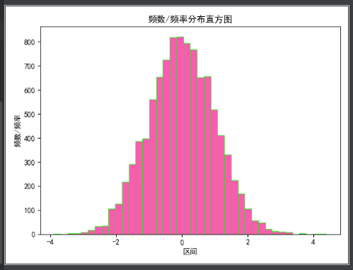

---
title: Matplotlib绘制条形图
date: 2019-11-08 23:42:10
summary: 本文分享Matplotlib绘制条形图的过程。
tags:
- Python
- Matplotlib
categories:
- Python
---

```python
# -*- coding: utf-8 -*-

import matplotlib.pyplot as plt
import numpy as np
import matplotlib


matplotlib.rcParams['font.sans-serif'] = ['SimHei']
matplotlib.rcParams['axes.unicode_minus'] = False

plt.figure(figsize=(10, 6), dpi=60)
values = (25, 32, 34, 20, 41, 50, 38)
index = np.arange(7)
width = 0.35
plt.bar(index, values, width, label="销售量", color="#87CEFA")
plt.xlim('月份')
plt.ylabel('销售量（台数')
plt.title('2018上半年销量')
plt.xticks(index, ('1月', '2月', '3月', '4月', '5月', '6月', '7月'))
plt.yticks(np.arange(0, 81, 10))
plt.legend(loc="upper right")
plt.show()
```


