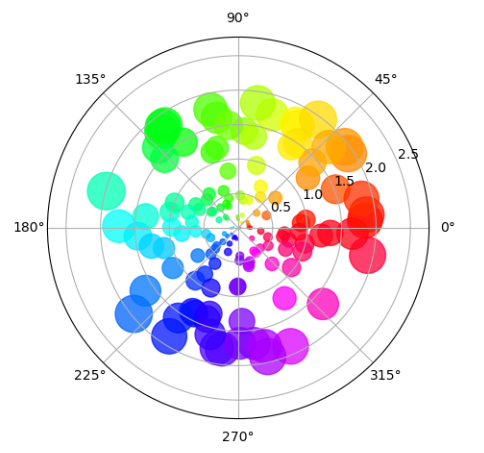
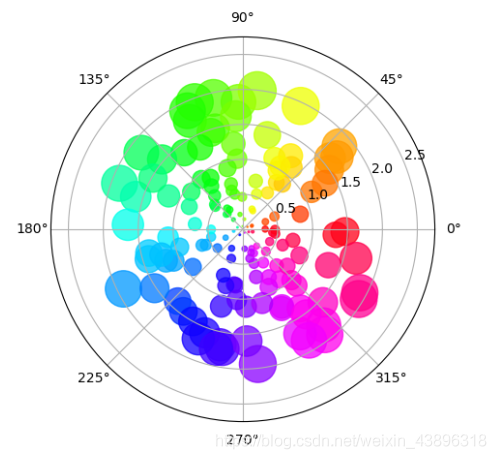

---
title: Matplotlib绘制极坐标散点图
date: 2020-02-13 15:13:05
summary: 本文分享Matplotlib绘制极坐标散点图的过程。
tags:
- Python
- Matplotlib
categories:
- Python
---

# Matplotlib编程实现

```python
import numpy as np
import matplotlib.pyplot as plt

num = 150
r = 2 * np.random.rand(num)
theta = 2 * np.pi * np.random.rand(num)
area = 200 * r**2
colors = theta

ax = plt.subplot(111, projection='polar')
c = ax.scatter(theta, r, c=colors, s=area, cmap='hsv', alpha=0.75)

plt.show()
```

# 成品图欣赏



