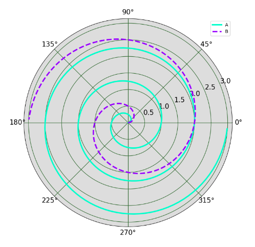

---
title: Matplotlib绘制极坐标螺旋线图
date: 2020-02-13 20:42:04
summary: 本文分享Matplotlib绘制极坐标螺旋线图的过程。
tags:
- Python
- Matplotlib
categories:
- Python
---

# Matplotlib编程实现

```python
import numpy as np
import matplotlib.pyplot as plt

plt.rc("grid", color="#316931", linewidth=1, linestyle="-")
plt.rc("xtick", labelsize=15)
plt.rc("ytick", labelsize=15)

fig = plt.figure(figsize=(8, 8))
ax = fig.add_axes([0.1, 0.1, 0.8, 0.8], projection="polar", facecolor="#DDDDDD")

r = np.arange(0, 3.0, 0.01)
theta = 2*np.pi*r
ax.plot(theta, r, color="#00FFCC", lw=3, label="A")
ax.plot(0.5*theta, r, color="#9900FF", ls="--", lw=3, label="B")
ax.legend()

plt.show()
```

# 成品图


