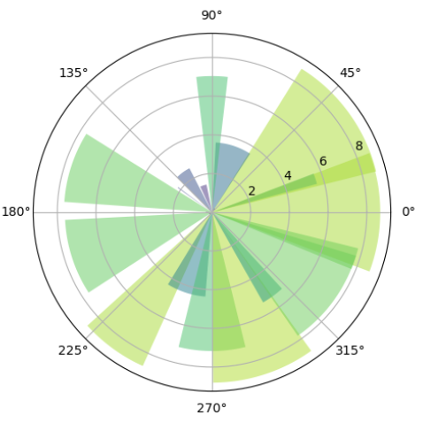
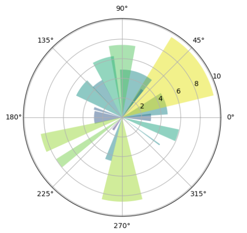
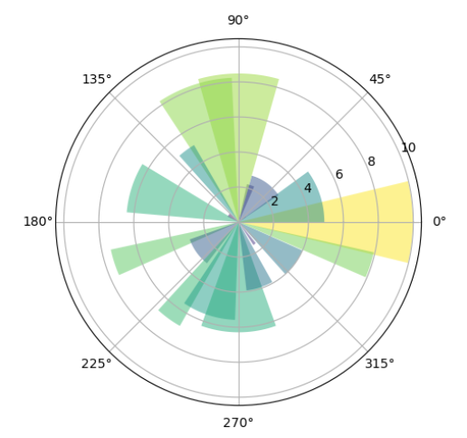
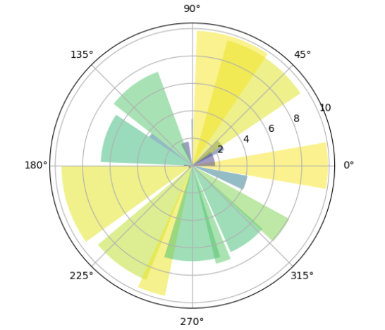

---
title: Matplotlib绘制极坐标雷达图
date: 2020-02-13 17:09:43
summary: 本文分享Matplotlib绘制极坐标雷达图的过程。
tags:
- Python
- Matplotlib
categories:
- Python
---

# Matplotlib编程实现

```python
import numpy as np
import matplotlib.pyplot as plt

num = 20
theta = np.linspace(0.0, 2 * np.pi, num, endpoint=False)
radii = 10 * np.random.rand(num)
width = np.pi / 4 * np.random.rand(num)

ax = plt.subplot(111, projection='polar')
bars = ax.bar(theta, radii, width=width, bottom=0.0)

for r, bar in zip(radii, bars):
    bar.set_facecolor(plt.cm.viridis(r / 10.))
    bar.set_alpha(0.5)

plt.show()
```

# 成品图欣赏





