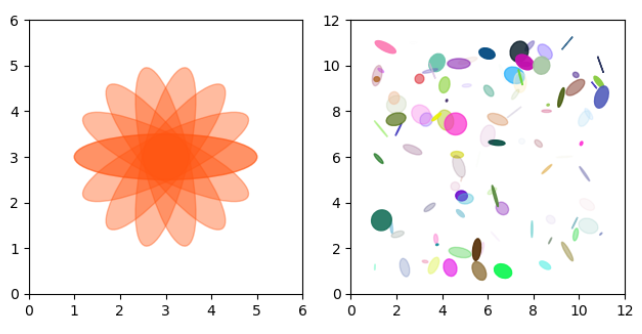

---
title: Matplotlib绘制椭圆
date: 2020-02-13 11:53:25
summary: 本文分享Matplotlib绘制椭圆的过程。
tags:
- Python
- Matplotlib
categories:
- Python
---

# 任务目标

打算绘制两幅图：


# 椭圆绘制

一般的椭圆绘制，可通过matplotlib库patches模块的Ellipse实现。

最后打算绘制在一张画布上。

# Matplotlib编程实现

```python
import matplotlib.pyplot as plt
import numpy as np
from matplotlib.patches import Ellipse

fig, ax = plt.subplots(1, 2, subplot_kw={"aspect": "equal"})

angles = np.linspace(0, 180, 8)

ellipse = [Ellipse((3, 3), 4, 1, a) for a in angles]

for elle in ellipse:
    ax[0].add_patch(elle)
    elle.set_alpha(0.4)
    elle.set_color("#FF5511")

ax[0].axis([0, 6, 0, 6])

num = np.arange(0, 100, 1)

ellipse = [Ellipse(xy=np.random.rand(2)*10+1, width=np.random.rand(1), height=np.random.rand(1),
                   angle=np.random.rand(1)*360) for i in num]

for elle in ellipse:
    ax[1].add_patch(elle)
    elle.set_alpha(np.random.rand(1))
    elle.set_color(np.random.rand(3))

ax[1].axis([0, 12, 0, 12])

plt.tight_layout()

plt.show()
```

# 成品图


