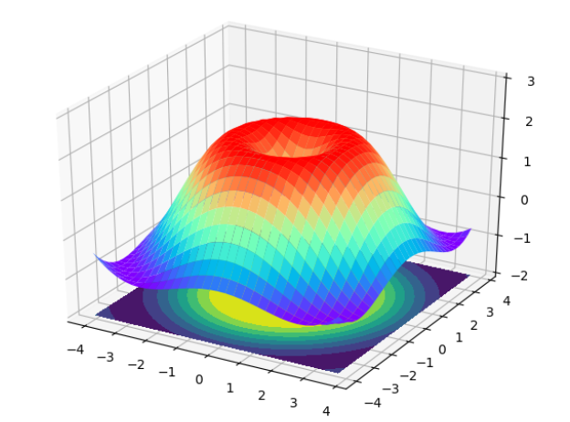
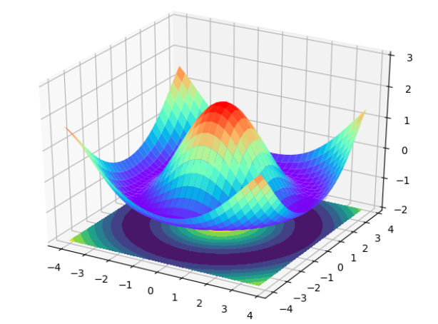

---
title: Matplotlib绘制正余弦曲面图
date: 2020-02-13 13:29:30
summary: 本文分享Matplotlib绘制正余弦曲面图的过程。
tags:
- Python
- Matplotlib
categories:
- Python
---

# Matplotlib绘制正弦曲面图

```python
import numpy as np
import matplotlib.pyplot as plt
from mpl_toolkits.mplot3d import Axes3D


fig = plt.figure()
ax = fig.add_subplot(111, projection='3d')

x = np.arange(-4, 4, 0.25)
y = np.arange(-4, 4, 0.25)
x, y = np.meshgrid(x, y)
distance = np.sqrt(x**2 + y**2)
z = 1.5*np.sin(distance)+0.5

ax.plot_surface(x, y, z, rstride=1, cstride=1, cmap=plt.get_cmap('rainbow'))
ax.contourf(x, y, z, zdir='z', offset=-2)
ax.set_zlim(-2, 3)

plt.show()
```

正弦曲面成品图：


# Matplotlib绘制余弦曲面图

```python
import numpy as np
import matplotlib.pyplot as plt
from mpl_toolkits.mplot3d import Axes3D

fig = plt.figure()
ax = fig.add_subplot(111, projection='3d')

x = np.arange(-4, 4, 0.25)
y = np.arange(-4, 4, 0.25)
x, y = np.meshgrid(x, y)
distance = np.sqrt(x**2 + y**2)
z = 1.5*np.cos(distance)+0.5

ax.plot_surface(x, y, z, rstride=1, cstride=1, cmap=plt.get_cmap('rainbow'))
ax.contourf(x, y, z, zdir='z', offset=-2)
ax.set_zlim(-2, 3)

plt.show()
```

余弦曲面成品图：

