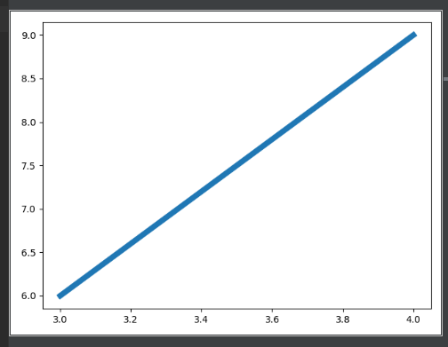
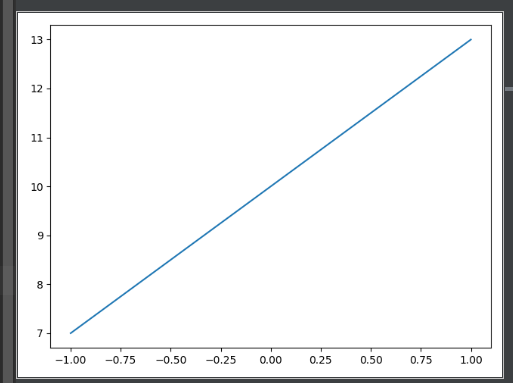
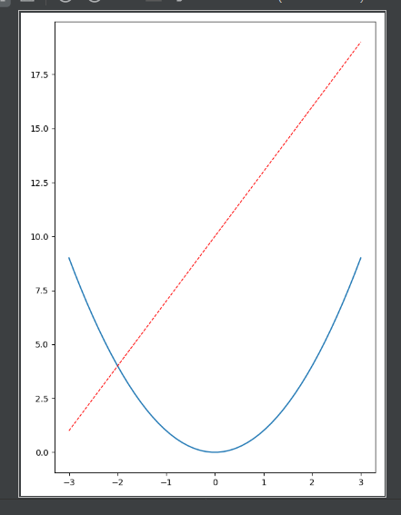
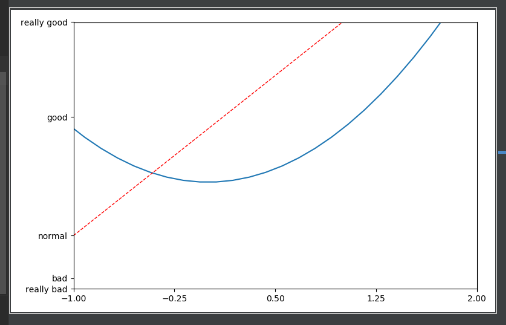

---
title: Matplotlib绘制直线图
date: 2019-11-08 21:19:38
summary: 本文分享Matplotlib绘制直线图的过程。
tags:
- Python
- Matplotlib
categories:
- Python
---

# Code1

```python
import matplotlib.pyplot as plt


x = [3, 4]
y = [6, 9]

plt.plot(x, y, linewidth=6)
plt.show()
```



# Code2

```python
import numpy as np
import matplotlib.pyplot as plt


x = np.linspace(-1, 1, 50)
y = 3*x + 10

plt.figure()
plt.plot(x, y)
plt.show()
```



# Code3

```python
import numpy as np
import matplotlib.pyplot as plt


x = np.linspace(-3, 3, 50)
y1 = 3*x + 10
y2 = x**2

plt.figure()
plt.plot(x, y1)
plt.show()
plt.figure(num=4, figsize=(6, 8))
plt.plot(x, y2)
plt.plot(x, y1, color='red', linewidth='1.0', linestyle='--')
plt.show()
```



# Code4

```python
import numpy as np
import matplotlib.pyplot as plt


x = np.linspace(-3, 3, 50)
y1 = 2*x + 1
y2 = x**2

plt.figure()
plt.plot(x, y1)
plt.show()
plt.figure(num=3, figsize=(8, 5))
plt.plot(x, y2)
plt.plot(x, y1, color='red', linewidth='1.0', linestyle='--')
plt.xlim((-1, 2))
plt.ylim((-2, 3))
new_ticks = np.linspace(-1, 2, 5)
print(new_ticks)
plt.xticks(new_ticks)
plt.yticks([-2, -1.8, -1, 1.22, 3, ], [r'really bad', r'bad', r'normal', r'good', r'really good'])
plt.show()
```


