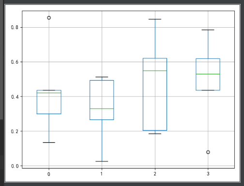

---
title: Matplotlib绘制箱线图
date: 2019-11-08 23:32:42
summary: 本文分享Matplotlib绘制箱线图的过程。
tags:
- Python
- Matplotlib
categories:
- Python
---

```python
# -*- coding: utf-8 -*-

import matplotlib.pyplot as plt
import numpy as np
import pandas as pd
import matplotlib


matplotlib.rcParams['font.sans-serif'] = ['SimHei']
matplotlib.rcParams['axes.unicode_minus'] = False

np.random.seed(2)
df = pd.DataFrame(np.random.random((5, 4)))
columns = ['A', 'B', 'C', 'D']
df.boxplot()
plt.show()
```


