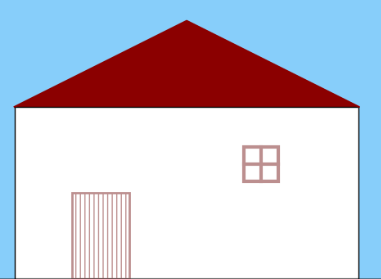
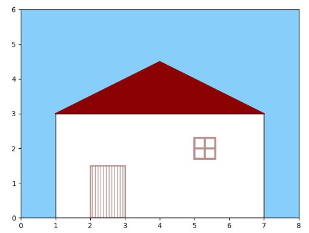

---
title: Matplotlib绘制蓝天下的房屋
date: 2020-02-12 23:46:30
summary: 本文分享Matplotlib绘制蓝天下的房屋的过程。
tags:
- Python
- Matplotlib
categories:
- Python
---

# 任务目标



# 颜色说明

- *lightskyblue*：<font color="lightskyblue">**天蓝色**</font>
- *darkred*：<font color="darkred">**深红色**</font>
- *black*：<font color="black">**黑色**</font>
- *w*：<font color="w">白色</font>
- *rosybrown*：<font color="rosybrown">**棕褐色**</font>

# 绘制思路

我们需要填充颜色的部分是砖红色房顶、房外的蓝天。
需要描边的是房顶的砖红色轮廓、棕褐色窗框&门框、黑色的房体轮廓

基本上，可以使用矩形和直线完成图形组合。

# Matplotlib编程实现

```python
import matplotlib.pyplot as plt
import numpy as np
from matplotlib.patches import Rectangle

fig, ax = plt.subplots(subplot_kw={"aspect": "equal"})

x1 = np.arange(1, 2.6, 0.1)
y1 = x1+2

x2 = np.arange(2.5, 4.1, 0.1)
y2 = 7-x2

# 设置背景色
rectangle = ax.patch
rectangle.set_facecolor("lightskyblue")

# 屋顶的绘制
array_x = [1, 4, 7]
array_y = [3, 4.5, 3]
ax.plot(array_x, array_y, color="darkred")
ax.fill_between(array_x, 3, array_y, color="darkred", interpolate=True)

# 生成房屋屋体轮廓
rectangle1 = Rectangle((1, 0), 6, 3, facecolor="w", edgecolor="black")

# 生成房门
rectangle2 = Rectangle((2, 0), 1, 1.5, facecolor="w", edgecolor="rosybrown", hatch="|||", linewidth=2)

# 生成窗体外边框
rectangle3 = Rectangle((5.0, 1.7), 0.6, 0.6, facecolor="w", edgecolor="rosybrown", linewidth=3)

# 绘制窗户内边框
ax.plot([5.3, 5.3], [1.7, 2.3], color="rosybrown", linewidth=3)
ax.plot([5.0, 5.6], [2.0, 2.0], color="rosybrown", linewidth=3)

rectangle_list = [rectangle1, rectangle2, rectangle3]

# 绘制矩形图案
for r in rectangle_list:
    ax.add_patch(r)
    
ax.axis([0, 8, 0, 6])

plt.show()
```

# 成品图


