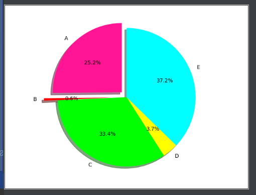

---
title: Matplotlib绘制饼图
date: 2019-11-08 21:41:57
summary: 本文分享Matplotlib绘制饼图的过程。
tags:
- Python
- Matplotlib
categories:
- Python
---

```python
import matplotlib.pyplot as plt

detal = [0.2515, 0.0057, 0.3336, 0.0368, 0.3724]
labels = ['A', 'B', 'C', 'D', 'E']
colors = ['deeppink', 'red', 'lime', 'yellow', 'cyan']
explode = [0.1, 0.2, 0, 0, 0]

plt.xlim(0, 4)
plt.ylim(0, 4)
plt.axis('equal')
plt.pie(x=detal, labels=labels, explode=explode, autopct='%3.1f%%',
        shadow=True, labeldistance=1.1, startangle=90, pctdistance=0.6, colors=colors)
plt.show()
```



调色方面，参考了[Matplotlib调色](https://www.cnblogs.com/darkknightzh/p/6117528.html)，大家可以读一读，调出自己喜欢的颜色。
