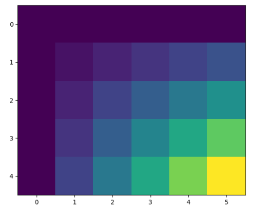
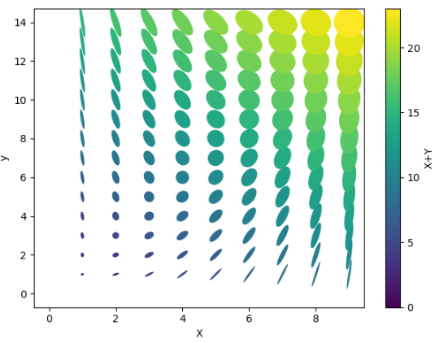
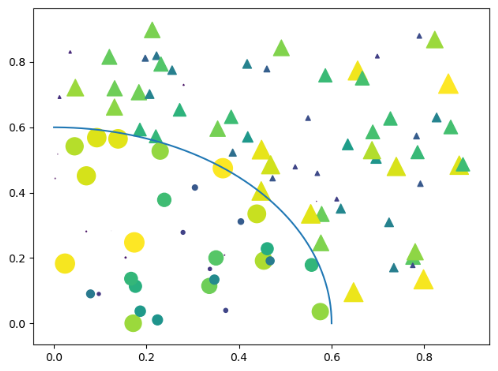

---
title: Matplotlib绘制黄绿蓝紫色图形
date: 2020-02-13 21:41:39
summary: 本文分享Matplotlib绘制黄绿蓝紫色图形的示例。
tags:
- Python
- Matplotlib
categories:
- Python
---

# Example1



```python
import matplotlib.pyplot as plt
import numpy as np

x = np.arange(6)
y = np.arange(5)
z = x * y[:, np.newaxis]

for i in range(5):
    if i == 0:
        p = plt.imshow(z)
        fig = plt.gcf()
        plt.clim()
    else:
        z = z + 2
        p.set_data(z)
    plt.pause(0.5)
```

# Example2



```python
import matplotlib.pyplot as plt
import numpy as np
from matplotlib.collections import EllipseCollection

x = np.arange(10)
y = np.arange(15)
X, Y = np.meshgrid(x, y)

XY = np.hstack((X.ravel()[:, np.newaxis], Y.ravel()[:, np.newaxis]))

ww = X/10.0
hh = Y/15.0
aa = X*9

fig, ax = plt.subplots()

ec = EllipseCollection(ww, hh, aa, units='x', offsets=XY, transOffset=ax.transData)
ec.set_array((X + Y).ravel())
ax.add_collection(ec)
ax.autoscale_view()
ax.set_xlabel('X')
ax.set_ylabel('y')
cbar = plt.colorbar(ec)
cbar.set_label('X+Y')

plt.show()
```

# Example3



```python
import matplotlib.pyplot as plt
import numpy as np

num = 100
r0 = 0.6
x = 0.9*np.random.rand(num)
y = 0.9*np.random.rand(num)
area = np.pi*(10 * np.random.rand(num))**2
c = np.sqrt(area)
r = np.sqrt(x*x + y*y)
area1 = np.ma.masked_where(r < r0, area)
area2 = np.ma.masked_where(r >= r0, area)
plt.scatter(x, y, s=area1, marker='^', c=c)
plt.scatter(x, y, s=area2, marker='o', c=c)
theta = np.arange(0, np.pi/2, 0.01)
plt.plot(r0*np.cos(theta), r0*np.sin(theta))

plt.show()
```
