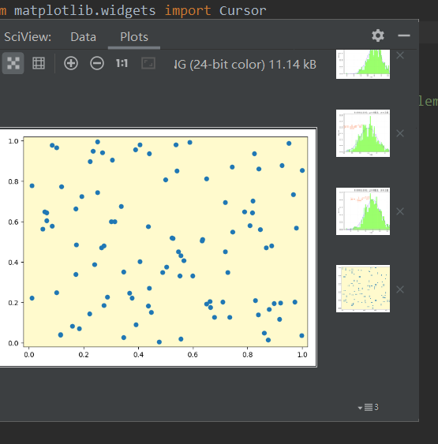

# PyCharm中绘图不能显示UI效果

我们利用了Matplotlib的类Cursor，向图形添加一组纵横交叉的直线，从而实现图形界面中任何位置的数值定位的可视化效果。

但使用PyCharm，绘图结果在右侧的部分：


这固然是需要绘制的图，但确实静态的，没有实现所谓的“定位可视化”……

## 解决方法

1. 打开 File → Settings，选择最下面的Tools：

2. 接下来，展开Tools，看到 Python Scientific：

3. 点击Python Scientific，右边有一个被选中的对勾，这不是我们需要的，勾掉就好：

4. 接下来，右侧的边栏图案就单独分离出来了：

5. 我们重新运行程序，就得到了需要的结果：


跟踪阅读：[本文样例的编程实现](https://blog.csdn.net/weixin_43896318/article/details/104332585)

# 绘制图像中文标注乱码问题

本图的坐标轴需要使用中文，我们按照库函数的使用方法，可能会写出这样的代码：

```python
import numpy as np
import matplotlib.pyplot as plt
import matplotlib as mpl

mu = 60.0
sigma = 2.0
x = mu + sigma*np.random.randn(500)

bins = 50

fig, ax = plt.subplots(1, 1)

n, bins, patches = ax.hist(x, bins, density=True, histtype="bar", facecolor="#99FF33", edgecolor="#00FF99", alpha=0.75)

y = ((1/(np.power(2*np.pi, 0.5)*sigma))*np.exp(-0.5*np.power((bins-mu)/sigma, 2)))

ax.plot(bins, y, color="#7744FF", ls="--", lw=2)

ax.grid(ls=":", lw=1, color="gray", alpha=0.2)

ax.text(54, 0.2, r"$y=\frac{1}{\sqrt{2\pi}\sigma}e^{-\frac{(x-\mu)^2}{2\sigma^2}}$", {"color":"#FF5511", "fontsize":20})

ax.set_xlabel("体重")
ax.set_ylabel("概率密度")
ax.set_title(r"体重的直方图：$\mu=60.0$, $\sigma=2.0$", fontsize=16)

plt.show()
```

完整代码：[Matplotlib在直方图中添加概率密度曲线和数学表达式](https://blankspace.blog.csdn.net/article/details/104328977)

接下来就会爆一堆“红字”（异常），制出的图是这样的：


红线围住的区域都是乱码。

## 解决方法

首先尝试加上utf-8题头注释：
```python
# -*- coding:utf-8 -*-
```

结果还是一样的，乱码。

正确的处理方式是在代码中加入这两行代码：
```python
mpl.rcParams["font.sans-serif"] = ["KaiTi"]
mpl.rcParams["axes.unicode_minus"] = False
```


