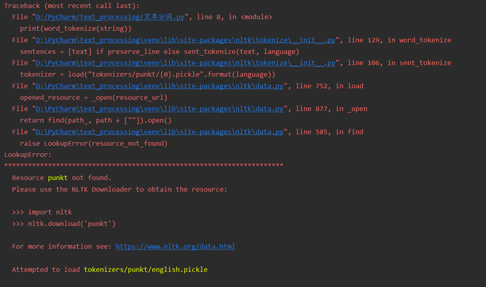
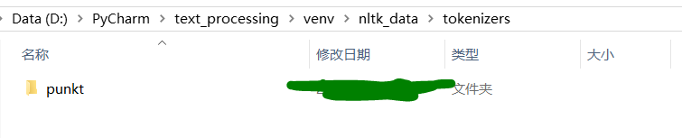

# Resource punkt not found.

报错信息如下：

```
Traceback (most recent call last):
  File "D:/PyCharm/text_processing/文本分词.py", line 8, in \<module>
    print(word_tokenize(string))
  File "D:\PyCharm\text_processing\venv\lib\site-packages\nltk\tokenize__init__.py", line 129, in word_tokenize
    sentences = [text] if preserve_line else sent_tokenize(text, language)
  File "D:\PyCharm\text_processing\venv\lib\site-packages\nltk\tokenize__init__.py", line 106, in sent_tokenize
    tokenizer = load("tokenizers/punkt/{0}.pickle".format(language))
  File "D:\PyCharm\text_processing\venv\lib\site-packages\nltk\data.py", line 752, in load
    opened_resource = _open(resource_url)
  File "D:\PyCharm\text_processing\venv\lib\site-packages\nltk\data.py", line 877, in _open
    return find(path_, path + [""]).open()
  File "D:\PyCharm\text_processing\venv\lib\site-packages\nltk\data.py", line 585, in find
    raise LookupError(resource_not_found)
LookupError: 
**********************************************************************
  Resource punkt not found.
  Please use the NLTK Downloader to obtain the resource:

  >>> import nltk
  >>> nltk.download('punkt')
  
  For more information see: https://www.nltk.org/data.html

  Attempted to load tokenizers/punkt/english.pickle

  Searched in:
     - 'C:\\Users\\xxx/nltk_data'
     - 'D:\\PyCharm\\text_processing\\venv\\nltk_data'
     - 'D:\\PyCharm\\text_processing\\venv\\share\\nltk_data'
     - 'D:\\PyCharm\\text_processing\\venv\\lib\\nltk_data'
     - 'C:\\Users\\xxx\\AppData\\Roaming\\nltk_data'
     - 'C:\\nltk_data'
     - 'D:\\nltk_data'
     - 'E:\\nltk_data'
     - ''
**********************************************************************
```



解决方法：

先是看了[这篇文章](https://www.freesion.com/article/7564306889/)，知道可能是浏览器权限的问题，然后碰到了[这篇文章](https://blog.csdn.net/dengzhuo8077/article/details/104006876)，觉得还蛮有道理的。
但我比较倾向于下载punkt包，所以去[这里](http://www.nltk.org/nltk_data/)下载了punkt包。
下载的时候可能打不开网页，因为不可说的原因，我是找了别人帮忙才下载成功的，读者自己想办法吧 ~~（后续可能我会提交一份CSDN资源吧）~~ 。

选画圈的位置下载即可：

下载完毕的是一个zip压缩包，处理方式是解压，在可能被搜索到的路径下安置这个文件夹。
我选择的是工程里面的venv文件夹。
不论选择哪个路径，注意的是：在安装之前，必须新建两层文件夹：<code>nltk_data</code>、<code>tokenizers</code>：




看看PyCharm的venv结构：

然后就能跑代码了。
