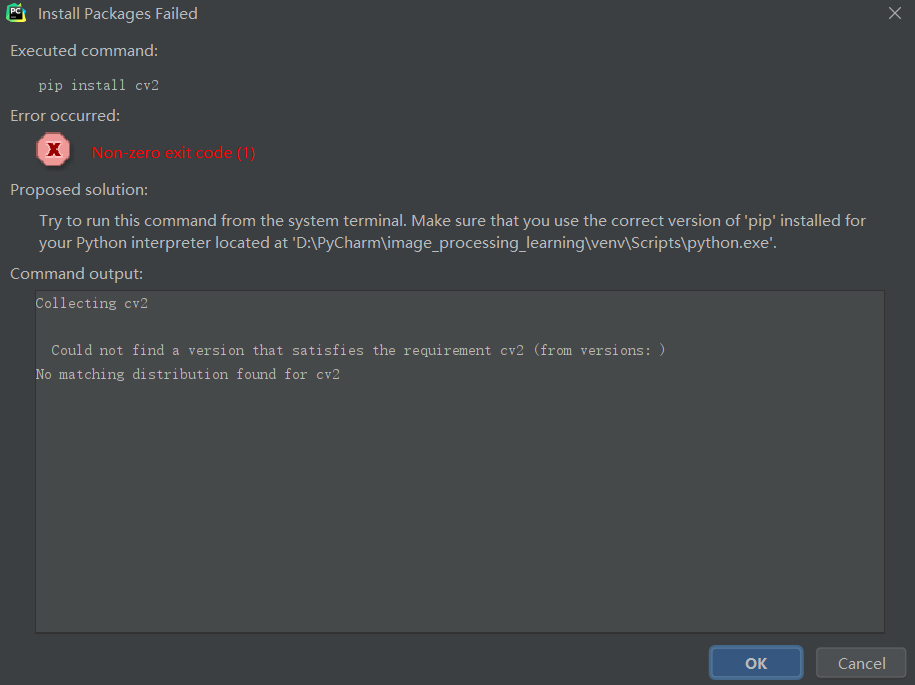
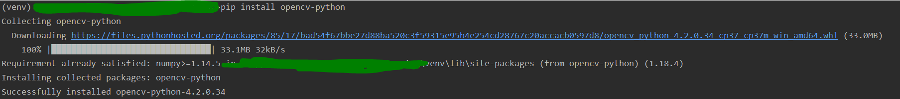

---
title: OpenCV运行错误的解决方法
date: 2020-09-26 19:18:06
summary: 本文分享一些OpenCV常见运行错误的解决方法。
tags:
- Python
- OpenCV
- 异常修复
categories:
- Python
---

# Could not find a version that satisfies the requirement cv2 (from versions: )

pip下载cv2出现下面的错误：
<font color="red">  Could not find a version that satisfies the requirement cv2 (from versions: )
No matching distribution found for cv2</font>



解决方案：
修改pip语句为：`pip install opencv-python`，下载完毕后再`import cv2`就可以正常使用了。



# cv2.error: ... (-215:Assertion failed) ssize.empty() in function 'cv::resize'

遇到了奇怪的错误：

<font color="red">cv2.error: OpenCV(4.2.0) C:\projects\opencv-python\opencv\modules\imgproc\src\resize.cpp:4045: error: (-215:Assertion failed) !ssize.empty() in function 'cv::resize'</font>

代码如下

```python
import numpy as np
from matplotlib import pyplot as plt
import cv2

image = cv2.imread("plane_256x256.jpg", cv2.IMREAD_GRAYSCALE)
image10x10 = cv2.resize(image, (10, 10))
print(image10x10.flatten())

plt.imshow(image10x10, cmap="gray"), plt.axis("off")
plt.show()

print(image10x10.shape)
print(image10x10.flatten().shape)

image_color = cv2.imshow("plane_256x256.jp", cv2.IMREAD_COLOR)
image_color_10x10 = cv2.resize(image_color, (10, 10))
print(image_color_10x10.flatten().shape)

image_256x256_gray = cv2.imread("plane_256x256.jpg", cv2.IMREAD_GRAYSCALE)
print(image_256x256_gray.flatten().shape)

image_256x256_color = cv2.imshow("plane_256x256.jpg", cv2.IMREAD_COLOR)
print(image_256x256_color.flatten().shape)
```

上网查了不少资料，觉得描述的不够好，这里讲讲自己的看法。
一般来说都是路径的问题，我测了一下报错的image_color_10x10，发现加载完是None，这就相当于Java空指针了，显然是加载有问题。
当然，笔者的错误其实很明显：
1. imread()写成imshow()
2. 路径的jpg写成jp

下面说说普遍的情况：路径不对。
其实这种问题基本上都是路径错误，路径要注意：
1. 看的是图片路径
2. 路径不能有中文以及qqgg的符号
3. 路径用单斜线不要用反斜线
4. 绝对路径和相对路径都行，注意规则就行 ~~（网上居然有说不能是相对路径的，笑死，我用的就是相对的）~~ 
5. 图片格式和名称不要写错
6. ……

好，就这样吧，修改后的代码：

```python
import numpy as np
from matplotlib import pyplot as plt
import cv2

image = cv2.imread("plane_256x256.jpg", cv2.IMREAD_GRAYSCALE)

# 将图像尺寸转换成10x10
image10x10 = cv2.resize(image, (10, 10))

# 将图像数据转换成一维向量
print(image10x10.flatten())

plt.imshow(image10x10, cmap="gray"), plt.axis("off")
plt.show()

print(image10x10.shape)
print(image10x10.flatten().shape)

# 以彩色模式加载图像
image_color = cv2.imread("plane_256x256.jpg", cv2.IMREAD_COLOR)
image_color_10x10 = cv2.resize(image_color, (10, 10))

# 将该图像数据转换成一维数组并显示数组维度
print(image_color_10x10.flatten().shape)

image_256x256_gray = cv2.imread("plane_256x256.jpg", cv2.IMREAD_GRAYSCALE)
print(image_256x256_gray.flatten().shape)

image_256x256_color = cv2.imread("plane_256x256.jpg", cv2.IMREAD_COLOR)
print(image_256x256_color.flatten().shape)
```
