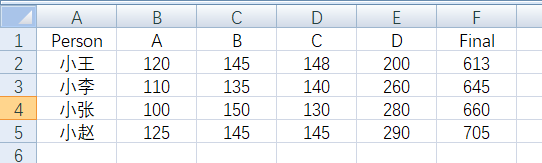

---
title: Pandas数据加载和操作
date: 2020-02-27 08:43:08
summary: 本文分享Pandas数据加载和操作的相关内容，数据源包括csv、json、excel、sqlite等。
tags:
- Python
- Pandas
categories:
- Python
---

# Pandas加载CSV文件数据

csv_test.csv数据：
```
1,2,3,4,5
2,3,4,5,6
3,4,5,6,7
4,5,6,7,8
5,6,7,8,9
```

Python编程实现：
```python
import pandas as pd

# 创建URL
url = 'csv_test.csv'

# 加载数据集
dataframe = pd.read_csv(url)

# 查看前三行数据
print(dataframe.head(3))
```

输出结果：
```
   1  2  3  4  5
0  2  3  4  5  6
1  3  4  5  6  7
2  4  5  6  7  8
```

# Pandas加载JSON文件数据

json数据内容：
```json
[
  {
    "name": "Sam",
    "id": "20200227"
  },
  {
    "name": "Bob",
    "id": "20200228"
  },
  {
    "name": "Tim",
    "id": "20200229"
  }
]
```

Python编程实现：
```python
import pandas as pd

# 创建一个URL
url = 'json_test.json'

# 加载数据
dataframe = pd.read_json(url, orient='columns')

# 查看前两行数据
print(dataframe.head(2))
```

输出结果：
```
  name        id
0  Sam  20200227
1  Bob  20200228
```

# Pandas加载Excel文件数据

Excel数据表设计：


Python编程实现：
```python
import pandas as pd

# 创建一个URL
url = 'grade_table.xlsx'

# 加载数据
dataframe = pd.read_excel(url, sheet_name=0, header=0)

# 查看前两行
print(dataframe.head(2))
```

遇到错误：<font color="red">TypeError: read_excel() got an unexpected keyword argument \`sheetname\`
</font>
错误原因：我使用的3.7+版本中，sheetname早就更名为sheet_name了，所以要写sheet_name。

输出结果：
```
  Person    A    B    C    D  Final
0     小王  120  145  148  200    613
1     小李  110  135  140  260    645
```

# Pandas加载SQLite数据

提示：建议采用 <font color="red">try...except...finally...</font> 或者 <font color="red">try...finally...</font> ，保证与数据库的连接被关闭。

建库建表：注意connect()如果没对应.db库的话会自动建一个。
```python
import sqlite3

try:
    connection = sqlite3.connect('sample.db')
    print("Opened database successfully")
    cursor = connection.cursor()
    cursor.execute('''CREATE TABLE COMPANY
           (ID INT PRIMARY KEY     NOT NULL,
           NAME           TEXT    NOT NULL,
           AGE            INT     NOT NULL,
           ADDRESS        CHAR(50),
           SALARY         REAL);''')
    print("Table created successfully")
    connection.commit()
finally:
    connection.close()
```

插入数据：
```python
import sqlite3

try:
    connection = sqlite3.connect('sample.db')
    cursor = connection.cursor()
    print("Opened database successfully")
    cursor.execute("INSERT INTO COMPANY (ID,NAME,AGE,ADDRESS,SALARY) VALUES (1, 'Sam', 32, 'BeiJing', 20000.00)")
    cursor.execute("INSERT INTO COMPANY (ID,NAME,AGE,ADDRESS,SALARY) VALUES (2, 'Bob', 25, 'ShangHai', 15000.00)")
    cursor.execute("INSERT INTO COMPANY (ID,NAME,AGE,ADDRESS,SALARY) VALUES (3, 'Jack', 23, 'Norway', 20000.00)")
    cursor.execute("INSERT INTO COMPANY (ID,NAME,AGE,ADDRESS,SALARY) VALUES (4, 'Tom', 25, 'GuangZhou', 65000.00)")
    connection.commit()
    print("Records created successfully")
finally:
    connection.close()
```

Python编程实现：
使用create_engine，定义了一个到SQLite数据库引擎的连接，然后使用pandas库中的read_sql_query，通过SQL语句查询数据库，并将结果存入一个DataFrame中。
```python
import pandas as pd
from sqlalchemy import create_engine

# 创建一个数据库连接
database_connection = create_engine('sqlite:///sample.db')

# 加载数据
dataframe = pd.read_sql_query('SELECT * FROM COMPANY', database_connection)

# 查看前两行数据
print(dataframe.head(2))
```

输出结果：
```
   ID NAME  AGE   ADDRESS   SALARY
0   1  Sam   32   BeiJing  20000.0
1   2  Bob   25  ShangHai  15000.0
```
