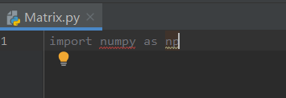
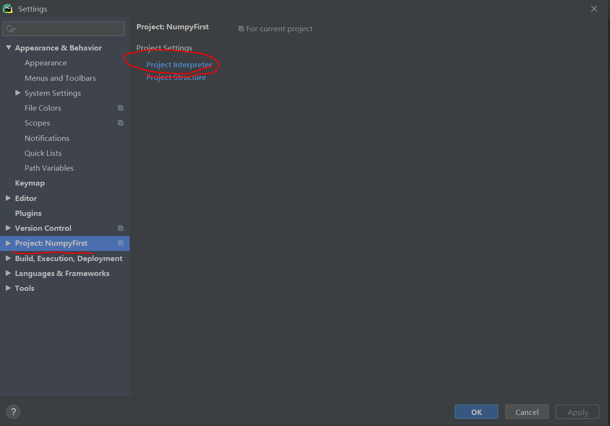
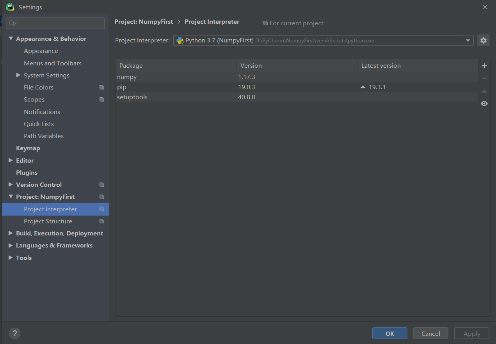
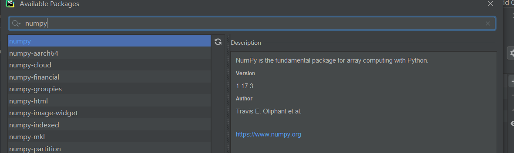
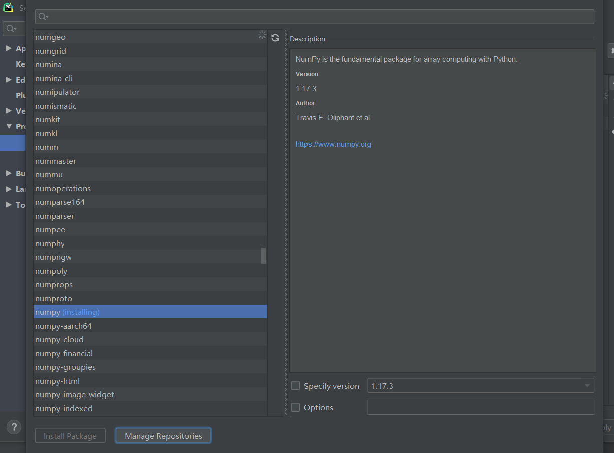
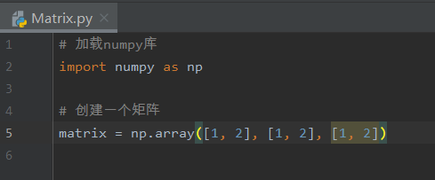
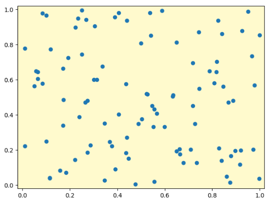
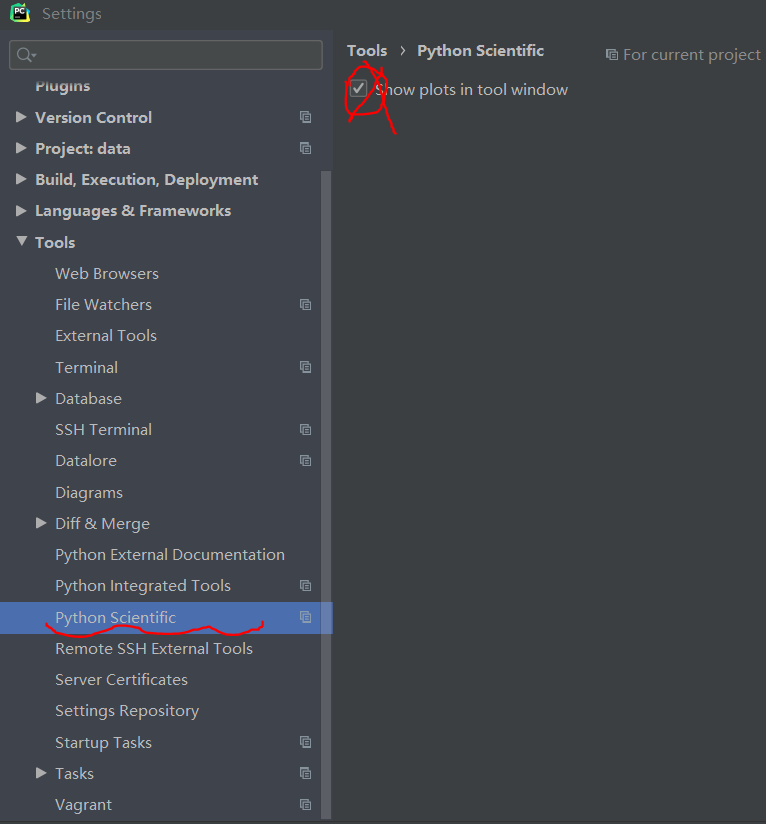
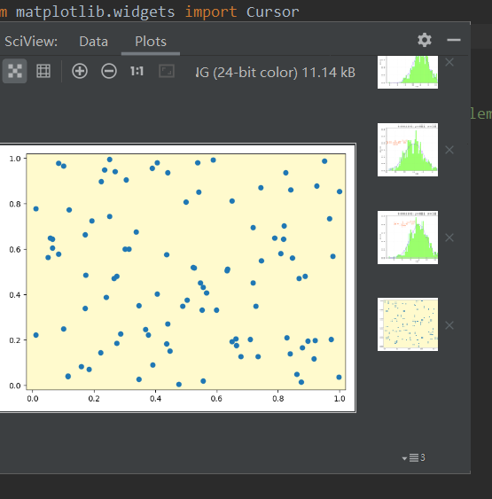

---
title: PyCharm用法总结
date: 2020-05-13 11:17:42
summary: 本文总结使用PyCharm的经验。
tags:
- Python
- PyCharm
categories:
- 开发技术
---

# Package状同普通Dictionary

就比如这样的：

其实我创建的都是 python package，也有 `__init__.py`，可惜的是图标不同，不仔细看可能看不出什么太大的问题。

经过简单的测试，发现出现这种情况的原因是：package名出现了空格，比如neural_network是多打空格，tree_and_forest是把下划线打成了空格。

对于遇到同样问题的读者来说，未必是因为空格的问题，但必须要认真检查自己的命名格式是否规范化，调整一下命名应该就解决啦！

# 第三方库的安装使用

我们直接写导入第三方库的语句，会遇到下面的情况：

这太正常了，毕竟没有安装Numpy包嘛。

解决方法可以是这样的：
1. 点击顶部File菜单栏，选择Settings，打开设置界面。
2. 点击Project，选择Project Interpreter。

3. 这样应该会发现未安装numpy（我已安装，所以有显示）。

4. 点击右上角的+号，搜索numpy（不要手动找，包太多了，很难找）。

5. 然后就点击下载。

6. 等待下载成功。

7. 使用numpy。

如注释所言，我们生成了一个矩阵。

在出现这样错误的时候，可以直接利用IDE功能下载。

我们就把鼠标移到红字上，给出的解决方案是安装numpy包，那就点一下。

# 关联Git和GitHub

核心操作和[《IntelliJ_IDEA项目关联Git的解决方案》](https://blog.csdn.net/weixin_43896318/article/details/105802880)是一致的，毕竟都是JetBrains家的产品。

这次简明扼要地总结一下步骤（默认你已经能做到本地Git和Github关联）：
1. Github创建NewRepository，成功后复制URL
2. 创建PyCharm项目
3. 顶部菜单栏选择VCS，选Git，再选Remotes...
4. 点击+，将复制的URL粘贴到URL栏中，确定
5. Pull项目到本地，项目文件夹开GitBash，输入`git pull origin master --allow-unrelated-histories`，防止README.md等文件导致提交失败
6. VCS选择Add
7. VCS选择Commit，在文本栏中输入-m以后的提交注释内容
8. VCS选择Git，再选Push，看一下是origin master，然后确认提交，等待成功提示

大概就是这么一个流程。

# 项目依赖库过大无法push

根据上文，可得PyCharm项目关联Git的解决方案。但在写一些数据分析和机器学习的项目的时候，其实不太能这么操作，因为类库太多了，而且很多都重重依赖，仅是pip都需要好久，下载完以后甚至几个GB大小。Github的一个项目只能是500MB-，所以必须处理。

解决方法：先在原先的代码区域新建一个文件夹，把代码放进去，再把.git和README.md挪过去，只提交code不提交venv里的内容。这个过程可能或多或少有些问题，自己调整调整就行，不会很复杂。

其实在你觉得这个项目类库太大的时候，就应该事先考虑只提交代码了。

更合适的方法是，使用本地Anaconda/Miniconda自带的Python，通过conda或pip下载依赖。
不要去创建项目的虚拟环境，而是直接创建conda的虚拟环境，这样可以避免很多无谓的下载。
如此，自然也不用担心项目依赖库随着项目代码本身提交的问题了。

# Matplotlib绘图不能显示UI效果

我们利用了Matplotlib的类Cursor，向图形添加一组纵横交叉的直线，从而实现图形界面中任何位置的数值定位的可视化效果。

但使用PyCharm，绘图结果在右侧的部分：

这固然是需要绘制的图，但确实静态的，没有实现所谓的“定位可视化”……

解决步骤：
1. 打开 File → Settings，选择最下面的Tools：

2. 接下来，展开Tools，看到 Python Scientific：

3. 点击Python Scientific，右边有一个被选中的对勾，这不是我们需要的，勾掉就好：

4. 接下来，右侧的边栏图案就单独分离出来了：

5. 我们重新运行程序，就得到了需要的结果：

