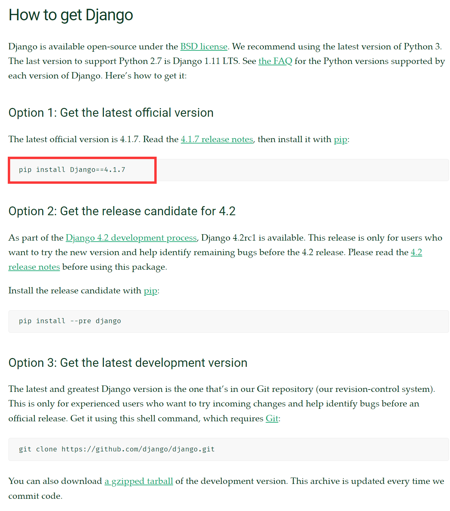

---
title: Python包管理工具pip
date: 2021-04-16 20:55:13
summary: 本文分享Python包管理工具pip的安装、命令、配置等内容。
tags:
- Python
categories:
- Python
---

# pip安装

对于Python3.4和2.7及以上版本，pip会随着Python或Conda的安装而安装，无需单独安装。低版本的Python需另行安装pip，但不推荐使用。

推荐阅读：[Python开发环境搭建](https://blankspace.blog.csdn.net/article/details/129352680)

# pip命令

常见的pip命令如下所示：
- 查看是否已经安装pip并加载到环境变量：`pip --version`
- 下载某个Python软件包：`pip install <package_name>`
- 移除某个Python软件包：`pip uninstall <package_name>`
- 查看已安装的全部Python软件包：`pip list`
- 查看已安装的某个Python软件包：`pip show <package_name>`
- 修改pip已有设置：`pip config set <var_key> <var_value>`

推荐阅读：[Python第三方库的安装方法](https://blankspace.blog.csdn.net/article/details/122036563)

# pip配置

对于Windows，pip配置文件在`C:\Users\<username>\AppData\Roaming\pip\pip.ini`下，相关配置可以通过命令交互或直接修改此文件实现。

对于Linux或者MacOS，pip配置文件在`~/.pip/pip.conf`下，相关配置可以通过命令交互或vim等文本编辑器修改实现。

## pip修改缓存位置

pip默认缓存的位置是`C:\Users\username\AppData\Local\pip\cache`，这占用了大量的C盘空间，我们可能想要改变此路径为`D:\Python\pipcache`。

做法是向终端输入如下命令：`pip config set global.cache-dir "D:\Python\pipcache"`

得到反馈：`Writing to C:\Users\username\AppData\Roaming\pip\pip.ini`

调整完毕！

## pip避免下载超时

以[Django](https://www.djangoproject.com/download/)的下载为例，根据官网的下载命令`pip install Django==4.1.7`执行下载。



下载时出现下载超时导致失败的问题。

缓解此问题的方法可以是：在pip命令中添加`--no-cache-dir`和`--default-timeout=1000`，即``pip --no-cache-dir --default-timeout=1000 install Django==4.1.7``。

这是一个治标不治本的方法。想要更好地解决问题，请仔细查看下面的两部分内容。

## pip修改代理源

注意：本文不讨论如何安装配置代理，只分享pip如何修改代理源！

向终端输入如下命令：`pip install requests --proxy=xxx.xxx.xxx.xxx:xxxx`

## pip修改镜像源

在一次pip下载中，我们可以通过`-i`和`--trusted-host`配置此次的镜像源，例如`pip install Django==4.1.7 -i http://pypi.douban.com/simple --trusted-host pypi.douban.com`。

为了在每次下载中都能用到镜像，我们可以打开`pip.ini`文件，向文件中追加以下内容：
```java
[global]
index-url = http://pypi.douban.com/simple/
[install]
trusted-host = pypi.douban.com
```

常用的国内pip镜像源如下表所示：

| 机构名 | URL |
|:----:|:----:|
| 阿里云 | `http://mirrors.aliyun.com/pypi/simple/` |
| 豆瓣 | `http://pypi.douban.com/simple/` |
| 清华大学 | `https://pypi.tuna.tsinghua.edu.cn/simple/` |
| 中国科学技术大学 | `http://pypi.mirrors.ustc.edu.cn/simple/` |

# pip操作requirements.txt

生成requirements.txt的方法：
- `pip install pipreqs`
- `pipreqs ./ --encoding=utf-8`

利用requirements.txt下载依赖：
- `pip install -r requirements.txt`

# pip常见错误解决方法

## ERROR: Could not install packages due to an OSError: [Errno 28] No space left on device

<font color="red">ERROR: Could not install packages due to an OSError: [Errno 28] No space left on device</font>

原因分析：安装包过大，设备分配给某个目录的磁盘空间不够。

解决方法：清理磁盘空间，为安装包腾出空间。
