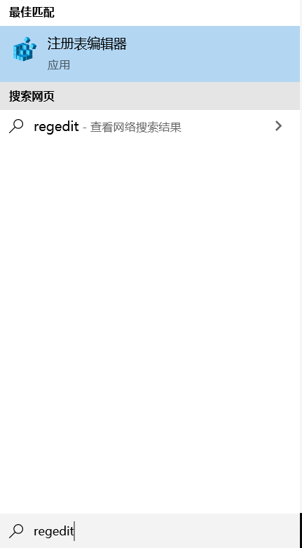
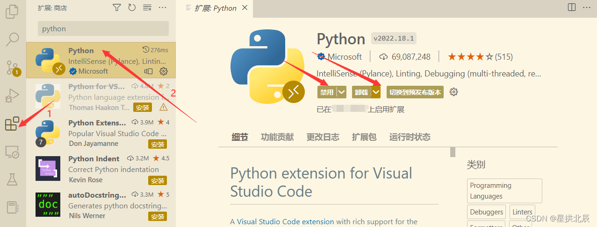

# IDLE

IDLE是Python自带的开发工具，是应用Python第三方库的图形接口库Tkinter开发的一个图形界面的开发工具，有如下特点：
- 跨平台（Windows、Linux、UNIX、Mac OS X）
- 智能缩进
- 代码着色
- 自动提示
- 可以实现断点提示、单步执行等调试功能
- 具有智能化菜单

Windows安装Python自带IDLE，Linux需要使用 yum 或者 apt-get 命令进行单独安装。

Windows下的 Python IDLE 的界面：


可以直接在这里运行代码。

# IDLE开发程序

当然，如果我们需要写一个完整的程序，还是需要新建一个文件的。
在上面的界面中点击“File”→"new File"，出现下面的界面：

我们可以保存文件并run（运行）。
写完以后，点击“Run”→"Run Module"，保存文件即可run。
在第一个界面中可以看到运行结果。

我们双击.py文件也可以运行已经写好的Python文件，但是会容易出现“闪现闪灭”的情况。
解决方案是在程序末尾加一行：
```python
input()
```

下面是hello world：


如果直接双击.py运行，闪灭。

加上上述语句：


再按回车，闪灭。

# IDLE快捷键

下面是IDLE一些常用快捷键：
 - `Ctrl+]`：缩进代码
 - `Ctrl+[`：取消缩进
 - `Alt+3`：注释代码
 - `Alt+4`：去除注释
 - `F5`：运行代码
 - `Ctrl+Z`：撤销一步

# IDLE问题解决

## Windows系统下Python文件打开方式没有IDLE选项

有一天，博主突然发现IDLE还在，但Python文件右键没有了IDLE。虽然我觉得IDLE丑了点，可IDLE是真的方便，没有还真不适应。那就让我们看看如何重新设置打开方式有IDLE吧！

Windows10系统左下角的查找输入框中输入`regedit`：


找到`HKEY_CLASSES_ROOT\SystemFileAssociations`，点开文件夹，往下找，看是否有`.py`的文件夹，暂时没有的话自己新建一个，命名为`.py`：


设置：


可见：


# 更好的IDE

进行Python编程可以选择好的文本编辑器如VSCode等，也可以选择PyCharm等IDE。

## PyCharm

推荐阅读：[PyCharm用法总结](https://blankspace.blog.csdn.net/article/details/106093626)


## VSCode

推荐阅读：[VSCode通过虚拟环境运行Python程序](https://blankspace.blog.csdn.net/article/details/127766482)

VSCode安装Python扩展插件后，可以编写和执行Python程序。

如果Python工程在远程服务器上，需要先[远程连接Linux服务器](https://blankspace.blog.csdn.net/article/details/127764676)，Python扩展也要在服务器上安装一份：



组合键`Ctrl+Shift+P`，会弹出输入框：


输入`Python: Select Interpreter`，选择需要的虚拟环境`python.exe`


至此，即可基于对应的虚拟环境运行Python程序。
