---
title: Python开发环境搭建
date: 2023-03-06 01:42:02
summary: 本文介绍Windows和Linux操作系统下搭建Python开发环境的方法。
tags:
- Python
categories:
- Python
---

# Python

## Linux安装Python

Linux系统是为编程而设计的，因此在大多数Linux计算机中，都默认安装了Python。

遗憾的是，Linux默认安装的Python一般是Python2.x，可用`python`命令查看：
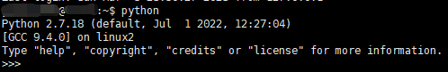

退出此模式的方法是采用`Ctril+D`或输入`exit()`。

Linux系统也可能有安装好的Python3.x，需要`python3`命令而不是`python`命令：
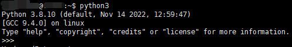

查看`python`安装位置：
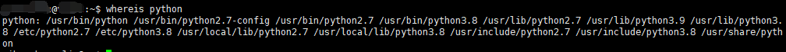

查看所有的Python版本：输入`python`后按`tab`键。
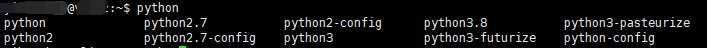

安装步骤：
1. 下载压缩包：`wget xxxxxx.tgz /opt`直接下载 或 下载后传输至Linux服务器上。
2. 解压软件包：`tar -xzvf /opt/xxxxxx.tgz -C /usr/local/src`
3. 切换至安装目录：`cd /usr/local/src/xxxxxx.tgz`
4. 配置：`./configure --prefix=/usr/local/python3`
5. 构建：`make && make install`
6. 查看环境变量：`echo $PATH`
7. 切换到`/etc/profile.d/`：`cd /etc/profile.d/`
8. 创建`python3.sh`：`vim python3.sh`
9. 配置环境变量：`export PATH="$PATH:/usr/local/python3/bin"`
10. 重新载入环境变量：`source ../profile`
11. 再次查看环境变量：`echo $PATH`

## Windows安装Python

Windows检查Python环境可以向CMD等终端输入`python`，查看是否出现'python' 不是内部或外部命令，也不是可运行的程序或批处理文件。

这样做可能存在的问题是：如果`python.exe`未添加到PATH中，就无法终端启动，而Windows又不默认安装Python。

因此，可以去[Python官网](https://www.python.org/downloads/)下载安装。

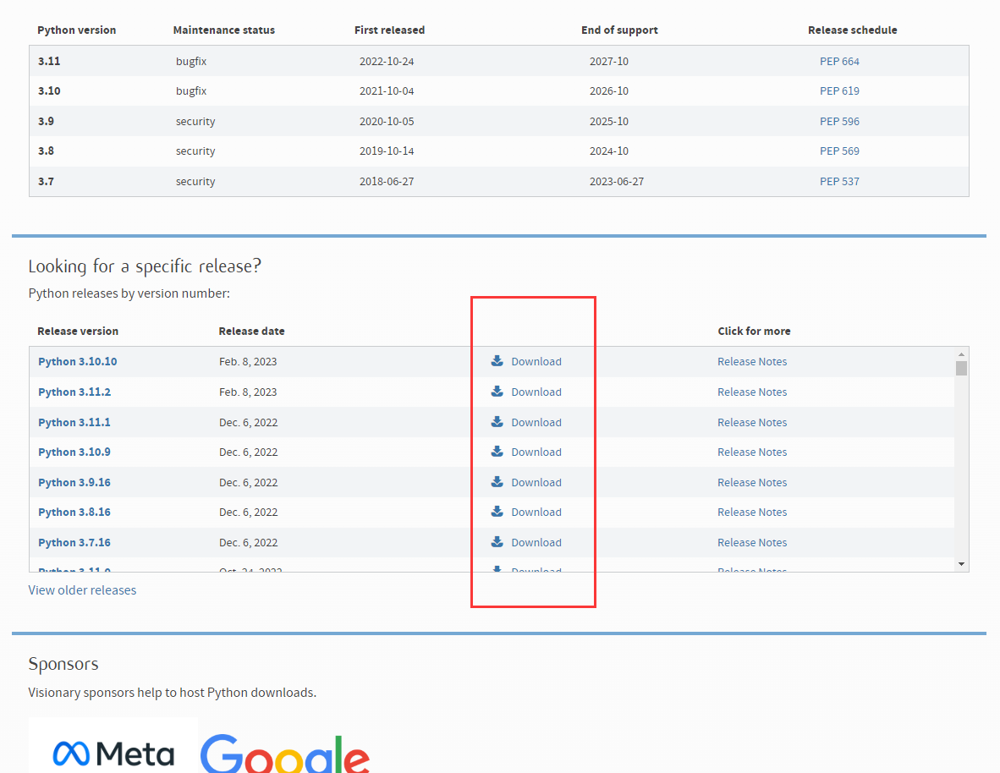

正常启动Setup工具即可，一路选默认(一般最可能不默认的都是安装路径)。

# Conda

Conda是一个运行在Windows、MacOS和Linux上的开源包管理系统和环境管理系统。Conda可以快速安装、运行和更新包及其依赖项。Conda可以轻松地在本地计算机上创建、保存、加载和切换环境。它是为Python程序创建的，但它可以为任何语言打包和分发软件。

Conda作为包管理器可帮助开发者查找和安装包。如果开发者需要一个需要不同版本Python的包，他不需要切换到不同的环境管理器，因为Conda也是一个环境管理器。只需几个命令，开发者就可以设置一个完全独立的环境来运行不同版本的Python，同时继续在正常环境中运行常用的Python版本。

在其默认配置中，Conda可以在[repo.anaconda.com](https://repo.anaconda.com)上安装和管理由Anaconda构建、审查和维护的数千个软件包。

Conda可以与持续集成系统结合使用，以提供对代码的频繁、自动化测试。

Conda包和环境管理器包含在所有版本的Anaconda和Miniconda中。

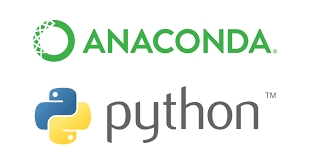

## Linux服务器搭建Conda环境

用sudo权限时，可能遇到以下报错：
xxx is not in the sudoers file.  This incident will be reported.

安装步骤：
1. 下载Linux版本的.sh脚本到本地，发送至远程服务器上：
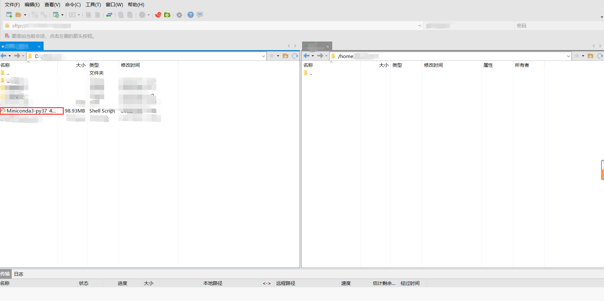
2. 在服务器上运行此安装脚本，安装Miniconda：`bash ./Miniconda3-py37_4.11.0-Linux-x86_64.sh`
3. 列出所有的Conda虚拟环境：`conda env list`
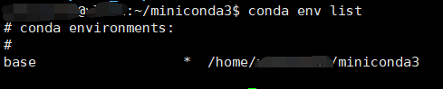
4. 创建Conda虚拟环境：`conda create --name cr python==3.7`
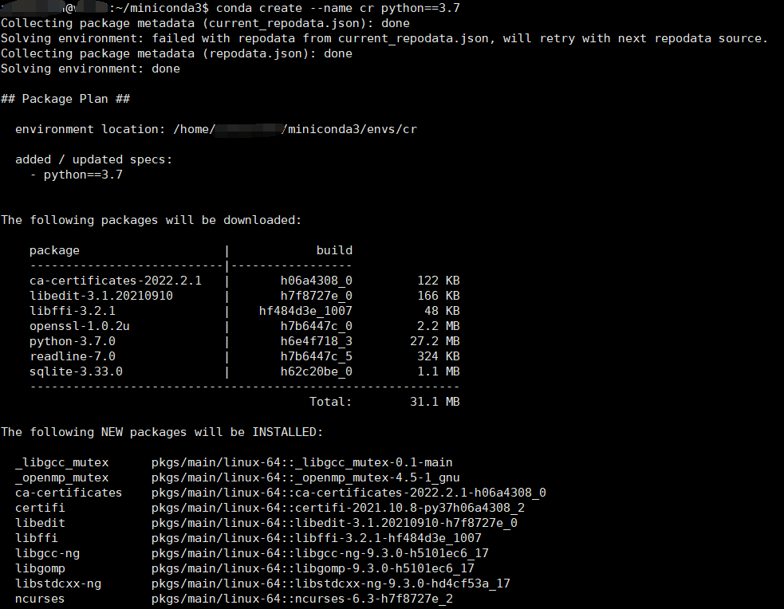
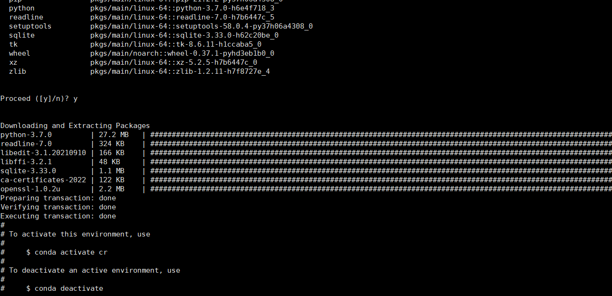
5. 进入指定的Conda虚拟环境：`conda activate cr`

6. pip设置镜像：`pip config set global.index-url https://pypi.tuna.tsinghua.edu.cn/simple`
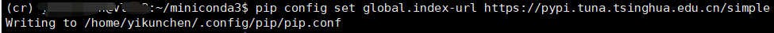
7. 退出当前Conda虚拟环境：`conda deactivate`
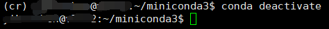
8. 删除指定的Conda虚拟环境：`conda remove -n cr --all`

## Windows本地搭建Conda环境

前往[官网](https://www.anaconda.com)下载Setup.exe。

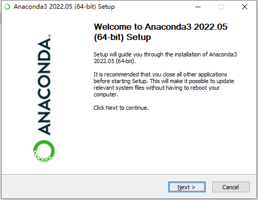

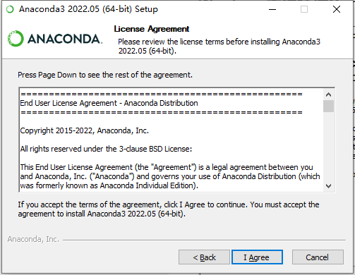

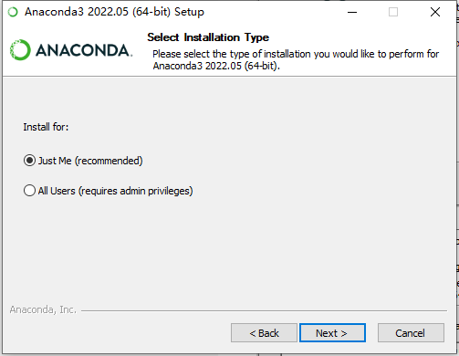

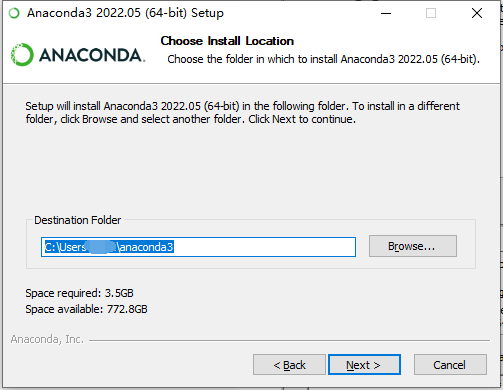
