---
title: Python推荐入门策略
date: 2022-01-25 15:13:46
summary: 本文推荐一份Python入门策略。
tags:
- Python
categories:
- Python
---

# Python开发环境搭建

推荐阅读：[Python开发环境搭建](https://blankspace.blog.csdn.net/article/details/129352680)

# Python之禅

Tim Peters撰写的“Python之禅”中包含了编写优秀Python代码的指导原则。

若想要查看“Python之禅”，可以这样做：
```python
import this
```

输出结果：
- Beautiful is better than ugly. (优美胜过丑陋)
编程是为了解决实际问题，设计良好、高效而优雅的解决方案是值得推崇的。
- Explicit is better than implicit. (显式定义优于隐式定义)
- Simple is better than complex. (简单胜于复杂)
如果既有简单的解决方案，也有复杂的解决方案，那么请选择简单的解决方案。这样，你编写的代码将更容易维护，你或他人以后改进这些代码时也会更容易。
- Complex is better than complicated. (即使复杂不可避免，也要尽可能避免繁琐难懂)
现实需求可能是复杂的，有时候可能没有简单的解决方案。在这种情况下，选择最简单可行的解决方案即可。
- Flat is better than nested. (扁平结构比嵌套结构更好)
例如：
    ```python
    if a and b:
        i += 1
    ```
    比
    ```python
    if a:
        if b:
            i += 1
    ```
    更好，因为更少的嵌套带来更简洁易懂的代码。
- Sparse is better than dense. (稀疏简洁胜过密密麻麻)
- Readability counts. (代码可读性是重要的)
即便是复杂的代码，也要让它易于理解。开发的项目涉及复杂代码时，一定要为这些代码编写有益的注释。
- Special cases aren't special enough to break the rules. (特殊情况不是打破规则的理由)
- Although practicality beats purity. (实用性炼就纯粹)
- Errors should never pass silently. (不能悄悄地放过错误)
- Unless explicitly silenced. (除非明确了要忽略错误) (这条指南的语义接上条)
- In the face of ambiguity, refuse the temptation to guess. (面对模棱两可的情况，不该妄加猜测)
- There should be one-- and preferably only one --obvious way to do it. (应该最好只有一种方法可以完成任务，这种方法应该是显而易见的)
如果让两名Python程序员去解决同一个问题，他们提供的解决方案应大致相同。这并非抹杀编程的创造性。只是，大部分编程工作都是使用常见解决方案来解决简单的小问题，但这些小问题都包含在更庞大、更有创意空间的项目中。在你的程序中，各种具体细节对其他Python程序员来说都应易于理解。
- Although that way may not be obvious at first unless you're Dutch. (即使最初的方法不够显而易见，也要坚定地做下去) (这条指南的语义接上条)
- Now is better than never. (现在开始尝试总比从未尝试要好)
- Although never is often better than \*right\* now. (即时从未尝试比现在开始尝试要好) (这条指南的语义接上条)
你可以将余生都用来学习Python和编程的纷繁难懂之处，但这样你什么项目都完不成。不要企图编写完美无缺的代码；先编写行之有效的代码，再决定是对其做进一步改进还是转而去编写新代码。
- If the implementation is hard to explain, it's a bad idea. (如果实现难以解释，那它不是个好想法)
- If the implementation is easy to explain, it may be a good idea. (如果实现容易解释，那它可能是个好想法)
- Namespaces are one honking great idea -- let's do more of those! (多多使用命名空间对程序是有好处的)

# Python3.X相对Python2.X的变更

1. 使用内置函数print()，而不是print语句。
2. 整数除法的结果是浮点数。
在Python2中，1/2（两个整数做除法）的结果是0；在Python3中，1/2的结果是0.5。因此在Python3的脚本中，尝试使用3/(float)2或者3/2.0来代替3/2，以此来避免将Python3的代码迁移到Python2的过程中，发生整数除法上的变化。
3. 默认使用Unicode文本字符串。
4. 不再使用内置函数xrange()，而是用内置函数range()。
5. 异常语法：触发异常和异常处理。
6. for循环中的变量存储的内容不再赋值给同名的全局变量。
7. 使用内置函数input()解析用户输入的内容。
8. 很多内置函数和使用方法返回的是可迭代对象而不是列表。
在Python2中，很多内置函数和方法返回的是列表；在Python3中，这些函数和方法返回的是可迭代对象，而不像在Python2中返回列表。
下面列出了Python3中不再返回列表的内置函数和方法：
- zip()
- map()
- filter()
- 字典的keys()方法
- 字典的values()方法
- 字典的items()方法

在Python3中，如果需要列表，则可以通过内置函数list()将可迭代对象转化成列表。将返回对象转化成列表，可以避免绝大多数在Python3中执行Python2的脚本产生的问题。

# Python常用语法细节

1.格式化输出：
```python
your_name = "Bob"
my_name = "Sam"
print(f"Hello, {your_name}! I'm {my_name}")
```
输出结果：

```python
Hello, Bob! I'm Sam
```

2.格式化输出：

```python
print("Hello, my name is {}.".format("Sam"))
```
输出结果是：

```
Hello, my name is Sam.
```

3.三种方法实现单行、多行注释：

法1：
单行注释：`Shift + #`（在代码的最前面输入，非选中代码进行注释）
多行注释：同单行一样在每一行的前面输入`Shift+#`

法2：
单行和多行一样的方式：选中需要注释的代码，`Ctrl+/`，写Java的时候就是常用的方法

法3：
输入`''' '''`或者`""" """`，将要注释的代码插在中间

4.Python与Java在`*`的非数值运算用法的对比：

首先看一下Java的`'a'*10`：
```java
System.out.println('a'*10);
```
得到：

```java
970
```
然后是Java的`"a"*10`：
```java
System.out.println("a"*10);
```
会报错的。

解释：
Java中'a'的类型为char，char实际上是一个数值按照其ASCII码值映射的字符，可以做数值运算。'a'的ASCII码值为97，相当于97*10=970。
Java中的字符串不可以与数值相乘。

再看看Python：

```python
print('a'*10)
```
```python
print("a"*10)
```
得到：

```python
aaaaaaaaaa
```
```python
aaaaaaaaaa
```
解释：
`""`和`''`其实是等效的，`*`在Python里可以用来将字符/字符串复制n遍，这里是10遍。

5.Python与Java在`+`的非数值运算用法的对比：

首先看一下Java的`'a'+10`：
```java
System.out.println('a'+10);
```
得到：

```java
107
```
然后是Java的`"a"+10`：
```java
System.out.println("a"+10);
```
```java
a10
```

解释：
Java中'a'的类型为char，char实际上是一个数值按照其ASCII码值映射的字符，可以做数值运算。'a'的ASCII码值为97，相当于97+10=>107。
Java中的字符串的+相当于把10变为字符串与已有字符串连接，得到“a10”。

再看看Python：

```python
print('a'+10)
```
```python
print("a"*10)
```
都会报错。

即使这样：

```python
print("a", 10)
```
也是相当于打印两个变量，中间会有空格，始终不是一个变量。

解释：
`""`和`''`其实是等效的，在Python里字符串不能与数值直接相加。

6.`""""""`是可以的，`“ “ “ ” ” ”`是不对的。

7.直接将用户输入转化：
转成int：

```python
x = int(input())
```

转成float：

```python
y = float(input())
```
8.Python的print()从某种程度上相当于Java的System.out.println()或者说C#的Console.Writeline()，这是说执行后会换行。如果我们不想换行，可以这样：

```python
print("Hello, ", end=' ')
```
9.格式化的强化：

```python
formatter = "{} {} {}"

print(formatter.format(7, 9, 8))
print(formatter.format("李华", "李刚", "李想"))
print(formatter.format(formatter, formatter, formatter))
print(formatter.format(True, True, False))
print(formatter.format("哈哈", "嘎嘎", "呵呵"))
```
结果：

```python
7 9 8
李华 李刚 李想
{} {} {} {} {} {} {} {} {}
True True False
哈哈 嘎嘎 呵呵
```
10.导入命令行参数

```python
from sys import argv

a, b, c, d = argv

print("a is: ", a)
print("b is: ", b)
print("c is: ", c)
print("d is: ", d)
```
可以在命令行运行的时候输入命令行参数：

```python
test.py BeiJing ShangHai GuangZhou ShenZhen
```
这个就好像Java里面

```java
public static void main(String[] args){}
```
这个语句的args[]数组。

传入的都是字符串，哪怕是1,2,3这样的数值。

11.一些Python的库介绍
| Python框架 | 主要用途简介 |
|:----:|:----:|
| Django | Web开发工具库 |
| Numpy | 大量的维度数组与矩阵运算的数学函数库 |
| Matplotlib | 数据可视化库，多与Numpy配合使用 |
| Scipy | 机器学习和数值分析库 |
| Pandas | 数据操纵和分析库 |
| PyGame | 游戏开发库，带图形界面和声音 |
| ScraPy | 网络爬虫库 |
| TensorFlow | 机器学习和数据可视化库 |
| Requests | 简单易用的HTTP库 |
| Kivy | 桌面应用和移动平台的用户界面库 |
| Natural Language Tool Kit | 自然语言处理库，可用于分析文本、垃圾邮件过滤、自动聊天机器人 |

12.虽然Python的命名多采用下划线`_`，但是类的命名建议采用驼峰式。

13.建议采用比较一致的方式组织函数或者类的方法，比如：函数A参数为`(x, y, z)`，B也需要用到x, y, z，那相对来讲写成(x, y, z)总比(y, z, x)易于管理。

14.好好写注释，好好写文档！！

15.代码内部适当留白，应该有必要的空格或者空行以增强可读性。

16.像JavaScript这种原型（prototype）语言中，类和对象除了用法以外没多少不同，对象从某种程度上可以看做类的副本，然而Python里面类很像创建对象的模板，这点和Java类似。

17.对父构造器的引用
`super`和`__init__`的搭配使用：

```python
super(Child, self).__init__()
```
在Java里就是相当于：
```java
super();
```

18.大部分可以使用继承的场合都可以使用组合取代或者简化，而多重继承则需要不惜一切地避免。
（Java没有多继承并利用Interface来补充缺乏多继承的灵活性）

19.Python有这样的写法：`class className(object)`，object可以省略。这就好像Java里所有的类都是java.lang.Object的子类，然而并没有必要去写`public class A extends Object {}`。

20.Python面向对象里的self就可以用Java里的this来理解，只不过两门编程语言还是有语法使用上的差别的。

21.Python中有一种“key-value”的模式，应用广泛。
这个东西不要仅仅想到“字典”数据结构，再想想，是不是模块啊，类啊也是通过"XXX.key"的方式调用出"value"的呢？
这个概念是一个广泛应用的概念。
Java的java.util.HashMap也是k-v结构。

22.模块（module）的一些说明：
 - 模块是包含函数和变量的Python文件(.py)
 - 可以导入这些文件（import）
 - 可以使用.操作符访问模块中的函数和变量
 - 类与模块也是异曲同工的，只不过一个面向过程，一个面向对象

23.`collections.OrderedDict`是可排序的字典结构。
字典这东西，Java也有java.util.Dictionary，可以用Java里的java.util.Map类比，都是“key-value”。
至于能排序的Dic，Java的java.util.TreeMap说的直白点儿，不就是红黑树支持的排序Map吗……

24.Python的切片语法糖很实用，Java就必须顺着来，Python就无所谓，可以正着来也能倒着来，还能一端“开放不限界”。不过，“左闭右开”是通用的。

25.通用的经验：不要等全部开发完再测试，单元测试、模块化的测试应该及时的做好。

26.Java里面啊，想给用户输入加提示信息就非得先Sytem.out.print()一下，Python就可以直接在input()里加入参数，这个参数其实是打印给用户看的。

```python
x = input("请输入一个数字")
```

27.Python的简单输入较之Java比较简洁。
先看看Python的写法：
```python
x = input()
```
看看Java的写法：
```java
//类和方法省却了……直接写代码
Scanner scan = new Scanner(System.in);
String x = scan.next();
scan.close();
```

28.Python的for循环写起来更简洁，而且其for-each写法显得更简单。
引入循环结构要注意防止死循环。
根据Java编译后的结果，`for(;;)`和`while(true)`其实是等效的。

29.列表和数组的区别需要因编程语言而异。
从传统的、经典的定义看来，二者很不同，但是现在的很多编程语言有一些与传统规定不同的地方。
Ruby里面列表、数组统称数组。
Python里面列表、数组统称列表。
Java只有数组，列表需要看`java.util.ArrayList`。

30.in range()这个操作不只是用于for i in range(x)，后面的参数可以加上另一侧边界值和步长：

```python
x = int(input("请输入一个整数，将检查其是否在1~5"))
print(x in range(1, 6))
```

31.Python支持not or （或非）和 not and （与非）的写法是：

```python
not(a and b)
not(a or b)
```

32.readline()读文件，关键在于读“\n”。同样的，该函数返回结果带有“\n”换行符，这个是需要注意的。
print的话可以加一个end=' '参数。

33.open文件支持指定字符集：

```python
lang = open("lang.txt", encoding="utf-8")
```

34.函数参数可能出现`*args`：

```python
def f(*args):
    # balabala
```
其实就是和argv那东西挺像，只不过这是函数调用，那是命令行参数传入程序。

35.看这样的写法：

```python
data = open(file).read()
```
这样的话就没法运行close()了，因为read()一旦运行，文件就会被Python关掉。

36.exists可以先判一下文件存在不存在

```python
from os.path import exists
```
上面的语句可以调出来exists。

```python
print(f"这个文件存在吗？{exists(file)}")
```

Java给我印象很深的一个是`instanceof`，能在ClassCast的时候安全一些。

37.Python增量赋值语法：

```python
var = var + 1
```
或者是

```python
var += 1
```
但是下面的语句会报错：

```python
var++
```

这就比较起Java、C等编程语言，是一个需要适应的点，毕竟没有简便的++var和var++了啊！
不过，Java里非整型变量不能直接自增自减。
Python毕竟不是直接定义了类型，所以这么写也是可以理解的啊。

38.Python运算符有一些和Java、C等编程语言不同的点：
它支持整除`//`、非整除`/`和指数`**`两种运算。
Java里想做指数运算就比这个麻烦得多：

```java
double result = Math.pow(a, b);
```

39.eval()、int()、float()、str()函数可以直接用于input()函数内部，也可以另作他用。

```python
print(int("23"))
print(float("23"))
print(eval("23"))
print(str(23))
print(eval("23.5"))
x = 5
print(eval("23 + (2 *x)"))
```
输出：

```python
23
23.0
23
23
23.5
33
```
归纳：
 - int()可以将字符串转换成整型
 - float()可以将字符串、整型转换成浮点型
 - str()可以将数值型转换成字符串
 - eval()可以计算相应表达式，赋值为相应的数值类型（整型或浮点型）

40.下面是表示字符串内行连续的两种方式，请看下面的示例：

```python
a = "Hello, " + \
	"World!"
```

```python
b = ("Hello, " + 
	"World ~ Again!")
```

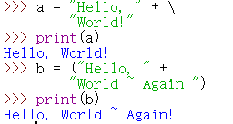

而Java由于是`{}` 、`[]`、`()`、`;`这些起到分隔作用的来决定，String的对象可以这么写：

```java
String a = "Hello, " + 
	"World!";
```

41.Python的print()有两个需要记住的参数：
sep=“” 和 end=""
看下面的例子：

```python
print("Hello", "World", sep="**")
print("Hello", "World", sep="")
print("1", "+", "2", "=", "3", sep=" ")
print("Hi", "Sam", sep="#", end=" ")
```
输出结果

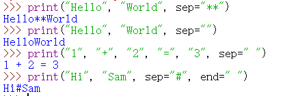

总结：
`sep="sepString"`中，sepString替换了分隔符Space（`" "`）
`end="endString"`中，endString替换了换行符Enter（`"\n"`)

42.Python输出域内对齐：如果字符串长度没达到指定的长度，则不够的部分用空白补齐；否则（超出长度），对齐无效。

对齐方式三种：
 - `ljust(n)`：左对齐
 - `rjust(n)`：右对齐
 - `center(n)`：居中对齐

看下面的例子：

```python
print("012345678901234567890123456789")
print("Rank".ljust(5), "Player".center(22), "HR".rjust(3), sep="")
print("1".ljust(5), "XiaoBiao".center(22), "100".rjust(3), sep="")
print("2".ljust(5), "XiaoChi".center(22), "98".rjust(3), sep="")
print("3".ljust(5), "XiaoDai".center(22), "93".rjust(3), sep="")
print("4".ljust(5), "XiaoSha".center(22), "60".rjust(3), sep="")
```

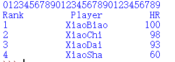

非常遗憾的是，我们用中文就不怎么理想：
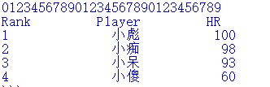

43.格式化数值（主要是浮点数）输出：
| 语句 | 输出 | 说明 |
|:----:|:----:|:----:|
| print("{0:10d}".format(12345678)) | 12345678 | 数字是个整型 |
| print("{0:10,d}".format(12345678)) | 12,345,678 | 添加千分符 |
| print("{0:10.2f}".format(1234.5678)) | 1234.57 | 四舍五入 |
| print("{0:10,.2f}".format(1234.5678)) | 1,234.57 | 四舍五入并添加千分符 |
| print("{0:10,.3f}".format(1234.5678)) | 1,234.568 | 四舍五入并添加千分符 |
| print("{0:10.2%}".format(12.345678)) | 1234.57% | 转换为百分数、四舍五入并添加千分符 |
| print("{0:10,.3%}".format(12.345678)) | 1,234.568% | 转换为百分数、四舍五入并添加千分符 |

44.列表的split()和join()方法：
- split()：将字符串分割生成列表
- join()：将列表元素拼接成字符串

看下面的例子：
```python
print("a,b,c".split(","))
print("a**b**c".split("**"))
print("a\nb\nc".split())
print("a b c".split())
```

查看输出：
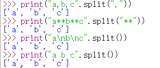

注意，split()方法没传参数，参数默认是空白字符，这个空白字符可以是Space、Tab、Enter。

```python
hello = ["H", "e", "l", "l", "o"]
print(hello)
print(" ".join(hello))
world = ["W", "o", "r", "l", "d"]
print(", ".join(world))
```

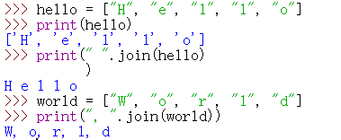

这种操作是非常常见的，而Python的支持也使其变得十分简单。

这方面Java也有支持（IDEA打开）：
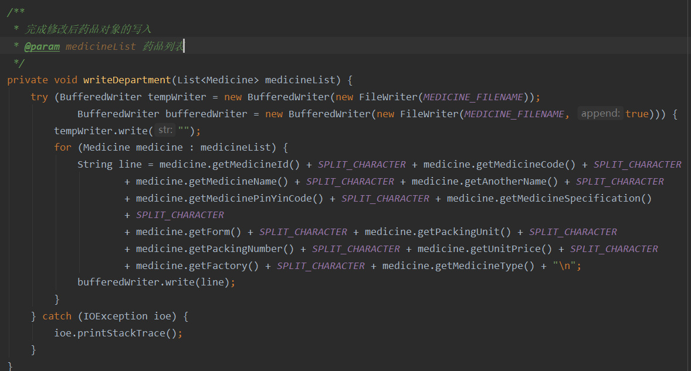
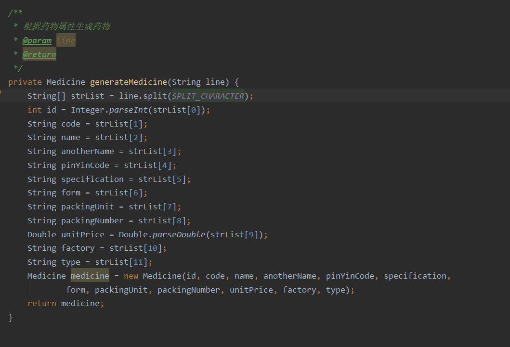
上面的代码是我自己以前写着玩的某一个项目的部分代码（写的挺烂），不过可见Java里这种切分与组合还是很重要的！

45.注意下面的语句：

```python
list1 = ["1", "2"]
list2 = list1
del list1[-1]
print(list2)
```

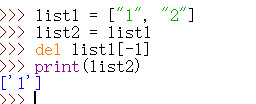

可见：这里是浅复制！！这里是比较深的知识，在Java里深拷贝也是比较有趣的知识，建议感兴趣的读者了解一下。

浅复制可以简单地解释为：这两个对象指向同一块内存空间，一个改变则全都改变。

46.Python里面，切片等操作也不能索引越界，否则会爆出IndexError（只不过Python允许负数索引，即“倒着找”）。

Java则是IndexOutOfBoundsException那种异常。

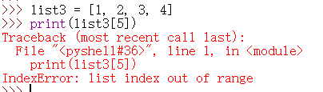
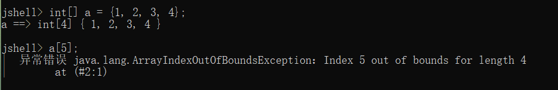

47.Python一些分析string内部字符后返回True/False的方法：
| 方法 | 返回True的条件 |
|:----:|:----:|
| str1.isdigit() | str1的所有字符都是数字 |
| str1.isalpha() | str1的所有字符都是字母 |
| str1.isalnum() | str1的所有字符都是字母或者数字 |
| str1.islower() | str1的所有字符都是小写字母 |
| str1.isupper() | str1的所有字符都是大写字母 |
| str1.isspace() | str1的所有字符都是空白字符 |

48.Python也有判断类型的函数isinstance()：

```python
isinstance(item, dataType)
```
返回布尔类型。

49.简化表达式条件：

case 1：
```python
(state == "A") or (state == "B") or (state == "C") or (state == "D")
```
可以简化为：

```python
state in ["A", "B", "C", "D"]
```

case 2：

```python
(x > 10) and (x <= 20)
```
可以简化成：

```python
10 < x <= 20
```

case 3：

```python
(x >= 20) or (x <= 10)
```
可以利用德.摩根律转换为：

```python
not(10 < x < 20)
```

50.Python的集合（Set）的重要方法：
 - add()：增
 - discard()：删
 - clear()：清空

还有这样的方法
set([...]) / set((...))可以将列表或者元组转换成无序集合

Python还支持集合论的基本操作(交/并/差)等：
 - set1.union(set2)：并集
 - set1.intersection(set2)：交集
 - set1.difference(set2)：差集

51.Python模块导入的五种类型
- 导入整个模块文件：`import module_name`
- 只导入指定函数：`from module_name import function_name`
- 使用as指定函数别名：`from module_name import function_name as another_name`
- 使用as指定模块别名：`import module_name as another_name`
- 导入所有函数：`from module_name import *`

52.Python列表操作的时间复杂度
| 操作 | 时间复杂度 |
|:----:|:----:|
| 索引 | O(1) |
| 索引赋值 | O(1) |
| 追加 | O(1) |
| pop() | O(1) |
| pop(i) | O(n) |
| insert(i, item) | O(n) |
| 删除 | O(n) |
| 遍历 | O(n) |
| 包含 | O(n) |
| 切片 | O(k) |
| 删除切片 | O(n) |
| 设置切片 | O(n+k) |
| 反转 | O(n) |
| 连接 | O(k) |
| 排序 | O(nlogn) |
| 乘法 | O(nk) |

53.Python字典操作的时间复杂度
| 操作 | 时间复杂度 |
|:----:|:----:|
| 复制 | O(n) |
| 取值 | O(1) |
| 赋值 | O(1) |
| 删除 | O(1) |
| 包含 | O(1) |
| 遍历 | O(n) |

54.Python中类的专有方法
 - `__init__`：构造方法，在生成对象时调用
 - `__del__`：析构函数，在释放对象时调用
 - `__repr__`：打印，转换
 - `__setitem__`：按照索引赋值
 - `__getitem__`：按照索引获取值
 - `__len__`：获得长度
 - `__cmp__`：比较运算
 - `__call__`：函数调用
 - `__add__`：加运算
 - `__sub__`：减运算
 - `__mul__`：乘运算
 - `__div__`：除运算
 - `__mod__`：求余运算
 - `__pow__`：乘方运算

55.Python中常用的字符串处理函数

| 字符串处理函数 | 描述 |
|:----:|:----:|
| string.capitalize() | 将字符串第一个字符大写 |
| string.count() | 获得字符串中某一个子字符串的数目 |
| string.find() | 获得字符串中某一个子字符串的起始位置，无则返回-1 |
| string.isalnum() | 检测字符串是否仅包含 0~9 、A~Z 和 a~z |
| string.isalpha() | 检测字符串是否仅包含 A~Z 和 a~z |
| string.isdigit() | 检测字符串是否只包含数字 |
| string.islower() | 检测字符串是否均为小写字母 |
| string.isspace() | 检测字符串中所有字符是否均为空白字符 |
| string.istitle() | 检测字符串中单词是否为首字母大写 |
| string.issuper() | 检测字符串是否均为大写字母 |
| string.join() | 连接字符串 |
| string.lower() | 将字符串全部转换为小写 |
| string.split() | 分割字符串 |
| string.swapcase() | 将字符串中大写字母全部转换为小写，小写字母全部转换为大写 |
| string.title() | 将字符串中的单词首字母大写 |
| string.upper() | 将字符串中全部字母转换为大写 |
| len(string) | 获取字符串长度 |

56.Python中常用的类型转换函数

| 函数 | 描述 |
|:----:|:----:|
| int(x, [, base]) | x转整数 |
| float(x) | x转浮点数 |
| complex(real [, imag]) | 创建一个复数 |
| str(x) | 将x转换为字符串 |
| repr(x) | 将x转换为表达式字符串 |
| eval(x) | 用来计算在字符串x中的有效Python表达式，并返回一个对象 |
| tuple(x) | 将序列x转换为一个元组 |
| list(x) | 将序列x转换为一个列表 |
| set(x) | 将x转换为可变集合 |
| dict(x) | 创建一个字典。x必须是一个序列(key, value)元组 |
| frozenset(x) | 将x转换为不可变集合 |
| chr(x) | 将一个整数x转换为一个字符 |
| unichr(x) | 将一个整数x转换为一个Unicode字符 |
| ord(x) | 将一个字符x转换为它的十进制整数值 |
| hex(x) | 将一个整数x转换为一个十六进制字符串 |
| oct(x) | 将一个整数x转换为一个八进制字符串 |
