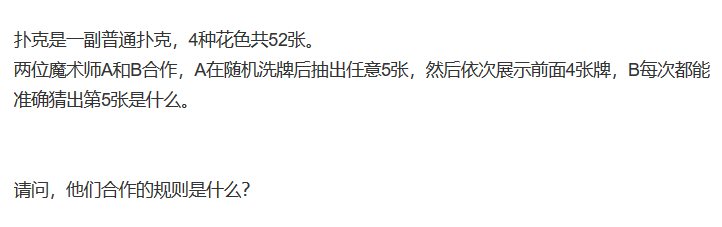
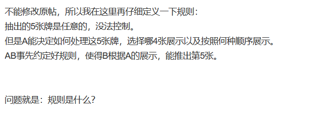

---
title: Python模拟魔术师读心术
date: 2019-10-07 10:32:38
summary: 本文用Python模拟魔术师读心术的实现。
tags:
- Python
categories:
- Python
---

贴吧里有这样一个题目

下面楼主的补发：

这种魔术看起来是有魔术师有“读心术”？
实际上不然。
奥秘在于助手的出牌顺序，这背后有一套算法，展示后魔术师经过计算已经知道了最后一张牌的值（每张牌有一个编号），对应的可以找到隐藏的牌。

我的思路是这样的（这是编程设计算法的思路，查阅过一些资料总结的）：
首先只有4种花色，抽5张牌，根据鸽巢原理（鸽洞原理），必定有重花色的情况出现。
然后一种花色只有13张牌，围成一个圈，最远的距离是6（双向可达）。
So，我们作如下规约：

 - 藏匿的卡牌花色与第一张相同
 - 藏匿卡牌的字面值与第一张相距在1~6之间（毕竟不能重复，0是不存在的）
 - 1~6 的距离由第2张~第4张展示的牌的大小顺序呈现（按照编号而不是字面值）
 	- （小->中->大）= 1
 	- （小->大->中）= 2
 	- （中->小->大）= 3
 	- （中->大->小）= 4
 	- （大->小->中）= 5
 	- （大->中->小）= 6
 - 编号顺序花色从Club（梅花）->Diamond（方片）->Heart（红心）->Spade（黑桃）
 - 花色内部编号从小到大A->2->3->...->K（与斗地主不同啊）
 - 依据先补满同字面值的花色再往后延伸字面值到K的顺序来编号

规约就是这样，然后就可以搞事情了嘿嘿嘿~~~

下面放出来Python描述的代码实现：

```python
# 你可以读心术——随机抽取五张牌，其中一张隐藏起来，按照特定的顺序给四张牌，你就能知道第五张牌是什么！

# deck是一个字符串列表，每个字符串是一张卡。名单上卡片的顺序很重要！！
deck = ['A_C', 'A_D', 'A_H', 'A_S', '2_C', '2_D', '2_H', '2_S',
        '3_C', '3_D', '3_H', '3_S', '4_C', '4_D', '4_H', '4_S',
        '5_C', '5_D', '5_H', '5_S', '6_C', '6_D', '6_H', '6_S',
        '7_C', '7_D', '7_H', '7_S', '8_C', '8_D', '8_H', '8_S',
        '9_C', '9_D', '9_H', '9_S', '10_C', '10_D', '10_H', '10_S',
        'J_C', 'J_D', 'J_H', 'J_S', 'Q_C', 'Q_D', 'Q_H', 'Q_S',
        'K_C', 'K_D', 'K_H', 'K_S']


# 给5张牌，助手会藏一张合适的牌，TA仔细挑选了剩下的四张卡片，然后把它们读出来！
def AssistantOrderCards():
    print('Cards are character strings as shown below.')
    print('Ordering is:', deck)
    # 初始化
    cards, cind, cardsuits, cnumbers = [], [], [], []
    numsuits = [0, 0, 0, 0]
    # 将卡片作为用户/观众的输入
    # 填写各种数据结构
    for i in range(5):
        print('Please give card', i + 1, end=' ')
        card = input('in above format: ')
        cards.append(card)
        n = deck.index(card)
        cind.append(n)
        cardsuits.append(n % 4)
        cnumbers.append(n // 4)
        numsuits[n % 4] += 1
        if numsuits[n % 4] > 1:
            pairsuit = n % 4
    # 从5个相同的套装中找出两张牌。保证存在
    cardH = []
    for i in range(5):
        if cardsuits[i] == pairsuit:
            cardH.append(i)
    # 找出需要隐藏的卡和要编码的号码
    hidden, other, encode = outputFirstCard(cnumbers, cardH, cards)
    remindices = []
    for i in range(5):
        if i != hidden and i != other:
            remindices.append(cind[i])
    # 按升序排列这三张牌
    sortList(remindices)
    # 给定需要编码的号码，对卡片进行适当的排序
    outputNext3Cards(encode, remindices)
    return


# 这个程序可以根据距离隐藏哪张卡。两张牌之间有相同的套装。它返回隐藏卡、第一张暴露卡和距离。
def outputFirstCard(ns, oneTwo, cards):
    encode = (ns[oneTwo[0]] - ns[oneTwo[1]]) % 13
    if 0 < encode <= 6:
        hidden = oneTwo[0]
        other = oneTwo[1]
    else:
        hidden = oneTwo[1]
        other = oneTwo[0]
        encode = (ns[oneTwo[1]] - ns[oneTwo[0]]) % 13
    print('First card is: ', cards[other])
    return hidden, other, encode


# 这个程序根据“编码”命令三张卡。需要进行编码。
def outputNext3Cards(code, ind):
    if code == 1:
        s, t, f = ind[0], ind[1], ind[2]
    elif code == 2:
        s, t, f = ind[0], ind[2], ind[1]
    elif code == 3:
        s, t, f = ind[1], ind[0], ind[2]
    elif code == 4:
        s, t, f = ind[1], ind[2], ind[0]
    elif code == 5:
        s, t, f = ind[2], ind[0], ind[1]
    else:
        s, t, f = ind[2], ind[1], ind[0]
    print('Second card is:', deck[s])
    print('Third card is:', deck[t])
    print('Fourth card is:', deck[f])


# 升序排列tList的元素
def sortList(tList):
    for ind in range(0, len(tList)-1):
        iSm = ind
        for i in range(ind, len(tList)):
            if tList[iSm] > tList[i]:
                iSm = i
        tList[ind], tList[iSm] = tList[iSm], tList[ind]


# 这个过程需要正确地编码四张卡并确定隐藏的卡
def MagicianGuessesCard():
    print('Cards are character strings are shown as below')
    print('Ordering is:', deck)
    cards, cind = [], []
    for i in range(4):
        print('Please give card', i+1, end=' ')
        card = input('in above format:')
        cards.append(card)
        n = deck.index(card)
        cind.append(n)
        if i == 0:
            suit = n % 4
            number = n // 4
    # 使用最后3张卡的顺序来确定与第一张卡的距离
    if cind[1] < cind[2] and cind[1] < cind[3]:
        if cind[2] < cind[3]:
            encode = 1
        else:
            encode = 2
    elif (cind[3] < cind[1] < cind[2]) or (cind[2] < cind[1] < cind[3]):
        if cind[2] < cind[3]:
            encode = 3
        else:
            encode = 4
    elif cind[1] > cind[2] and cind[1] > cind[3]:
        if cind[2] < cind[3]:
            encode = 5
        else:
            encode = 6
    # 知道号码和套装给出卡片索引然后字符串
    hiddenNumber = (number + encode) % 13
    index = hiddenNumber * 4 + suit
    print('Hidden card is:', deck[index])


# 类似于AssistantOrderCards()， 接收大量的卡，然后“随机”生成五张卡。
def ComputerAssistant():
    print('Cards are character strings as shown below.')
    print('Ordering is:', deck)
    cards, cind, cardsuits, cnumbers = [], [], [], []
    numsuits = [0, 0, 0, 0]
    number = 0
    while number < 99999:
        number = int(input('Please give random number' +
                           ' of at least 6 digits:'))
    for i in range(5):
        number = number * (i + 1) // (i + 2)
        n = number % 52
        cards.append(deck[n])
        cind.append(n)
        cardsuits.append(n % 4)
        cnumbers.append(n // 4)
        numsuits[n % 4] += 1
        if numsuits[n % 4] > 1:
            pairsuit = n % 4
    cardH = []
    for i in range(5):
        if cardsuits[i] == pairsuit:
            cardH.append(i)
    hidden, other, encode = outputFirstCard(cnumbers, cardH, cards)
    remindices = []
    for i in range(5):
        if i != hidden and i != other:
            remindices.append(cind[i])
    sortList(remindices)
    outputNext3Cards(encode, remindices)
    guess = input('What is the hidden card?')
    if guess == cards[hidden]:
        print('You are a Mind Reader Extraordinaire!')
    else:
        print('Sorry, not impressed!')
    return


AssistantOrderCards()
MagicianGuessesCard()
ComputerAssistant()
```

有三种模式：
AssistantOrderCards()是助手的算法，——助手抽4张牌，可以经过此算法知道何种顺序展示哪四张牌（当然了，展示的顺序很多种，这是助手跟魔术师约定的“秘钥”，我们这里只按我们的思路来）。
MagicianGuessesCard()是魔术师的算法——魔术师按照助手展示的顺序“读出”牌的值以及展示顺序背后的秘密，算出最后隐藏而他“不知道”的牌。
ComputerAssistant()是没有助手的魔术师“自行训练”所用，随机抽多张卡（输入大于100000停止），然后猜，看猜得对不对用来检验技术达不达标。

OK,终于解决，下面升华一下主题，咳咳~~
这个“读心术”涉及到了一个 ***信息编码*** 的问题：
这个玩法里有 3! = 6 种排列方式，而一般对于 n! 来说，我们可以通过一个具体排列方式对传递的消息进行简单编码，普通的监听者知道有秘密但是他并不能轻易的破解（除非他知道秘钥，对吧...），而传递信息的双方则可以根据加密解密来传递信息，蛮有趣的呢~~
