---
title: Python海龟绘图可视化
date: 2019-11-22 20:09:21
summary: 本文分享Python海龟绘图可视化的案例。
tags:
- Python
categories:
- Python
---

# 粉色五角星

```python
import turtle


def drawFivePointStar(t, x, y, lengthOfSide):
    # 从(x, y)向东南方向出发
    t.up()
    t.goto(x, y)
    t.left(36)
    t.down()
    for i in range(5):
        t.forward(lengthOfSide)
        # 144 = 180 - 36
        t.left(144)


myTurtle = turtle.Turtle()
myTurtle.hideturtle()
myTurtle.color("deeppink")
myWindow = myTurtle.getscreen()
lengthOfSide = 200
drawFivePointStar(myTurtle, 0, 0, lengthOfSide)
myWindow.exitonclick()
```

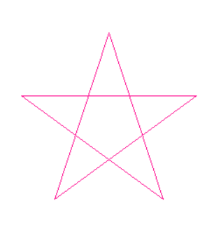

# 连续五个随机颜色五角星

```python
from turtle import *
from random import randint


def drawStar(x, y):
    pu()
    goto(x, y)
    pd()
    colormode(255)
    # set heading: 0
    seth(0)
    for i in range(5):
        r = randint(0, 255)
        g = randint(0, 255)
        b = randint(0, 255)
        pencolor(r, g, b) 
        fd(40)
        rt(144)


hideturtle()
for x in range(0, 250, 50):
    drawStar(x, 0)
done()
```

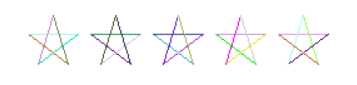

# 红色玩具车

```python
import turtle

t = turtle.Pen()
t.color(1,0,0)
t.begin_fill()
t.forward(100)
t.left(90)
t.forward(20)
t.left(90)
t.forward(20)
t.right(90)
t.forward(20)
t.left(90)
t.forward(60)
t.left(90)
t.forward(20)
t.right(90)
t.forward(20)
t.left(90)
t.forward(20)
t.end_fill()

t.color(0,0,0)
t.up()
t.forward(10)
t.down()
t.begin_fill()
t.circle(10)
t.end_fill()

t.setheading(0)
t.up()
t.forward(90)
t.right(90)
t.forward(10)
t.setheading(0)
t.begin_fill()
t.down()
t.circle(10)
t.end_fill()
t.hideturtle()
```

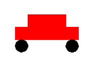

# 高度旋转堆叠的正方形组

```python
import turtle

for i in range(360):
    turtle.setheading(i)
    for i in range(4):
        turtle.forward(100)
        turtle.left(90)
```

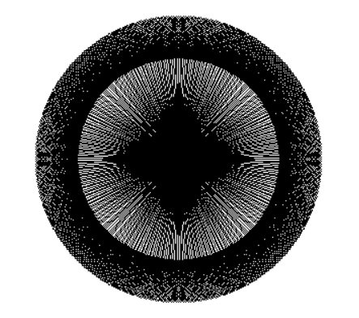

# K阶科赫雪花

```python
import turtle


def koch(len, n):
    if n == 0:
        turtle.fd(len)
    else:
        for i in [0, 60, -120, 60]:
            turtle.left(i)
            koch(len/3, n-1)


level = int(input())

turtle.penup()
turtle.goto(-250, 150)
turtle.pensize(2)
turtle.color('orange')
turtle.pendown()
koch(500, level)
turtle.right(120)
koch(500, level)
turtle.right(120)
koch(500, level)
turtle.right(120)
turtle.hideturtle()
turtle.done()
```

三阶科赫雪花：
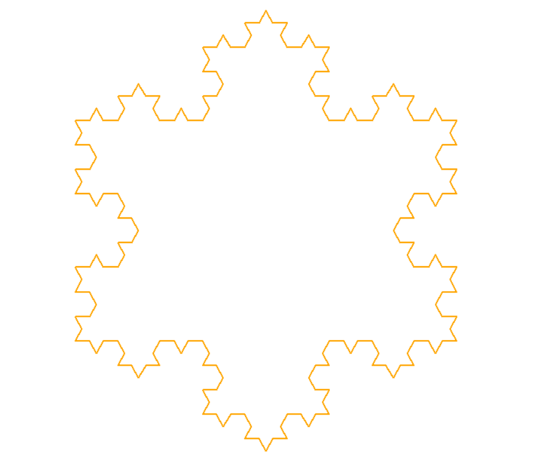

五阶科赫雪花：
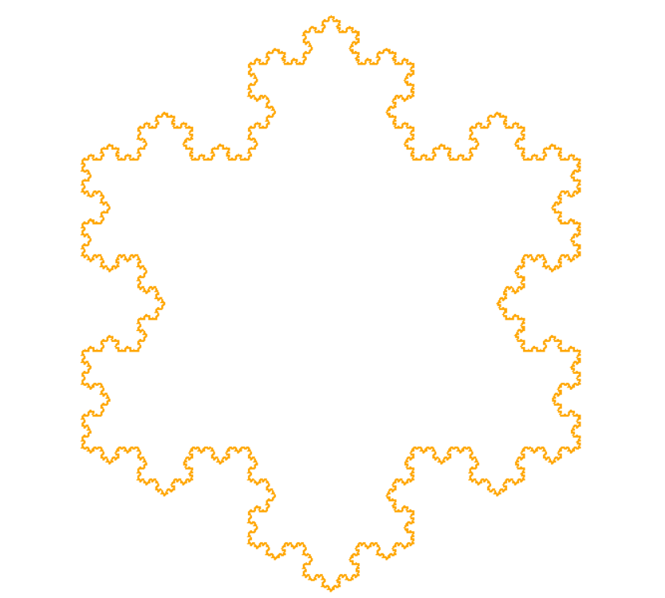

# 斜分绿树

```python
from turtle import *


# 递归绘制一棵树
def tree(branchLength, turtle):
    if branchLength > 5:
        turtle.forward(branchLength)
        turtle.right(20)
        tree(branchLength-15, turtle)
        turtle.left(40)
        tree(branchLength-10, turtle)
        turtle.right(20)
        turtle.backward(branchLength)


myTurtle = Turtle()
myWindow = myTurtle.getscreen()
myTurtle.hideturtle()
myTurtle.left(90)
myTurtle.up()
myTurtle.backward(300)
myTurtle.down()
myTurtle.color('green')
tree(110, myTurtle)
```

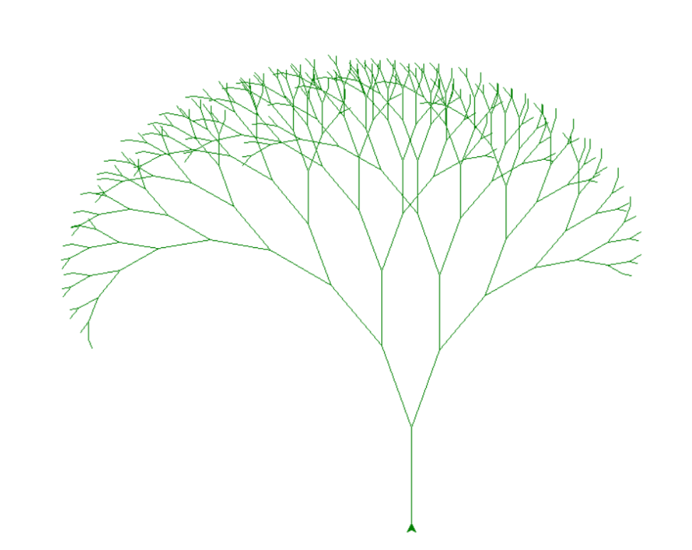

# 分形树

```python
from turtle import *

# 设置色彩模式是RGB:
colormode(255)

lt(90)

lv = 14
l = 120
s = 45

width(lv)

# 初始化RGB颜色:
r = 0
g = 0
b = 0
pencolor(r, g, b)

penup()
bk(l)
pendown()
fd(l)

def draw_tree(l, level):
    global r, g, b
    # save the current pen width
    w = width()

    # narrow the pen width
    width(w * 3.0 / 4.0)
    # set color:
    r = r + 1
    g = g + 2
    b = b + 3
    pencolor(r % 200, g % 200, b % 200)

    l = 3.0 / 4.0 * l

    lt(s)
    fd(l)

    if level < lv:
        draw_tree(l, level + 1)
    bk(l)
    rt(2 * s)
    fd(l)

    if level < lv:
        draw_tree(l, level + 1)
    bk(l)
    lt(s)

    # restore the previous pen width
    width(w)

speed("fastest")
draw_tree(l, 4)
done()
```

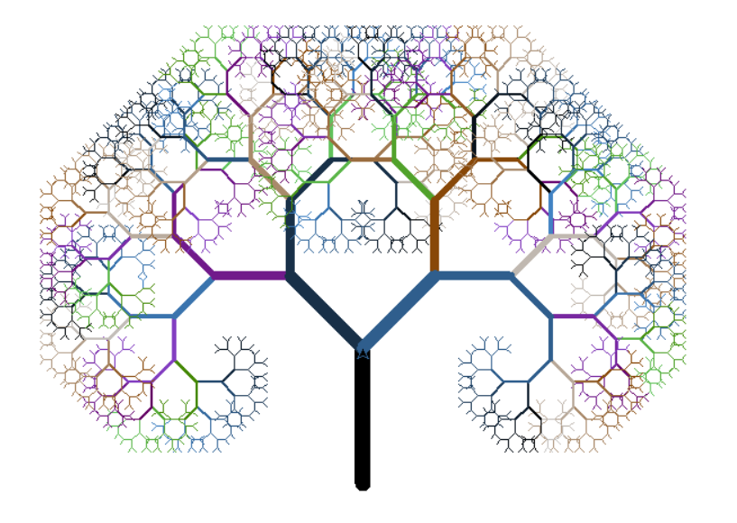

# 分形心

```python
import turtle


def fractal(myTurtle, x1, y1, x2, y2, level):
    # 从(x1, y1)坐标画到(x2, y2)坐标
    newX = 0
    newY = 0
    if level == 0:
        drawLine(myTurtle, x1, y1, x2, y2)
    else:
        newX = (x1+x2)/2 + (y2-y1)/2
        newY = (y1+y2)/2 - (x2-x1)/2
        fractal(myTurtle, x1, y1, newX, newY, level-1)
        fractal(myTurtle, newX, newY, x2, y2, level-1)


def drawLine(myTurtle, x1, y1, x2, y2):
    # 绘制从(x1, y1)到(x2, y2)的线
    myTurtle.up()
    myTurtle.goto(x1, y1)
    myTurtle.down()
    myTurtle.goto(x2, y2)


t = turtle.Turtle()
myWindow = t.getscreen()
t.hideturtle()
# 最快速度
t.speed(0)
level = 12
fractal(t, -80, 60, 80, 60, level)
# 窗口不会自动关闭
myWindow.exitonclick()
```

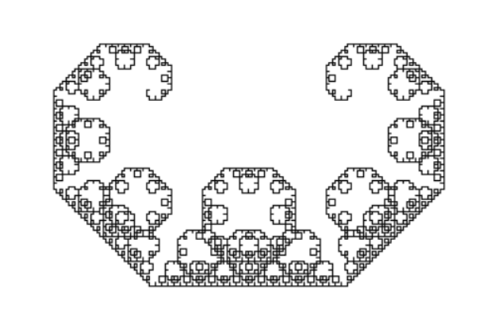

# 谢尔平斯基三角形

```python
from turtle import *


def drawTriangle(points, color, turtle):
    turtle.fillcolor(color)
    turtle.up()
    turtle.goto(points[0])
    turtle.down()
    turtle.begin_fill()
    turtle.goto(points[1])
    turtle.goto(points[2])
    turtle.goto(points[0])
    turtle.end_fill()


def getMid(p1, p2):
    return ( (p1[0] + p2[0]) / 2, (p1[1] + p2[1]) / 2 )


def sierpinski(points, degree, turtle):
    colorMap = ['blue', 'red', 'green', 'white', 'yellow', 'violet', 'orange']
    drawTriangle(points, colorMap[degree], turtle)
    if degree > 0:
        sierpinski([points[0], getMid(points[0], points[1]), getMid(points[0], points[2])], degree-1, turtle)
        sierpinski([points[1], getMid(points[0], points[1]), getMid(points[1], points[2])], degree - 1, turtle)
        sierpinski([points[2], getMid(points[2], points[1]), getMid(points[0], points[2])], degree - 1, turtle)


myTurtle = Turtle()
myWindow = myTurtle.getscreen()
myPoints = [(-400, -200), (0, 400), (400, -200)]
sierpinski(myPoints, 5, myTurtle)
myWindow.exitonclick()
```

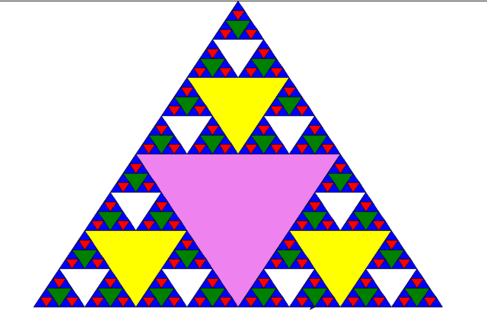

# 紫色小蛇

```python
import turtle


def drawSnake(rad, angle, len, neckrad):
    for _ in range(len):
        turtle.circle(rad, angle)
        turtle.circle(-rad, angle)
    turtle.circle(rad, angle/2)
    turtle.forward(rad/2)  # 直线前进
    turtle.circle(neckrad, 180)
    turtle.forward(rad/4)


turtle.setup(1500, 1400, 0, 0)
turtle.pensize(30)
turtle.pencolor("purple")
turtle.seth(150)
drawSnake(70, 80, 2, 15)
```

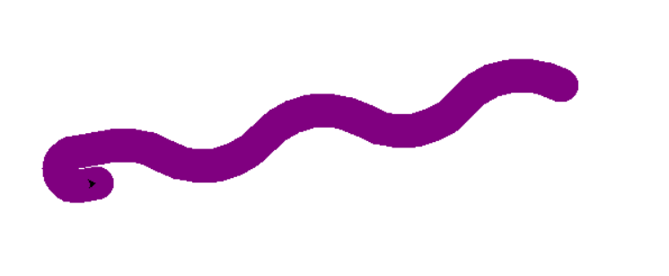

# 随机色旋转图形

```python
import turtle as tt
from random import randint

tt.TurtleScreen._RUNNING = True
tt.speed(0)  # 绘图速度为最快
tt.bgcolor("black")  # 背景色为黑色
tt.setpos(-25, 25)  # 改变初始位置，这可以让图案居中
tt.colormode(255)  # 颜色模式为真彩色
cnt = 0
while cnt < 500:
    r = randint(0, 255)
    g = randint(0, 255)
    b = randint(0, 255)
    tt.pencolor(r, g, b)  # 画笔颜色每次随机
    tt.forward(50 + cnt)
    tt.right(91)
    cnt += 1
tt.done()
```

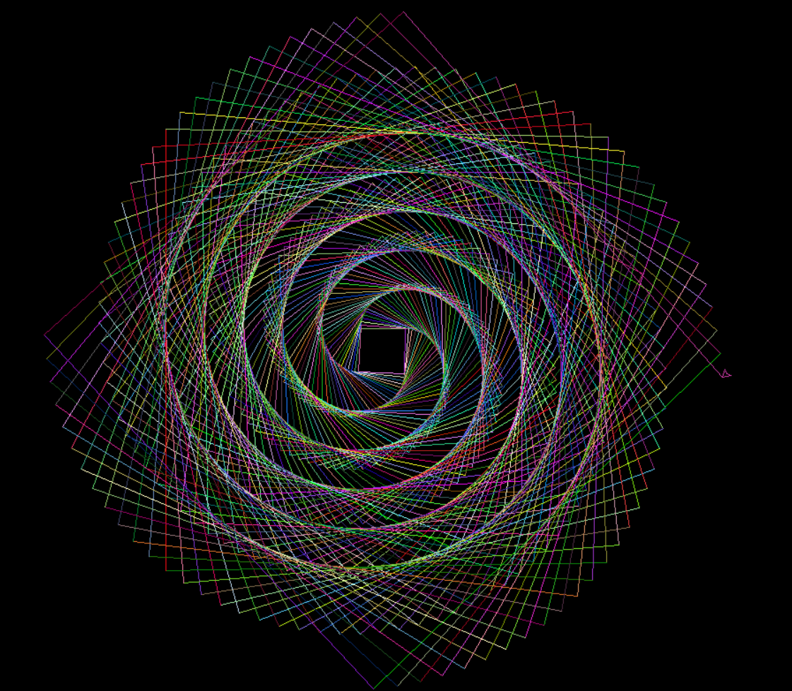

# 小猪佩奇

```python
import turtle as t

t.pensize(4)
t.hideturtle()
t.colormode(255)
t.color((255, 155, 192), "pink")
t.setup(840, 500)
t.speed(10)

# 鼻子
t.penup()
t.goto(-100,100)
t.pendown()
t.seth(-30)
t.begin_fill()
a = 0.4
for i in range(120):
    if 0 <= i < 30 or 60 <= i < 90:
        a = a+0.08
        t.left(3)
        t.forward(a)
    else:
        a = a-0.08
        t.left(3)
        t.forward(a)
        t.end_fill()

t.penup()
t.seth(90)
t.forward(25)
t.seth(0)
t.forward(10)
t.pendown()
t.pencolor(255, 155, 192)
t.seth(10)
t.begin_fill()
t.circle(5)
t.color(160, 82, 45)
t.end_fill()

t.penup()
t.seth(0)
t.forward(20)
t.pendown()
t.pencolor(255, 155, 192)
t.seth(10)
t.begin_fill()
t.circle(5)
t.color(160, 82, 45)
t.end_fill()

# 头
t.color((255, 155, 192), "pink")
t.penup()
t.seth(90)
t.forward(41)
t.seth(0)
t.forward(0)
t.pendown()
t.begin_fill()
t.seth(180)
t.circle(300, -30)
t.circle(100, -60)
t.circle(80, -100)
t.circle(150, -20)
t.circle(60, -95)
t.seth(161)
t.circle(-300, 15)
t.penup()
t.goto(-100, 100)
t.pendown()
t.seth(-30)
a = 0.4
for i in range(60):
    if 0 <= i < 30 or 60 <= i <90:
        a = a+0.08
        t.left(3)
        t.forward(a)
    else:
        a = a-0.08
        t.left(3)
        t.forward(a)
        t.end_fill()

# 耳朵
t.color((255, 155, 192), "pink")
t.penup()
t.seth(90)
t.forward(-7)
t.seth(0)
t.forward(70)
t.pendown()
t.begin_fill()
t.seth(100)
t.circle(-50, 50)
t.circle(-10, 120)
t.circle(-50, 54)
t.end_fill()

t.penup()
t.seth(90)
t.forward(-12)
t.seth(0)
t.forward(30)
t.pendown()
t.begin_fill()
t.seth(100)
t.circle(-50, 50)
t.circle(-10, 120)
t.circle(-50, 56)
t.end_fill()

#眼睛
t.color((255, 155, 192), "white")
t.penup()
t.seth(90)
t.forward(-20)
t.seth(0)
t.forward(-95)
t.pendown()
t.begin_fill()
t.circle(15)
t.end_fill()

t.color("black")
t.penup()
t.seth(90)
t.forward(12)
t.seth(0)
t.forward(-3)
t.pendown()
t.begin_fill()
t.circle(3)
t.end_fill()

t.color((255, 155, 192), "white")
t.penup()
t.seth(90)
t.forward(-25)
t.seth(0)
t.forward(40)
t.pendown()
t.begin_fill()
t.circle(15)
t.end_fill()

t.color("black")
t.penup()
t.seth(90)
t.forward(12)
t.seth(0)
t.forward(-3)
t.pendown()
t.begin_fill()
t.circle(3)
t.end_fill()

# 腮
t.color((255, 155, 192))
t.penup()
t.seth(90)
t.forward(-95)
t.seth(0)
t.forward(65)
t.pendown()
t.begin_fill()
t.circle(30)
t.end_fill()

# 嘴
t.color(239, 69, 19)
t.penup()
t.seth(90)
t.forward(15)
t.seth(0)
t.forward(-100)
t.pendown()
t.seth(-80)
t.circle(30, 40)
t.circle(40, 80)

# 身体
t.color("red", (255, 99, 71))
t.penup()
t.seth(90)
t.forward(-20)
t.seth(0)
t.forward(-78)
t.pendown()
t.begin_fill()
t.seth(-130)
t.circle(100,10)
t.circle(300,30)
t.seth(0)
t.forward(230)
t.seth(90)
t.circle(300,30)
t.circle(100,3)
t.color((255,155,192),(255,100,100))
t.seth(-135)
t.circle(-80,63)
t.circle(-150,24)
t.end_fill()

# 手
t.color((255,155,192))
t.penup()
t.seth(90)
t.forward(-40)
t.seth(0)
t.forward(-27)
t.pendown()
t.seth(-160)
t.circle(300,15)
t.penup()
t.seth(90)
t.forward(15)
t.seth(0)
t.forward(0)
t.pendown()
t.seth(-10)
t.circle(-20,90)

t.penup()
t.seth(90)
t.forward(30)
t.seth(0)
t.forward(237)
t.pendown()
t.seth(-20)
t.circle(-300,15)
t.penup()
t.seth(90)
t.forward(20)
t.seth(0)
t.forward(0)
t.pendown()
t.seth(-170)
t.circle(20,90)

# 脚
t.pensize(10)
t.color((240,128,128))
t.penup()
t.seth(90)
t.forward(-75)
t.seth(0)
t.forward(-180)
t.pendown()
t.seth(-90)
t.forward(40)
t.seth(-180)
t.color("black")
t.pensize(15)
t.forward(20)

t.pensize(10)
t.color((240, 128, 128))
t.penup()
t.seth(90)
t.forward(40)
t.seth(0)
t.forward(90)
t.pendown()
t.seth(-90)
t.forward(40)
t.seth(-180)
t.color("black")
t.pensize(15)
t.forward(20)

# 尾巴
t.pensize(4)
t.color((255, 155, 192))
t.penup()
t.seth(90)
t.forward(70)
t.seth(0)
t.forward(95)
t.pendown()
t.seth(0)
t.circle(70, 20)
t.circle(10, 330)
t.circle(70, 30)
t.done()
```

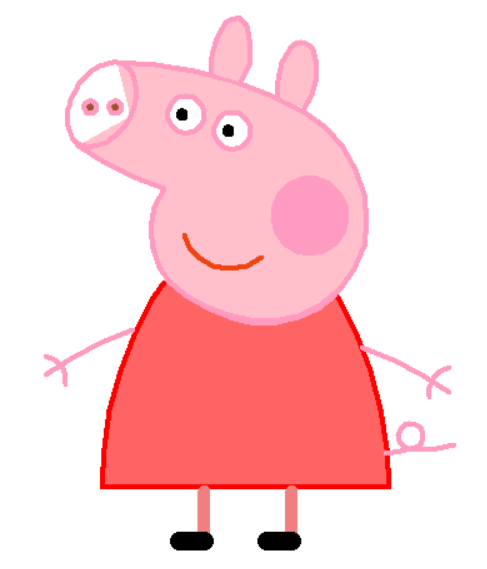
