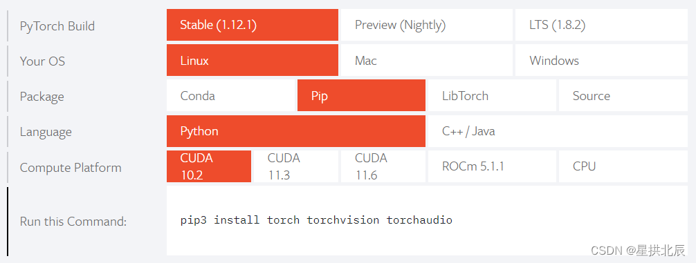

# Django

[Django官方网站](https://www.djangoproject.com/download/)

pip安装Django的方法：
```shell
pip install django
```

# TensorFlow

可以选择conda安装和pip安装，个人推荐pip安装。

conda搜索TensorFlow的GPU版本：

```shell
conda search tensorflow-gpu
```

conda安装TensorFlow的GPU版本：

```shell
conda install tensorflow-gpu==2.2.0
```

pip安装TensorFlow的GPU版本：

```shell
pip install tensorflow-gpu
```

# PyTorch

可以选择conda安装和pip安装，个人推荐pip安装。

conda搜索PyTorch的GPU版本：
```shell
conda search torch-gpu
```

conda安装PyTorch的GPU版本(版本1.2.0)：
```shell
conda install torch-gpu==1.2.0
```

CUDA版本查看：
```shell
nvcc -V
```


pip安装PyTorch的GPU版本：
```shell
pip install torch torchvision torchaudio
```

pip安装PyTorch的命令应该去[官网](https://pytorch.org)查看：



pip安装不顺可以直接下载[.whl](http://download.pytorch.org/whl)文件，本地`pip install`。

# pyahocorasick

`anaconda search -t conda XXXX` 命令用于搜索到相关包的各种版本的列表

```shell
anaconda search -t conda pyahocorasick
```

输出如下：

```shell
Packages:
     Name                      |  Version | Package Types   | Platforms       | Builds    
     ------------------------- |   ------ | --------------- | --------------- | ----------
     conda-forge/pyahocorasick |    1.4.0 | conda           | linux-64, win-32, win-64, osx-64 | py37h9bfed18_1, py36h97a6639_2, py36h14c3975_0, py36h68a101e_1, py36h14c3975_1000, py36h37b9a7d_1, py36_0, py36hfa6e2cd_0, py35h470a237_0, py27h14c3975_0, py37h470a237_0, py38h1e0a361_1, py27h0c8e037_1000, py27h1de35cc_0, py27h14c3975_1000, py35hfa6e2cd_0, py37h1de35cc_1000, py38h0b31af3_0, py38h1e0a361_2, py36h1de35cc_0, py27h89ed719_1, py36h1de35cc_1000, py27_0, py39h07f9747_2, py38h9de7a3e_1, py39hb5aae12_2, py38h4d0b108_2, py37h14c3975_0, py37h4ab8f01_2, py37h60d8a13_2, py37h0b31af3_0, py38h64e0658_1, py37h8f50634_1, py37h8f50634_2, py36h97a6639_1, py36h516909a_0, py38hfa6e2cd_0, py37h516909a_0, py36hfa6e2cd_1000, py39h4cdbadb_2, py37h8055547_1, py36h8c4c3a4_1, py27hdf8410d_1, py36h470a237_0, py37hfa6e2cd_1000, py36h0b31af3_0, py36h8c4c3a4_2, py36h9de38fb_2, py37h1de35cc_0, py36hae792fc_2, py37h14c3975_1000, py36h67ae4cd_1, py27h516909a_0, py37hfa6e2cd_0, py27h462b5f4_1, py27h0b31af3_0, py38h516909a_0, py38h1e8a9f7_2, py27h470a237_0, py27h1de35cc_1000, py36h779f372_2, py35_0, py27h0c8e037_0
                                          : Python module (C extension and plain python) implementing Aho-Corasick algorithm.
     estnltk/pyahocorasick     |    1.1.6 | conda           | linux-64, win-32, win-64, osx-64 | py36_0, 3.5, py35_0, py27_0
     urdvr/pyahocorasick       |    1.1.4 | conda           | linux-64        | py36_0    
Found 3 packages

Run 'anaconda show <USER/PACKAGE>' to get installation details
```

选择其中的`conda-forge/pyahocorasick`安装：

```shell
conda install -c https://conda.anaconda.org/conda-forge pyahocorasick
```

说明：`-c`用于自主选择channel

输出如下：
```shell
Collecting package metadata (current_repodata.json): done
Solving environment: done


==> WARNING: A newer version of conda exists. <==
  current version: 4.10.1
  latest version: 4.11.0

Please update conda by running

    $ conda update -n base -c defaults conda


## Package Plan ##

  environment location: /Users/xxx/opt/anaconda3

  added / updated specs:
    - pyahocorasick


The following packages will be downloaded:

    package                    |            build
    ---------------------------|-----------------
    conda-4.11.0               |   py38h50d1736_0        16.9 MB  conda-forge
    pyahocorasick-1.4.0        |   py38h4d0b108_2          32 KB  conda-forge
    python_abi-3.8             |           2_cp38           4 KB  conda-forge
    ------------------------------------------------------------
                                           Total:        16.9 MB

The following NEW packages will be INSTALLED:

  pyahocorasick      conda-forge/osx-64::pyahocorasick-1.4.0-py38h4d0b108_2
  python_abi         conda-forge/osx-64::python_abi-3.8-2_cp38

The following packages will be UPDATED:

  conda              pkgs/main::conda-4.10.1-py38hecd8cb5_1 --> conda-forge::conda-4.11.0-py38h50d1736_0


Proceed ([y]/n)? y


Downloading and Extracting Packages
pyahocorasick-1.4.0  | 32 KB     | ########################################################################################################################################### | 100% 
conda-4.11.0         | 16.9 MB   | ########################################################################################################################################### | 100% 
python_abi-3.8       | 4 KB      | ########################################################################################################################################### | 100% 
Preparing transaction: done
Verifying transaction: done
Executing transaction: done
```

# joblib

import部分代码：


发现 缺 joblib，需要补一下安装。

安装scikit-learn的依赖包，-U表示安装最新版本：

`pip install -U joblib`
`pip install -U scikit-learn`


查看一下目录，即使用命令安装了，externals 还是没有 joblib：


但是发现还是有 joblib 的：


所以，此时 `import joblib` 即可。

# graphviz

Python报错：
<font color="red">pydotplus.graphviz.InvocationException: GraphViz's executables not found</font>

解决方法是使用pip下载：
- `pip install pydotplus`
- `pip install graphviz`
